# Architecture review — pewpew — 2026-09-02

**Scope**: Hot-spot-weighted scan. `git log` over the last ~120 non-merge commits puts `src/main/session-manager.ts` (2541 lines, 35 touches) far ahead of everything else, with its remote-host neighbours (`pty-manager`, `host-bootstrap`, `remote-host-runtime`) next. Two exploration sub-agents walked (a) the main-process session/host modules and (b) the renderer, shared types, and support modules. No `CONTEXT.md` and no ADRs exist in this repo, so no recorded decision constrains the candidates.

**Picked**: `spawn-remote-agent-pipeline` — see the PR and `.architecture/backlog.md`.

**Degradations**: none. `gh` authenticated; both exploration sub-agents ran; `codebase-design` vocabulary loaded.

**Diagram legend**: solid edges are the module **interface** (what a caller sees); dashed edges are **implementation** hidden behind a seam.

---

## Candidates

### spawn-remote-agent-pipeline — extract the post-worktree remote spawn tail · Strong · score 23/25

- **Files**: new `src/main/remote-agent-spawn.ts`; edits in `src/main/session-manager.ts` at the four create/adopt callbacks — `adoptRemoteWorktree` (`session-manager.ts:702`), `createRemoteSession` (`session-manager.ts:838`), `createRemotePrSession` (`session-manager.ts:1013`), `createRemoteIssueSession` (`session-manager.ts:2256`); new `src/main/remote-agent-spawn.test.ts`. **Estimate: 3–4 files.**
- **Score 23/25**
  - **Leverage 5** — one primitive pays back across four remote-spawn call sites _and_ removes the copied `createRemotePty` options object and the four-copy branch-resolve, so a test exercises the spawn tail once instead of four times.
  - **Locality 5→4** — the hooks-then-pty ordering invariant, the `ompHookScriptPath → notifyHookPath` mapping, and branch resolution concentrate in one module; scored 4 because the agent-path error still lives at each caller by design.
  - **Blast radius 2** — a new internal module and its direct callers; no exported signature, IPC channel (`src/preload`), or wire format changes. `session-manager`'s exported functions keep identical return types and error modes.
  - **Heat 5** — `session-manager.ts` is the hottest file in the repo and three of its last six commits are exactly this genre of extraction (`buildSession` #291, create-or-adopt worktree protocol #280, agent-resumability core #279).
- **Problem** — the interface of "spawn a remote agent in a worktree" is duplicated verbatim across four callers, and one part of that interface — its error mode — has already drifted. Each of the four callbacks ends with the identical three steps:
  1. resolve the branch: `git -C <wt> rev-parse --abbrev-ref HEAD` then `.trim() || <fallback>` — copied at `session-manager.ts:706, 842, 1017, 2260`;
  2. `installRemoteAgentHooks(tool, host, worktreePath, notifyScriptPath, guardScriptPath)` — `:711, :847, :1022, :2265`;
  3. `createRemotePty(id, worktreePath, host, { tool, agentPath, projectPath, notifyHookPath: ompHookScriptPath, remoteSocketPath, sandboxAvailable })` — the options object copied verbatim at `:712, :854, :1029, :2272`.

  Nothing names this sequence, so understanding "how a remote agent is launched" means reading all four copies to confirm they still agree. The agent-path failure already disagrees — three sites `throw` (`:688, :778, :1561`), two `return` a string (`:955, :2205`) — which is the exact drift this shape invites.

- **Deletion test** — concentrates. Delete the (hypothetical) primitive and the branch-resolve + hooks-install + pty-spawn sequence, and the `notifyHookPath` mapping, reappear across four callers, each of which must independently keep the hooks-before-pty ordering correct. Complexity concentrates rather than moving to callers — a genuine deepening.
- **Solution** — a deep primitive `finishRemoteAgentSpawn(host, prepared, { id, worktreePath, projectPath, tool, agentPath, branchFallback }): Promise<{ branch; sandboxed }>` owning steps 1–3, with the module-private `installRemoteAgentHooks` (`session-manager.ts:593`) moved into the new module (its only callers are these paths plus revive). Each caller keeps its distinct worktree-provisioning and its own agent-path resolution + error mode, then calls the primitive with the resolved `agentPath` and its fallback branch (`'HEAD'`, `branchName`, `branch`, `branch`). The fifth remote-spawn site, `reviveSession` (`:1587`), is deliberately **left as-is**: it passes resume fields (`continueSession`, `agentSessionId`) and has no branch-resolve step, so folding it in would widen the interface. Four callers is already a real seam.
- **Benefits** — **leverage**: callers shrink to "provision the worktree, resolve the agent path, call the primitive"; the pty options object and branch-resolve exist once. **Locality**: the hooks→pty ordering and the `ompHookScriptPath` mapping are fixed in one file. **Test surface**: the spawn tail becomes testable through one interface (`remote-agent-spawn.test.ts`) with a call-order assertion (`installRemoteAgentHooks` before `createRemotePty`), rather than being re-verified inside four different session-creation tests.

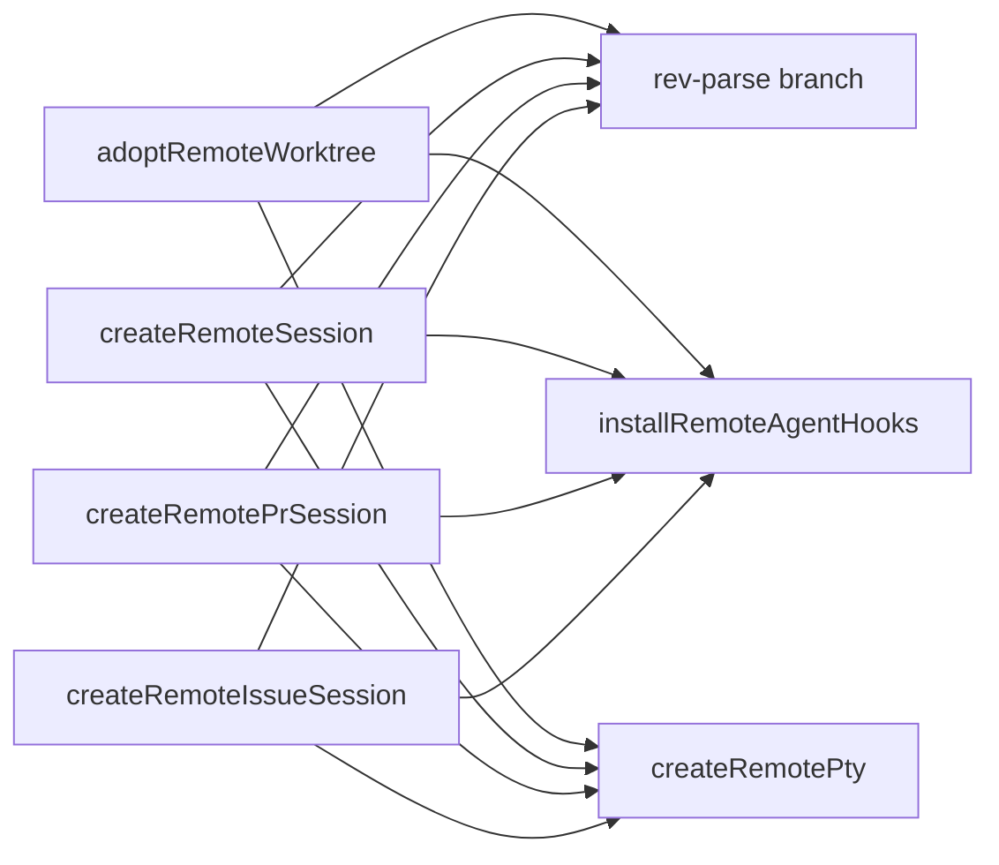

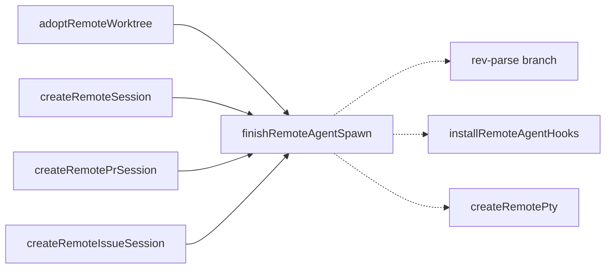

---

### remote-reconnect-coordinator — house reconnect orchestration behind one module · Worth exploring · score 21/25

- **Files**: new `src/main/remote-reconnect.ts` + `session-manager.ts:1183-1529` + `session-manager.test.ts`. Estimate: ~3 files.
- **Score 21/25** — Leverage 4, Locality 5, Blast 2, Heat 4.
- **Problem** — one concept, "reconnect a dropped remote session", is spread across ~350 lines: `reconnectRemoteSession`, `doReconnectRemoteSession`, `attemptAutoReconnect`, `probePendingSessionsOnHost`, plus two in-flight coalescing maps (`inflightReconnects` `:1191`, `inflightBatchProbes` `:1421`) and prepared-host lease lifecycle. The pure decision cores are already extracted (`computeProbeTransition`, `classifyAutoReconnectResult`); the stateful glue that sequences them is not.
- **Deletion test** — concentrates: the coalescing + lease lifecycle reappears in the IPC handler and the scheduler.
- **Solution** — a `RemoteReconnectCoordinator` owning the two maps and the lease lifecycle behind a small injected `SessionLookup` seam; exported functions become one-line delegators.
- **Note** — its direction partly depends on the `session-store` candidate's `SessionLookup` seam; standalone it risks being a move-within-file rather than a deepening.

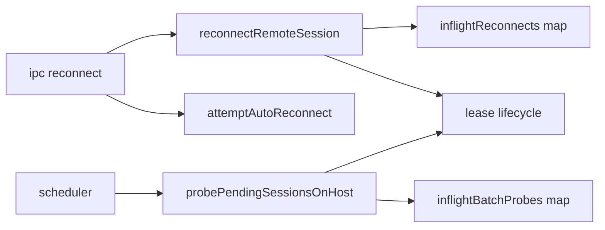

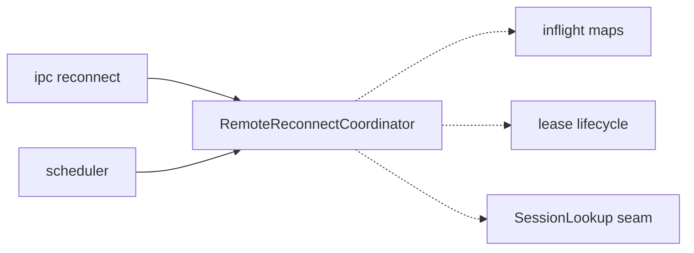

---

### session-store — a store owning mutate+persist+notify · Worth exploring · score 20/25

- **Files**: new `src/main/session-store.ts` + `session-manager.ts` (nearly every function) + `session-manager.test.ts`. Estimate: large diff, ~3 files but touches the test harness broadly.
- **Score 20/25** — Leverage 4, Locality 5, Blast 4, Heat 5.
- **Problem** — the "interface" to session state is a raw module-global `Map` (`session-manager.ts:147`) plus an unwritten invariant that every mutation is followed by `onSessionsChanged()`. There are ~22 `connectionState =` writes and ~30 `onSessionsChanged()` calls hand-paired at each site; a missed pairing silently desyncs the renderer and `sessions.json`.
- **Deletion test** — concentrates: persist + broadcast + tray + rate-limit reappears at ~30 sites.
- **Solution** — a `SessionStore` with `patch`, `setConnectionState`, and a `batch(fn)` primitive that coalesces one persist+broadcast+tray.
- **Trap (recorded)** — `doProbePendingSessionsOnHost` deliberately writes `connectionState` at `:1472/:1521` **without** notifying, batching to one call at `:1528` (the #185 write-storm fix). A store that auto-persists on every write would regress that; the deepened store **must** expose the batch primitive. This raises blast (it disturbs the 3881-line test scaffolding), which is why it scores below the pick.

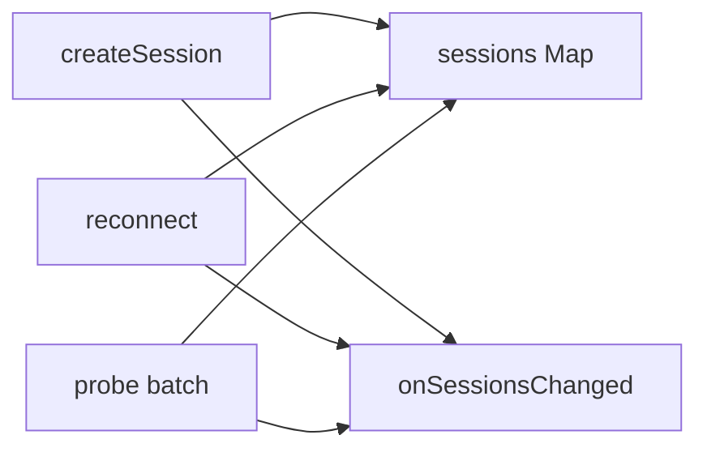

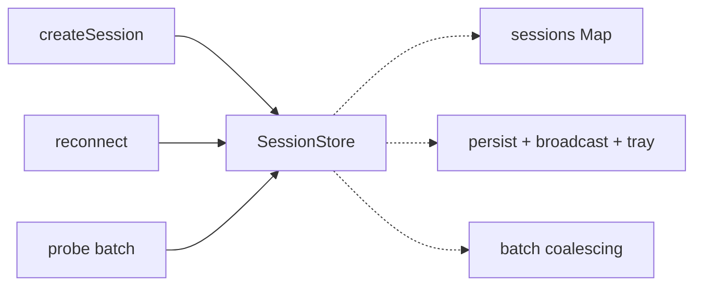

---

### materialize-pr-worktree — one executor for the local+remote PR-worktree plan · Worth exploring · score 20/25

- **Files**: new `src/main/pr-worktree-materializer.ts` + `session-manager.ts` (`:2057-2088` local, `:960-1011` remote) + test. Estimate: ~3 files.
- **Score 20/25** — Leverage 4, Locality 4, Blast 2, Heat 4.
- **Problem** — `planPrWorktree` (in `pr-worktree-planner.ts`) is the pure plan, but _executing_ it against git is duplicated and the two copies have **drifted**: local uses try-then-fallback (`:2074-2088`), remote uses probe-first (`:987-1006`) _because_ — per its own comment (`:982-986`) — the fallback masked real failures. The remote path fixed a bug the local path still carries.
- **Deletion test** — concentrates, and unifying removes a latent local-path bug.
- **Solution** — `materializePrWorktree(runGit, plan, worktreePath)` implementing probe-first once, driven by an injected local-or-remote `GitRunner`.

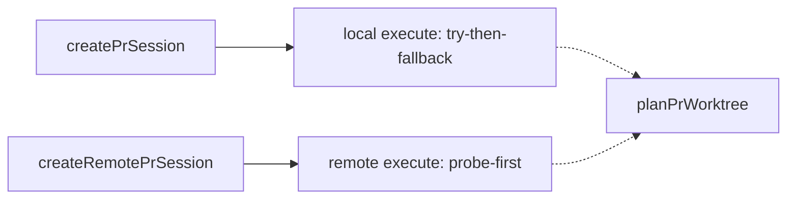

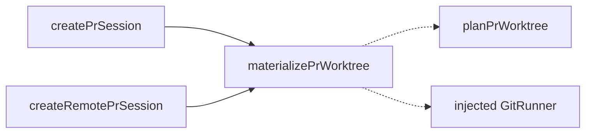

---

### resolve-local-review-context — one owner for the review IPC preamble · Worth exploring · score 19/25

- **Files**: `src/main/index.ts:596-641` (three `review:*` handlers) + optional helper module. Estimate: ~1–2 files.
- **Score 19/25** — Leverage 3, Locality 4, Blast 2, Heat 5.
- **Problem** — `review:get-diff`, `review:list-branches`, `review:get-default-branch` each re-run the same preamble: `getSession` → throw if missing → reject remote with `{ ok: false, reason: 'remote-unsupported' }` → `reviewGit(cwd)`. The escape hatch is even re-declared three times in `src/shared/types.ts:192-208`.
- **Deletion test** — concentrates: the 4-line guard reappears verbatim in all three handlers.
- **Solution** — `resolveLocalReviewContext(sessionId): { ok: true; git; cwd } | { ok: false; reason }`. (Unifying the three published result types is a _separate_, higher-blast change — keep it out.)

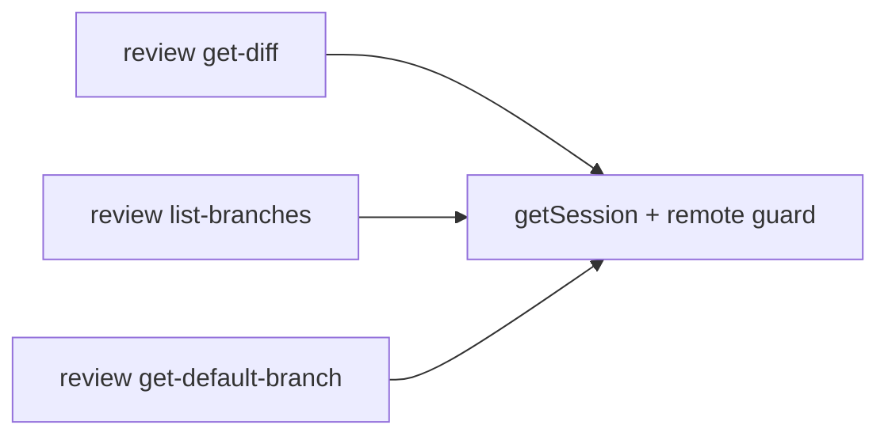

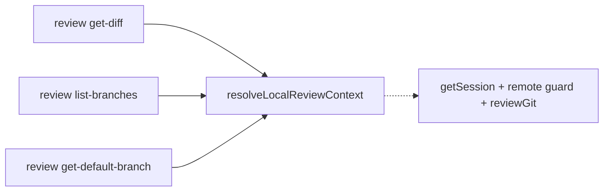

---

### create-broadcast-setting-store — a factory for broadcast-backed setting stores · Worth exploring · score 18/25

- **Files**: `src/renderer/stores/theme.ts` + `src/renderer/stores/animations.ts` + new factory. Estimate: ~3 files.
- **Score 18/25** — Leverage 3, Locality 5, Blast 2, Heat 3.
- **Problem** — the two stores are structurally identical: `loaded`, `mutationCount`, a module-level `broadcastListenerInstalled`, an `init()` with the same stale-reply race guard, a `set()`, a `toggle()`. `animations.ts:34` literally comments "Mirrors the theme store's race guard." The invariant lives in two hand-synced places.
- **Deletion test** — concentrates: delete one guard and it reappears in the other.
- **Solution** — `createBroadcastSetting<T>({ initial, apply, fetch, save, subscribe })`; theme and animations become ~10-line declarations, `animations` keeps `initFocusTracking` as an extra hook.

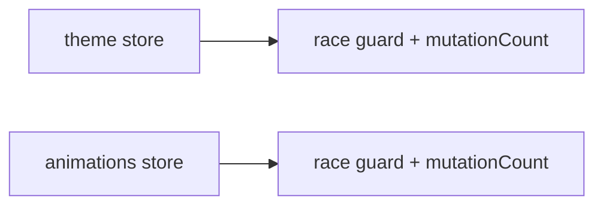

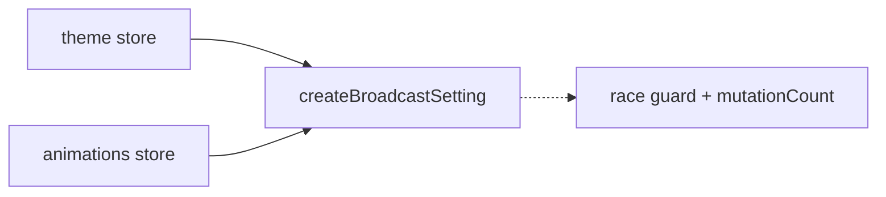

---

### git-runner-factories — factories owning the GitRunner adapter + timeout policy · Worth exploring · score 17/25

- **Files**: new `src/main/git-runner.ts` + `session-manager.ts`. Estimate: ~2 files.
- **Score 17/25** — Leverage 3, Locality 3, Blast 2, Heat 4.
- **Problem** — the local `execFileAsync('git', …)` and remote `expectRemoteOk(host, …)` `GitRunner` adapters are rebuilt inline ~6 times (`:782, :1077, :1998, :2140, :2211`), and their timeout policy is inconsistent — `5000` at `:179`, `30000` at `:1080/:2141`, and **no timeout** in `createPrSession`'s runner (`:1998-2001`), where a hung `git fetch` is unbounded.
- **Deletion test** — concentrates weakly for the adapters (short) but genuinely for the timeout policy (a correctness rule).
- **Solution** — `localGitRunner(projectPath, { timeoutMs })` / `remoteGitRunner(host, projectPath)` returning the shared `GitRunner` shape, with one timeout default.

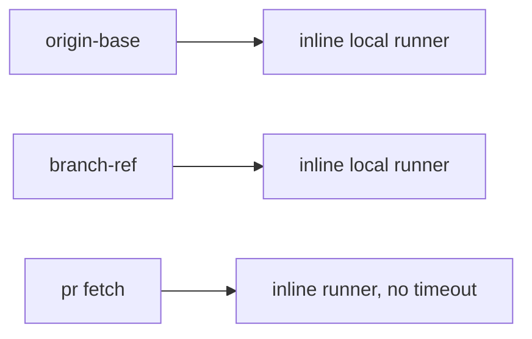

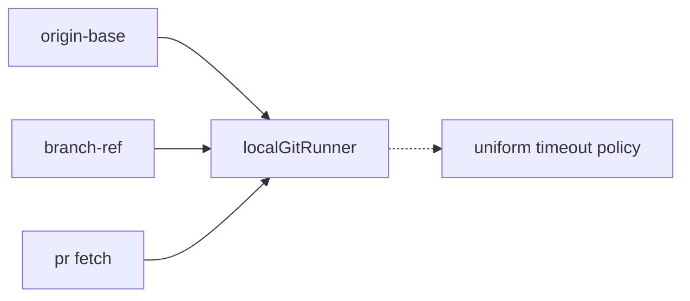

---

### single-owner-pr-metadata — collapse the duplicated PR-view parsing · Worth exploring · score 17/25

- **Files**: `src/main/github.ts:9-52` + `src/main/pr-worktree-planner.ts:12-58` + `session-manager.ts` import lines. Estimate: ~2 files.
- **Score 17/25** — Leverage 3, Locality 5, Blast 2, Heat 2.
- **Problem** — `PrViewInfo`, `PR_VIEW_FIELDS`, `forkFieldsFromPr`, `describePrLookupFailure` are defined **verbatim in two live modules**; a new `--json` field or a tweak to the "genuinely missing" regex must be edited in both or they drift.
- **Deletion test** — concentrates: re-export the planner's copy from `github.ts` ("the GitHub gateway") and the duplication collapses to one owner.
- **Solution** — `github.ts` owns the four symbols; the planner and `session-manager` import them.

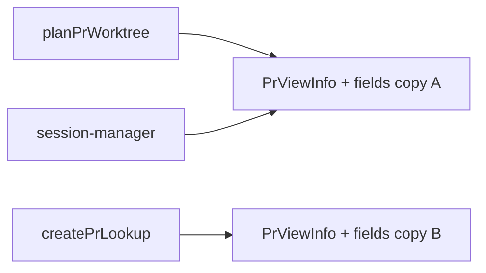

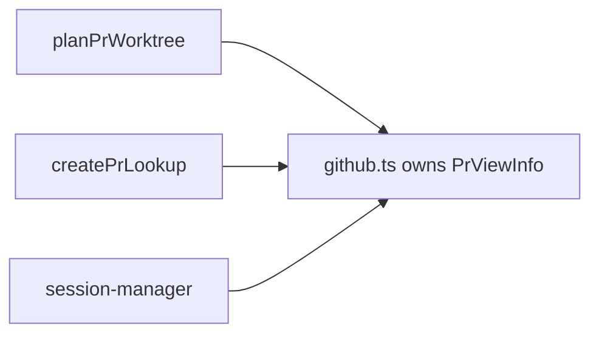

---

### unify-gh-query-dispatch — one gh dispatcher for local args + remote script · Worth exploring · score 16/25

- **Files**: `src/main/github-items.ts`. Estimate: ~1 file.
- **Score 16/25** — Leverage 3, Locality 4, Blast 1, Heat 1.
- **Problem** — every query (`getRepoChoices`, `listLocalOpenGhItems`/`listRemoteOpenGhItems`, `listRepoLabels`) writes the "resolve repo → `gh api` → parse → classify error" pipeline twice: once as `execFile` args, once as an inline `sh -c` heredoc (`:197, :289`). 3 ops × 2 branches = 6 near-duplicate bodies.
- **Deletion test** — concentrates: an internal `runGh(projectPath, hostId, spec)` owns probe + local/remote branch + error wrapping; each op declares only endpoint/jq/parser.
- **Solution** — `runGh(projectPath, hostId, { localArgs, remoteScript, parse })`. Caveat: a true 6→1 needs the remote script _generated_ from the same spec (shell-quoting jq); otherwise it is 6→2.

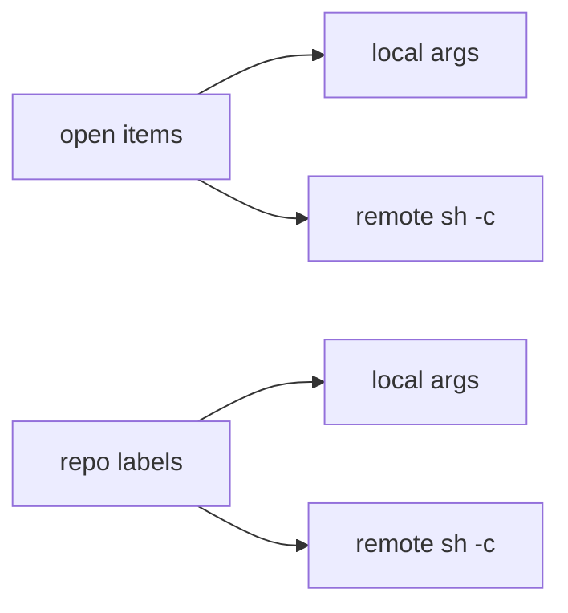

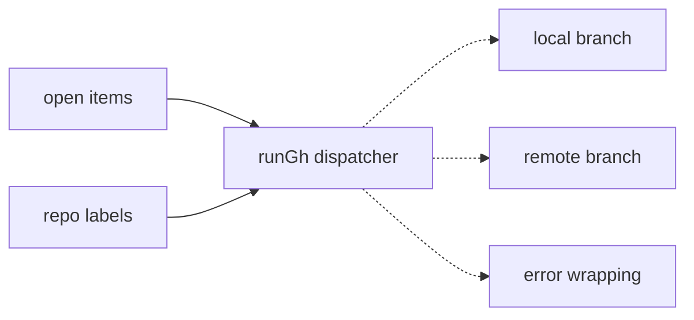

---

### hunk-key-value — a value for the review hunk key · Worth exploring · score 15/25

- **Files**: `src/renderer/stores/review.ts:31`, `src/renderer/utils/prompt-generator.ts:32`, `src/renderer/components/review/DiffViewer.tsx:12`, `src/renderer/components/ReviewOverlay.tsx:287`. Estimate: ~4 files + tests.
- **Score 15/25** — Leverage 3, Locality 3, Blast 3, Heat 3.
- **Problem** — primitive obsession: the composite key `` `${filePath}::${hunkIndex}` `` is built in three places and parsed by `.split('::')[0]` in a fourth; a path containing `::` breaks the reader, and the "index 0 is the path" invariant lives only in `ReviewOverlay`.
- **Deletion test** — concentrates: `hunkKey(filePath, i)` / `parseHunkKey(key)` gives the format one owner.
- **Solution** — a `hunkKey`/`parseHunkKey` pair (or a branded `HunkKey`) in a shared review util.

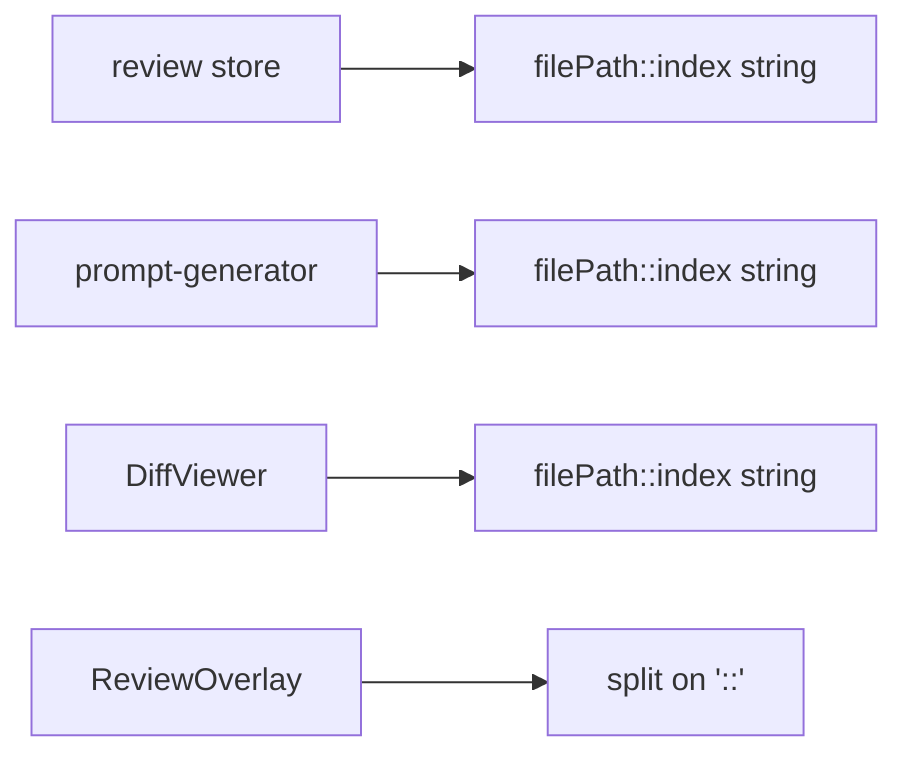

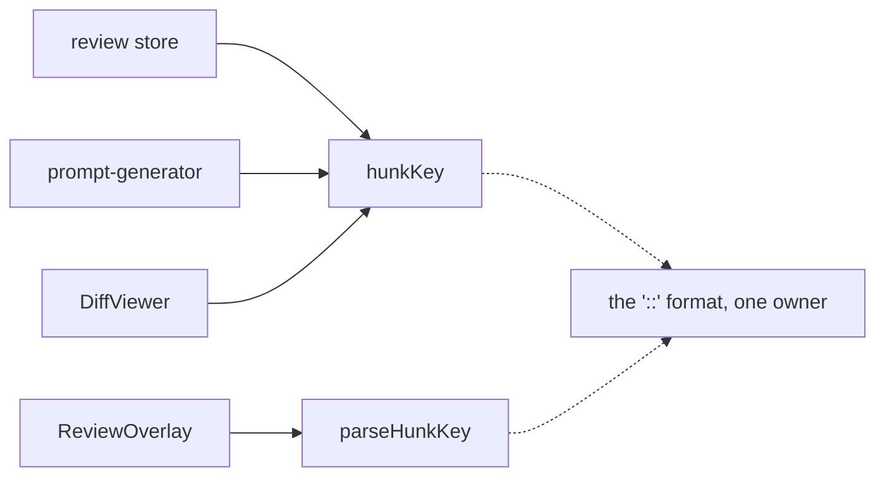

---

## Dropped

| Candidate                | Dropped because                                                                                                                                                                                                                                                                   |
| ------------------------ | --------------------------------------------------------------------------------------------------------------------------------------------------------------------------------------------------------------------------------------------------------------------------------- |
| `config-ipc-passthrough` | Leverage 1 — fails the deletion test. A `registerConfigChannel(name, field)` over the 13 `config:*` channels (`index.ts:643-721`) mostly _moves_ plumbing rather than concentrating behaviour; the only real behaviour is the broadcast in `save-theme`/`save-reduce-animations`. |
| `repo-ref-value-object`  | Published-interface change. A `RepoRef` value object over `owner/name` rewrites exported `src/shared/types.ts` fields and the preload IPC surface; the autonomy contract bars expanding a published interface unattended beyond what the pick requires.                           |
| `gh-string-error-union`  | Pervasive-convention migration. The `T \| string` value-or-error channel across `github-items.ts` (consumed via `typeof x !== 'string'` in `ProjectTree.tsx:38`) is a repo-wide convention; deepening it is a migration across many files, not a single seam.                     |

## Too large to automate

None. No surviving candidate scored blast radius 5. The two largest (`session-store`, blast 4; `repo-ref-value-object`) are recorded above — `session-store` as a scored candidate, `repo-ref-value-object` as dropped for touching a published interface.

## Pick

**`spawn-remote-agent-pipeline`, 23/25.** It is the clear top: the only candidate with leverage 5, in the hottest file in the repo, with internal-only blast radius. The runner-up **candidate** is `remote-reconnect-coordinator` (21/25) — a 2-point gap, so the pick is not close; the runner-up is the natural next firing, but it also partly depends on the `session-store` seam and so is better sequenced after it. The pick continues a deliberate, already-established arc of extract-a-deep-module refactors on `session-manager.ts` (#279, #280, #291), which is the strongest signal that this seam is both real and welcome.

Two design constraints are fixed before the design pass, from reading all five remote-spawn sites:

1. **Error mode is per-caller and published.** Three callers `throw` on a missing agent path, two `return` a string that flows out through `index.ts` → preload → renderer. Unifying it would change the IPC contract (blast 4). The primitive therefore receives an already-resolved `agentPath`; each caller keeps its own agent-path check, error mode, and exact message string. Both modes are pinned by tests before extraction.
2. **Revive is out of scope.** `reviveSession` (`:1587`) passes resume fields and has no branch-resolve; folding it in widens the interface. The seam is the four create/adopt paths.

## Design

_Filled in step 4 (design-it-twice + adjudication), after this report and the backlog were first committed._
