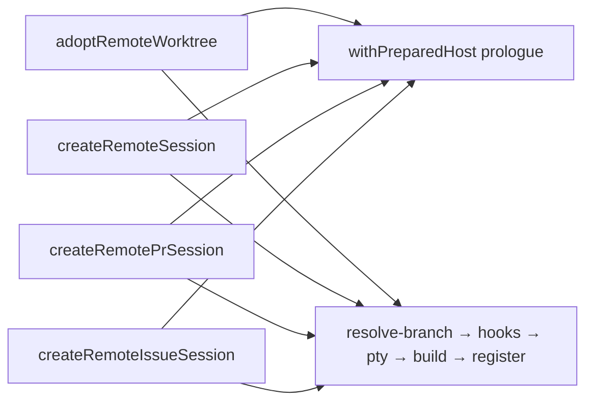
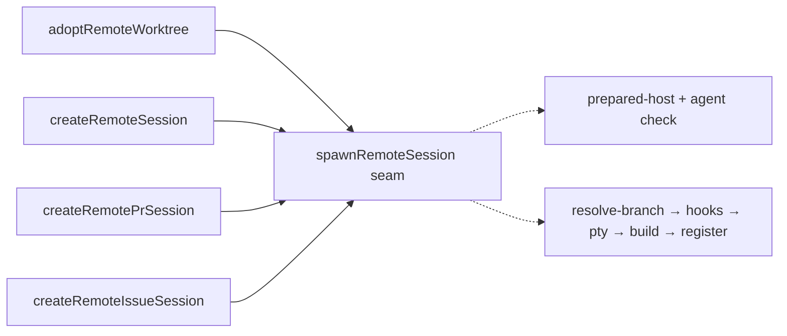
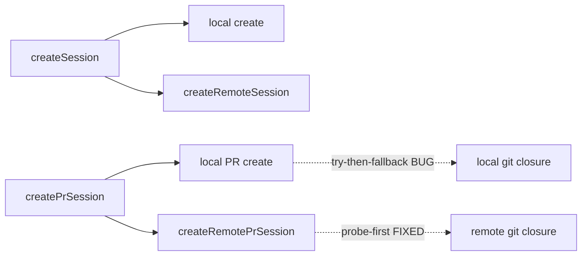
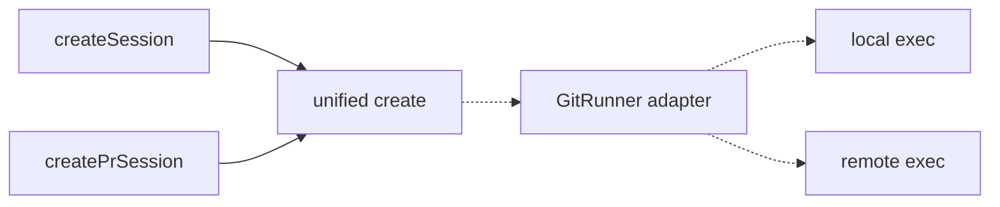
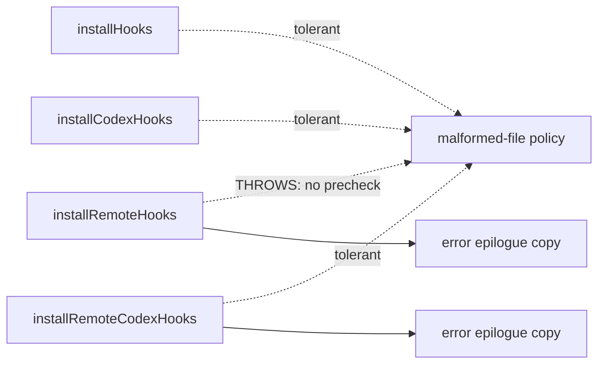
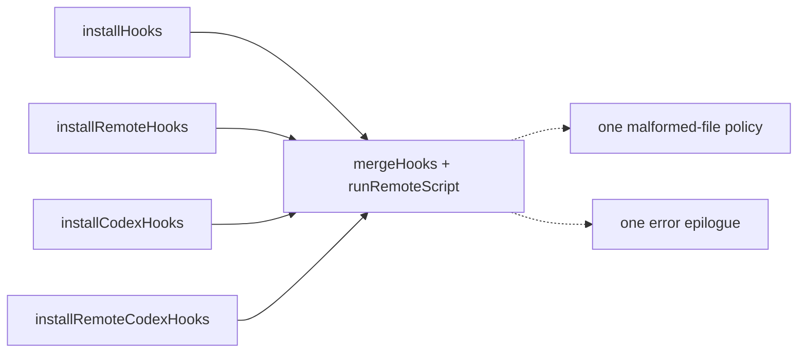

# Architecture review — pewpew — 2026-09-03

**Scope**: `src/main/` (the dominant hot spot — 155 of the last ~120 commits' file
touches land here), with special attention to `session-manager.ts` (2541 lines,
151 commits, the single most-churned module) and its remote-host collaborators.
Two parallel Explore sub-agents walked the code: one on the session-manager
cluster, one across the rest of `src/main`, `src/shared`, `src/preload`, and
`src/renderer/stores`.

**Picked**: `remote-spawn-epilogue` — see the PR and `.architecture/backlog.md`.

**Degradations**: none. `gh` is authenticated; sub-agents were available; all
delegated skills present.

> **Diagram convention**: solid edges are the module's _interface_ (what a caller
> wires up itself); dashed edges are _inside_ the implementation (hidden behind
> the seam). This replaces the upstream HTML legend.

This is the **first** run in this repo — there was no `.architecture/backlog.md`,
`CONTEXT.md`, or `docs/adr/` to reconcile against, so no candidate is excluded by
prior memory and no ADR is in play.

## Candidates

### `remote-spawn-epilogue` — collapse 4 copies of the remote session-spawn prologue/epilogue into one deep seam · Strong · score 22/25

- **Files**: `src/main/session-manager.ts` — `adoptRemoteWorktree` (:664–742),
  `createRemoteSession` (:744–884), `createRemotePrSession` (:893–1061),
  `createRemoteIssueSession` (:2177–2301). Seam consumers also include
  `reviveSession`'s remote branch (~:1540–1640). File-count estimate: **1** (all
  internal to `session-manager.ts`; a `+1` for its test file). No published
  interface changes — the public `createSession`/`createPrSession`/
  `createIssueSession` signatures are untouched.
- **Score**: **22/25**
  - **Leverage 4** — one seam pays back across the 4 remote-spawn functions (and
    `reviveSession`'s remote branch), and removes the drift class below. Not 5
    only because it is remote-side session birth, not every call site in the repo.
  - **Locality 4** — remote session birth (hook install → pty → build → register
    → broadcast) becomes a one-place edit. A future change to that sequence today
    means editing four functions in lock-step; afterwards, one.
  - **Blast radius 1** — single module, no published interface changes, ~1–2
    files. (Band description "no published interface changes" governs.)
  - **Heat 5** — `session-manager.ts` is the most-churned file in the repo (151
    commits), so this sequence keeps being edited and keeps drifting.
- **Problem**: The four functions that create a remote session are a **shallow,
  hand-duplicated family**. Each repeats the same _prologue_ —
  `getRequiredHost(hostId)` → `getRemoteProject(hostId, projectPath)` →
  `remoteHostRuntime.withPreparedHost(...)` with the identical six-field destructure
  `{ notifyScriptPath, guardScriptPath, ompHookScriptPath, remoteSocketPath,
sandboxAvailable, agentPaths }` → `agentPath = agentPaths[tool]` missing-agent
  check — and the same _epilogue_: `rev-parse --abbrev-ref HEAD` to resolve the
  branch → `installRemoteAgentHooks(...)` → `createRemotePty(id, worktreePath, host,
{...})` → `buildSession({...})` → `registerSpawnedSession(session)` →
  `onSessionsChanged()` → `return session`. Only the _middle_ varies: how the
  worktree comes to exist (already present / `worktree add -b` / PR fetch+checkout
  / issue create-or-adopt) and which extra `buildSession` fields result. The seam
  the local side already has (`createSessionForWorktree` → `adoptWorktree`) has no
  remote equivalent, so the epilogue is written out four times.
- **Deletion test — CONCENTRATES.** Delete the four inlined epilogues in favour of
  one seam and the complexity concentrates into a single remote-session-birth
  module; the callers shrink to "produce the worktree, hand me the branch + extra
  fields." Deleting the _seam_ (the counterfactual) would scatter that sequence
  back across every caller — the signal we want.
- **Evidence the copies have already drifted** (a shallow duplicated family is
  where bugs breed):
  - **Missing-agent contract is inconsistent**: `adoptRemoteWorktree` (:688) and
    `createRemoteSession` (:777) **throw**; `createRemotePrSession` (:954) and
    `createRemoteIssueSession` (:2204) **return a string**. Same check, two
    error contracts.
  - **Branch-fallback differs per copy**: `|| 'HEAD'` (:709), `|| branchName`
    (:845), `|| branch` (:1020, :2263).
  - Only `adoptRemoteWorktree` validates `--is-inside-work-tree` (:691–700); the
    create paths skip it (they legitimately just created the worktree — but the
    asymmetry is invisible until you read all four).
- **Solution**: Introduce a single deep seam that brackets the shared prologue and
  epilogue around a caller-supplied "produce the worktree" step. Each remote-create
  function passes a small closure that creates/locates the worktree and yields the
  resolved branch and any extra session fields; the seam owns the prepared-host
  lifecycle, the missing-agent contract, hook install, pty creation, and session
  build/register/broadcast. The exact interface is chosen in the **Design** section
  via design-it-twice.
- **Benefits**: **Leverage** — a caller learns one thing ("give me a worktree, get
  a registered session") instead of re-deriving the 7-step epilogue. **Locality** —
  the missing-agent contract and branch-fallback become single decisions rather than
  four that disagree. **Test surface** — the birth sequence can be exercised once,
  through the seam, with a stub worktree-producer, instead of standing up four
  near-identical `withPreparedHost` fixtures in `session-manager.test.ts`.

### `local-vs-remote-parallel-create` — converge the local/remote create families behind a shared git-runner · Worth exploring · score 21/25

- **Files**: `src/main/session-manager.ts` (all five `if (hostId) return <remote>`
  entrypoint forks) + a new git-runner module + `origin-base`/`pr-worktree-planner`
  touchpoints. File-count estimate: **4**.
- **Score**: **21/25** — Leverage 5 (every public create entrypoint splits into a
  local and a remote implementation; a shared `GitRunner` adapter collapses the 6
  inline git-runner closures at :191/:783/:2212 and :1077/:1996/:2138 and lets the
  two families converge); Locality 4; Blast radius 4 (five entrypoint pairs, a new
  module, crosses toward the `origin-base` seam — inverts to +2); Heat 5.
- **Problem**: The **same latent bug the remote side already fixed still lives on
  the local side.** Local `createPrSession` (:2074–2088) still uses try-then-fallback
  `worktree add`; the remote path's own comment (:983–986) says that shape was
  abandoned because "the fallback masked real failures … by surfacing the second
  attempt's misleading 'branch already exists' error," and the probe-first fix
  (:987–1006) landed on the remote side only. A second drift: the "serialize a
  remote-Codex batch" policy exists twice — the pure `shouldCreateSerially(...)`
  (:1954) and an inline `getConfig().defaultTool === 'codex'` in
  `mirrorAllRemoteWorktrees` (:587) — and they can disagree.
- **Deletion test — CONCENTRATES**, but multi-file and higher-risk. **This is the
  natural follow-on to `remote-spawn-epilogue`**: unify the remote family first
  (this run), then converge local↔remote behind the git-runner in a later PR. Not
  picked because its blast radius is 4× this run's and it would touch a partly-public
  seam a single unattended PR should not expand mid-flight.

### `hook-installer-remote-runner` — one remote-script seam + shared hook-merge, closing a live divergence · Strong · score 20/25

- **Files**: `src/main/hook-installer.ts` (whole file, 491 lines); may reuse
  `src/main/remote-command.ts`. File-count estimate: **1**.
- **Score**: **20/25** — Leverage 4 (collapses the remote-exec error epilogue,
  byte-identical 4× at :169–172/:248–251/:344–347/:486–489, the jq hook-merge
  program 2× at :159–165/:334–340, and the TS merge 2× at :133–136/:282–285, and
  makes one malformed-file policy); Locality 4; Blast radius 1 (single file, no
  published interface); Heat 3 (19 commits — actively but not heavily maintained).
- **Problem**: A **live behavioral divergence**. A malformed / non-object prior
  hooks file is handled three different ways across sibling installers:
  `installHooks` (local claude, :126–127) tolerates it via `parseAsObject → {}`
  and silently overwrites; `installRemoteCodexHooks` (:329) explicitly pre-checks
  `jq -e 'type == "object"'` and tolerates it (its comment says it is _mirroring
  the local installer's tolerance_); but `installRemoteHooks` (remote claude,
  :158–165) has **no** such precheck, so under `set -e` a malformed settings file
  makes `jq` abort and the install **hard-throws**. The fix was back-ported to
  codex-remote and never to claude-remote.
- **Deletion test — CONCENTRATES.** A `runRemoteScript(execRemote, argv, {timeoutMs,
label})` helper deletes the 4 error epilogues; a shared jq-merge constant deletes
  2; a shared `mergeHooks(existing, newHooks)` deletes 2 TS copies and forces one
  canonical malformed-file policy. The TS-vs-shell split is inherent (can't run TS
  on the remote) and stays; the within-local and within-remote duplication all
  collapses. **This is the distinct runner-up candidate** — self-contained, lowest
  blast radius, fixes a proven bug. It lost to the pick purely on heat.

### `pty-lifecycle-bimodal-dispatch` — push the local/remote split down into pty-manager · Worth exploring · score 18/25

- **Files**: `src/main/pty-manager.ts` + `src/main/session-manager.ts`. Estimate: **2**.
- **Score**: **18/25** — Leverage 3 (a `destroyPty(session)`/`reattachPty(session)`/
  `hasSession(session)` facade dispatching on `session.hostId` collapses ~5 bimodal
  sites: `killSession` :1169, `removeWorktree` :1713, `reviveSession` :1540, etc.);
  Locality 3; Blast radius 2; Heat 5. Partial concentrate — it moves the branch into
  pty-manager rather than eliminating it, so lower leverage than the pick.

### `github-items-gh-runner-seam` — one dispatch/probe/error/query seam for all gh calls · Worth exploring · score 18/25

- **Files**: `src/main/github-items.ts` (303 lines). Estimate: **1**.
- **Score**: **18/25** — Leverage 4 (a `runGh(projectPath, hostId, ghArgs, {errorLabel})`
  collapses the 3× remote probe prologue at :88/:182/:276, the 7× error epilogue,
  and makes `ghApiOpenItemsArgs` the single query source for both local and the
  hand-written remote shell strings, which currently have **no parity test**);
  Locality 4; Blast radius 1; **Heat 1** (2 commits, last touched 2026-07-10). YAGNI
  drops it down the ranking: the duplication is real but the code is cold, so a
  deepening pays back little.

### `index-session-ipc-handlers` — table-drive the session op IPC handlers · Worth exploring · score 17/25

- **Files**: `src/main/index.ts` (:490–573 single+batch, :596–641 review). Estimate: **1**.
- **Score**: **17/25** — Leverage 3, Locality 3, Blast radius 1, Heat 3. Genuine
  boilerplate reduction (a `singleOp`/`batchOp` op-table over 8 handlers, one
  `localSessionCwd` guard over 3 review handlers) but shallow — it removes repetition
  without hiding substantial implementation behind a new seam.

### `omp-notify-single-source` — de-duplicate the hand-synced omp hook bridge · Speculative · score 13/25

- **Files**: `hooks/omp-notify.ts` vs `src/main/host-bootstrap.ts:338–372`
  (`buildOmpHookScript`). Estimate: **2**.
- **Score**: **13/25** — Leverage 2, Locality 2, Blast radius 2, Heat 3. CLAUDE.md
  flags these as "kept in sync by hand," but they are **currently in sync** (verified
  line-for-line), and unifying risks _moving_ complexity into a template engine
  (the remote copy needs the path baked in and an electron-vite ESM-shim workaround).
  A parity test is the cheaper guard. Low priority.

### `session-queries-occupancy` — collapse the near-identical session predicates · Speculative · score 14/25

- **Files**: `src/main/session-queries.ts` (126 lines). Estimate: **1**.
- **Score**: **14/25** — Leverage 2, Locality 2, Blast radius 1, Heat 3. Six
  near-identical "loop sessions, filter by hostId + field" predicates, but each has
  genuinely different match rules; a shared builder mostly **moves** complexity
  rather than concentrating it. The real risk lives in _which predicate a call site
  picks_, not in the predicates — not a deepening.

## Dropped

No candidate tripped a hard filter (no leverage-1, no blast-radius-5, no ADR
conflict, nothing already in the backlog, everything test-coverable). Nothing to
drop.

## Too large to automate

None at blast radius 5. The closest is `local-vs-remote-parallel-create` (blast 4):
implementable, but its _full_ local↔remote convergence is better done as a short
series of PRs, with `remote-spawn-epilogue` (this run) as its safe first step.

## Pick

**`remote-spawn-epilogue` — 22/25.** It is the highest-scoring candidate, lands in
the single hottest file in the repo (heat 5 vs the runner-up's 3), is contained to
one module with no published-interface change (blast radius 1), and its deep form —
brackets a shared prologue/epilogue around a caller-supplied worktree-producer —
passes the deletion test cleanly.

The runner-up **candidate** is `hook-installer-remote-runner` (20/25), the distinct
next-best: self-contained, lowest blast radius, and it closes a proven bug. It lost
on heat alone (`hook-installer.ts` has 19 commits to `session-manager.ts`'s 151), so
it is the natural next firing. The two are within 2 points, so the pick was close on
score but decisive on the heat axis, which is exactly the axis YAGNI says should
break a near-tie: deepening pays off through _future_ change, and `session-manager.ts`
keeps changing.

Note the closely-related `local-vs-remote-parallel-create` (21/25) is a _superset_
of this pick, not a competitor — this run is its first, safest step.

## Design

_Filled in step 4, after this report was first committed._
