# Architecture review — pewpew — 2026-09-04

**Scope**: Hot spots from the last ~60 commits, weighted toward the actively-refactored session-launch subsystem — `src/main/session-manager.ts` (2541 lines, 151 commits, the repo's #1 hot file) and its recently-extracted cores (`agent-resumability.ts`, `worktree-adoption.ts`, `buildSession`), plus the local/remote transport twins and the three-agent (claude/codex/omp) branching that threads through `pty-manager.ts`, `hook-installer.ts`, and `host-bootstrap.ts`.
**Picked**: `session-manager-spawn-reattach-seam` — **blocked, not implemented this firing** (see _Pick_). See `.architecture/backlog.md`.
**Degradations**: The `.architecture/` backlog memory does not exist on `origin/main`: prior firings' PRs (#300, #301) that would land it are still open, so their branch-local backlogs never merged. This firing reconciled by direct `gh` inspection instead of from a persisted backlog, and seeds the first `.architecture/backlog.md` on its own branch. Sub-agent exploration used; no design pass ran (bailed at step 2, before step 4).

**Diagram convention**: solid edges are the module's interface (what a caller wires up); dashed edges are inside the implementation, hidden behind the seam.

## Candidates

### session-manager-spawn-reattach-seam — one seam for "resume-or-spawn an agent into a session" · Strong · score 22/25

- **Files** — `src/main/session-manager.ts:1614-1641` (revive local), `:1555-1597` (revive remote), `:1660-1689` (attachLocalSession). Estimate: ~4 files (session-manager.ts, a new `src/main/agent-spawn.ts` + its test, session-manager.test.ts), following the repo's established "extract a core + its own test" convention (`agent-resumability.ts`, `worktree-adoption.ts`).
- **Score** — 22/25
  - Leverage 4 — three call sites re-assemble the identical reattach-or-resume decision by hand; the two local sites (`:1615-1639`, `:1661-1689`) are byte-for-byte identical bar their hook-error policy, and the remote site is the same shape in remote primitives.
  - Locality 4 — a resume/spawn bug today must be fixed in three places; `agent-resumability.ts:3-6` records exactly such a drift (the remote branch once hardcoded `--continue` and collapsed freshly-mirrored panes). After, the decision lives in one module.
  - Blast radius 1 — contained to `session-manager.ts` and a new sibling module; no `src/preload` IPC contract, wire format, or CLI surface is touched (description wins over the ~4-file count).
  - Heat 5 — `session-manager.ts` is the #1 hot file (151 commits) and these exact paths were edited by #279/#280/#287/#291.
- **Problem** — _Interface as complex as implementation; caller reaches past the seam._ Each of the three paths open-codes `hasTmux ? reattach : (canResume → warn-if-not → guarded hook reinstall → createPty{continueSession, tool, agentSessionId, projectPath})`. The pure cores (`canResumeLocal`/`canResumeRemote`, `buildSession`) are extracted and tested, but the orchestration _around_ them — the resume decision, the warn log, the existence-guarded hook reinstall, the createPty option shape — is copied, so the seam leaks.
- **Deletion test** — Concentrates. Deleting the ad-hoc orchestration and routing all three callers through one `resumeOrSpawn` seam pulls the decision into a single tested place rather than pushing it back onto callers.
- **Solution** — A `resumeOrSpawnAgent(session, transport, { onHookError })` seam: `transport` is `local | { host, prepared }`; it decides reattach vs resume-vs-fresh, reinstalls hooks under the right existence guard, and calls the matching `createPty`/`createRemotePty`. The one real asymmetry (`:1670-1677`: attach _swallows_ a hook-install failure, revive _propagates_ it) becomes the `onHookError` flag, not duplicated structure.
- **Benefits** — Leverage: revive/attach/reconnect collapse to a few lines each. Locality: the next resume-vs-fresh drift is a one-file fix. Test surface: the decision is exercised through one interface with a mock transport, instead of re-asserting `reattachPtyCalls`/`hasTmuxSessionIds` per caller (`session-manager.test.ts:1630,1736,1903`).

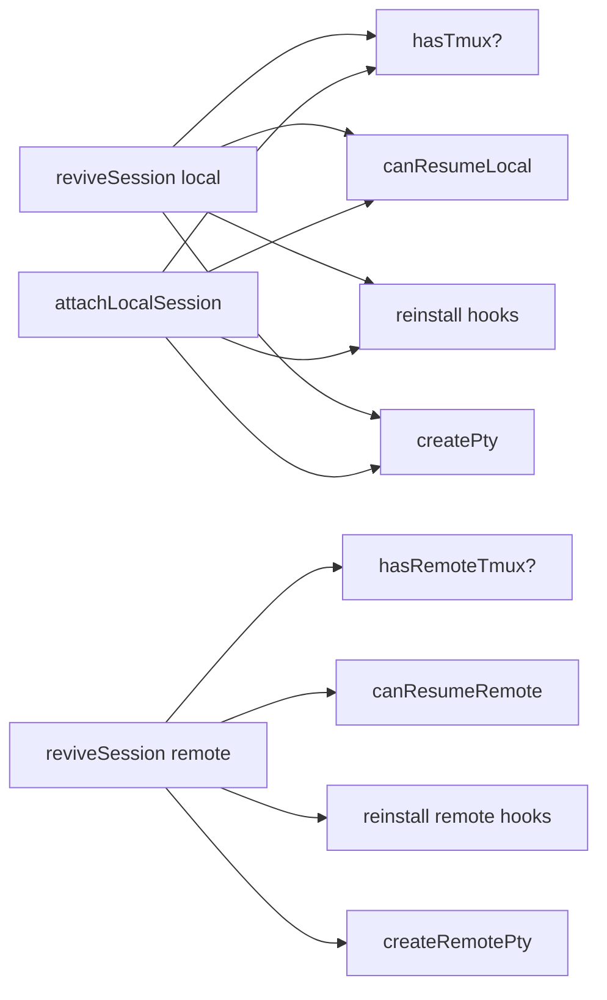

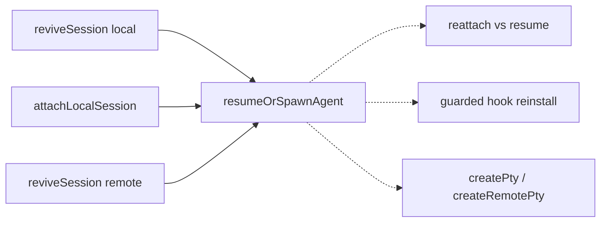

### local-remote-git-twins-exec-adapter — every git op written twice, once per transport · Worth exploring · score 20/25

- **Files** — `branchExists` `src/main/session-manager.ts:177` vs `remoteBranchExists:184`; local `worktree add` `:1105-1116` vs remote `:795-835`; `isGitWorktree:385` vs remote probe `:698`. Estimate ~3 files (session-manager.ts, worktree-adoption.ts, its test).
- **Score** — 20/25
  - Leverage 4 — the same git argv is authored twice, differing only in `execFileAsync` vs `expectRemoteOk(host, …)`; a `GitExec` adapter collapses the twins.
  - Locality 3 — argv strings would live once; behaviour still spans the two transports.
  - Blast radius 1 — contained to session-manager.ts and worktree-adoption.ts; no published interface.
  - Heat 4 — both create paths are hot (session-manager.ts, 151 commits), though `worktree-adoption.ts` itself is new (1 commit).
- **Problem** — _Two parallel implementations that drift._ `worktree-adoption.ts` already extracts the create-or-adopt protocol but takes three argv-building closures both local and remote callers re-supply — the core is extracted, the argv orchestration is still duplicated per transport.
- **Deletion test** — Concentrates. `interface GitExec { run(argv): Promise<Result> }` with two adapters (execFile, ssh) lets the protocol own the argv; two real adapters = a real seam.
- **Solution** — `createOrAdoptWorktree(git, {projectPath, worktreePath, branch})` builds argv once; local and remote pass a `GitExec`.
- **Benefits** — Leverage across both create paths; a git-flag fix stops being a two-edit change. Test surface: exercise the protocol against a fake `GitExec`.

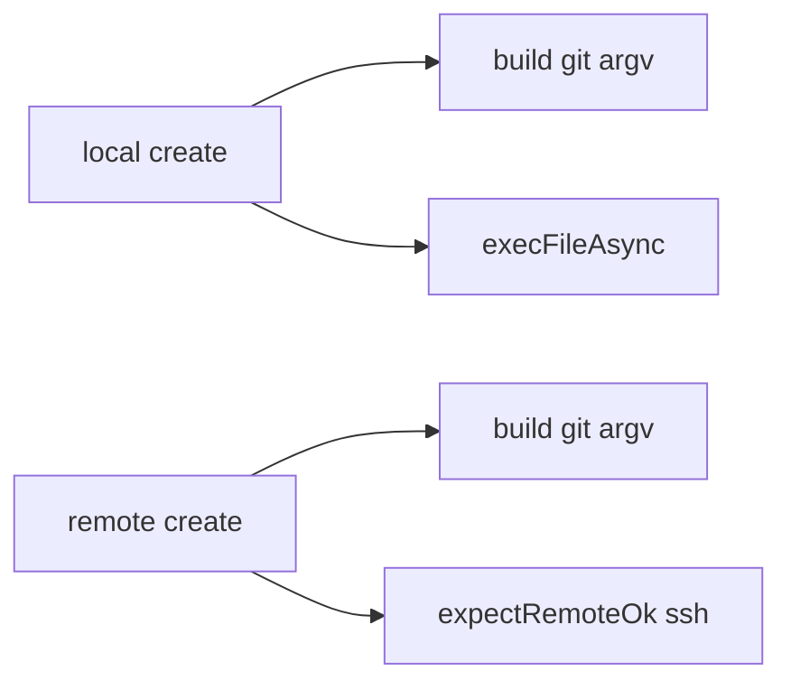

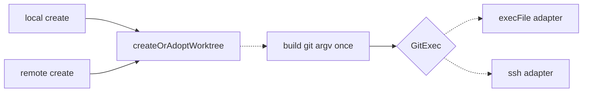

### agent-state-path-prefixes-centralize — finish what commit fccb2ca started · Worth exploring · score 18/25

- **Files** — `.claude/projects` ×3 and `.omp/agent/sessions` ×4 across `pty-manager.ts:250-256`, `remote-agent-state.ts:19-21`, `agent-resumability.ts:54,66,115,134`. Estimate ~3-4 files.
- **Score** — 18/25: leverage 3 (small, mechanical), locality 4 (a change that today edits several files becomes one), blast radius 1 (contained, no published interface), heat 3 (pty-manager.ts hot at 42, the others cold).
- **Problem** — _Repeated prologue / two encodings of one policy._ `fccb2ca` centralized the dir-name _encoding_ into `agent-state-paths.ts`; the _prefix_ it hangs off is still copy-pasted, and split across TS-fs and POSIX-shell forms that can drift (the claude probe reads `$HOME`, the omp probe reads `$h`, `agent-resumability.ts:115,134`).
- **Deletion test** — Concentrates cleanly; a natural sub-step of the profile table.
- **Solution** — Export `claudeProjectsDir(worktree)` / `ompSessionsDir(worktree)` and their shell analogues from `agent-state-paths.ts`; callers stop concatenating literals.
- **Benefits** — Locality: the state-dir layout lives in one module. Test surface: one place to assert the encoded path.

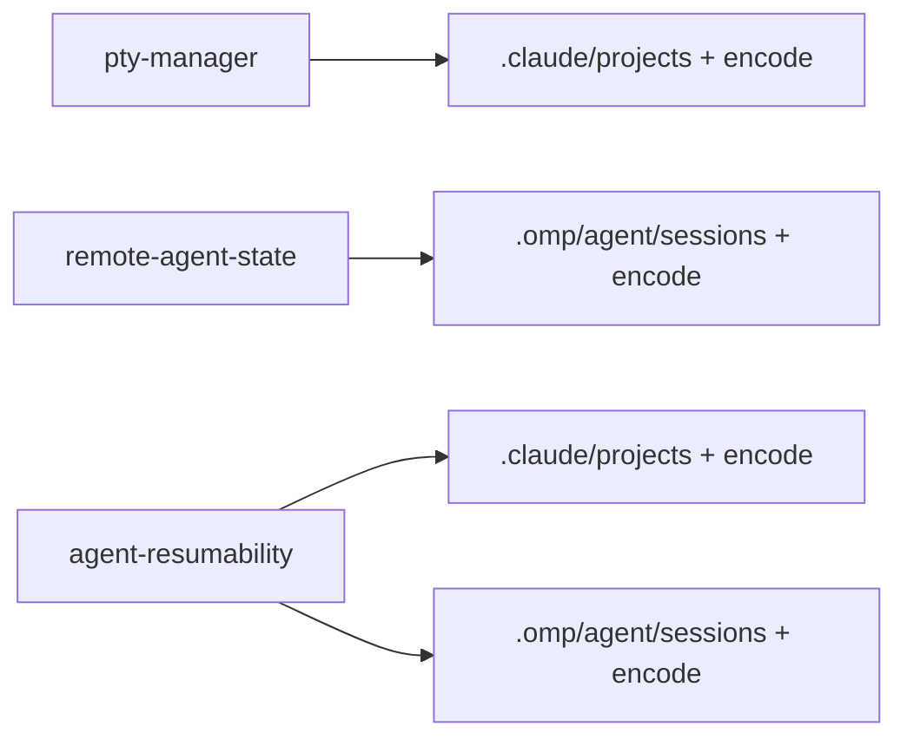

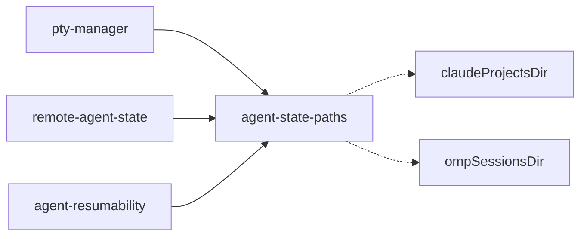

### agent-profile-table — data-only table so a tool stops being scattered switches · Worth exploring (north-star) · score 18/25

- **Files** — nine `if (tool === …)` sites: argv+resume flag `pty-manager.ts:65-83`, local state dir `:245-257`, remote state dir `remote-agent-state.ts:17-22`, resume source `agent-resumability.ts:30-39`, local/remote hooks `session-manager.ts:444,593`, serial-create rule `numbered-session-plan.ts:53`, agentSessionId capture `session-state-machine.ts:48`, omp bridge `host-bootstrap.ts:12,338`. Estimate ~9 files.
- **Score** — 18/25: leverage 4 (reasoning about a tool stops requiring a nine-file sweep), locality 3, blast radius 3 (9 files, one signature repo-wide), heat 4.
- **Problem** — _Understanding-requires-bouncing._ Adding or reasoning about a tool touches nine independent switches.
- **Deletion test** — Partial, and only safe if rows stay **data** (`{nonInteractiveFlags, stateDirPrefix, resumeSource, embedsWorktreePath, serialOnRemote, capturesSessionId}`). A table that carried _behaviour_ (installer fns) would be as wide as what it replaces — that would fail the depth criterion.
- **Solution** — `AGENT_PROFILES: Record<AgentTool, AgentProfile>` of flags/prefixes; each switch becomes a field read, keeping exhaustive-switch safety.
- **Benefits** — Leverage and locality across the whole agent-tool surface. Best approached incrementally via the three candidates above, not as one big-bang PR.

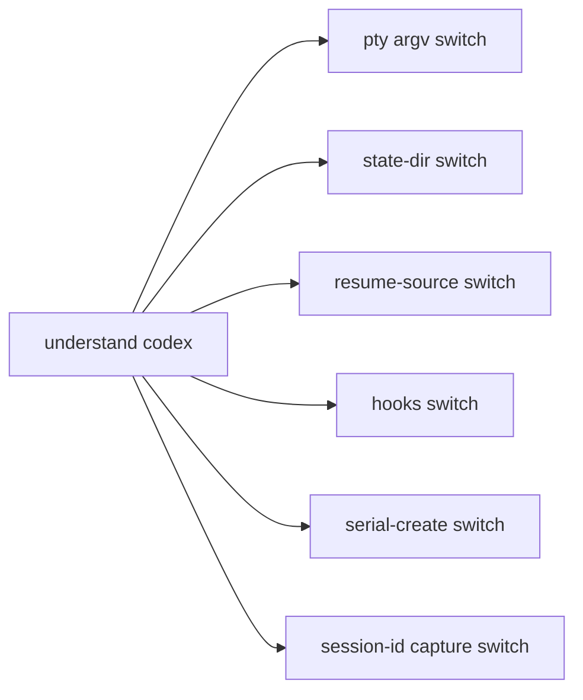

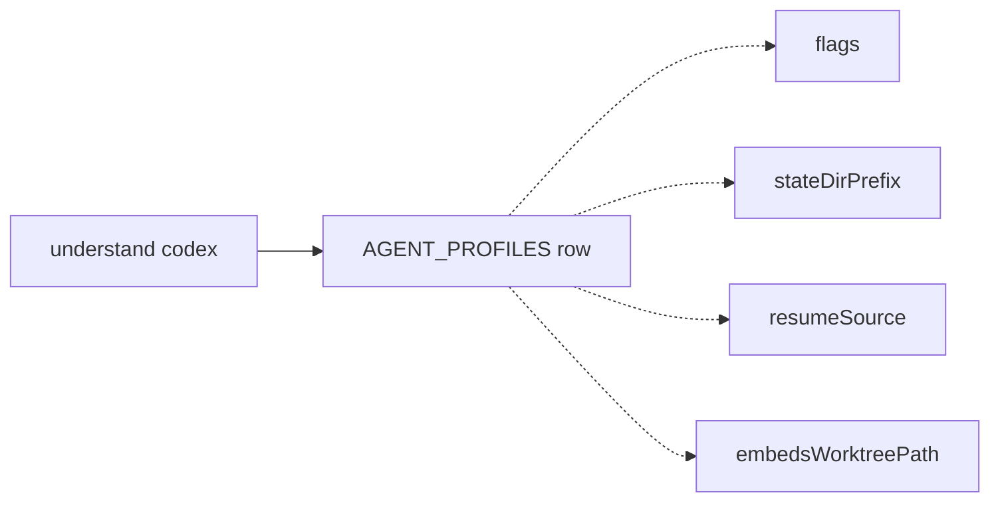

### agent-hook-install-two-seams — hook install is a per-tool switch written three times · Worth exploring · score 16/25

- **Files** — `installAgentHooks` `src/main/session-manager.ts:444-462`, `installRemoteAgentHooks:593-620`, and the past-the-seam claude-only call at `relocateProject:2381`. Estimate ~2-3 files.
- **Score** — 16/25: leverage 3, locality 3, blast radius 2 (session-manager.ts, hook-installer.ts + tests), heat 3.
- **Problem** — _Repeated prologue + caller reaches past seam._ The two installers share an identical codex/omp/claude branch structure, and `relocateProject:2381` bypasses both to call `installHooks` directly under `s.tool === 'claude'` — deliberate (only claude's guard hook bakes the worktree root into an argv literal) but it leaks "which tool's hooks embed the worktree path" out of `hook-installer.ts` into a session-manager call site.
- **Deletion test** — Concentrates. One `installHooks(tool, target, {reason})` absorbs both switches; a `hooksEmbedWorktreePath(tool)` predicate exported from `hook-installer.ts` removes the leaked knowledge.
- **Solution** — Fold local/remote installers into one dispatcher over a transport adapter (shared with the git-twins candidate); expose the relocation-reinstall fact as a predicate.
- **Benefits** — Locality of per-tool hook policy; the leaked fact returns to its module.

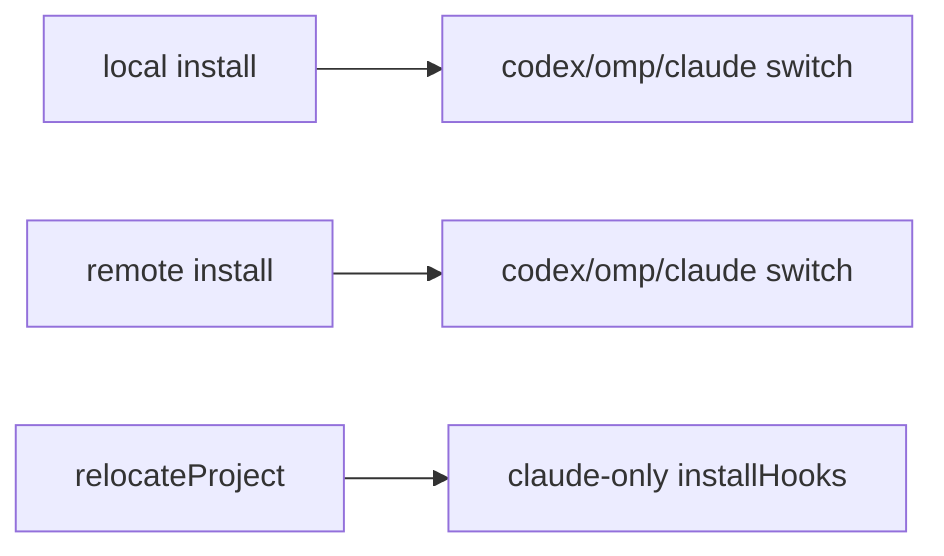

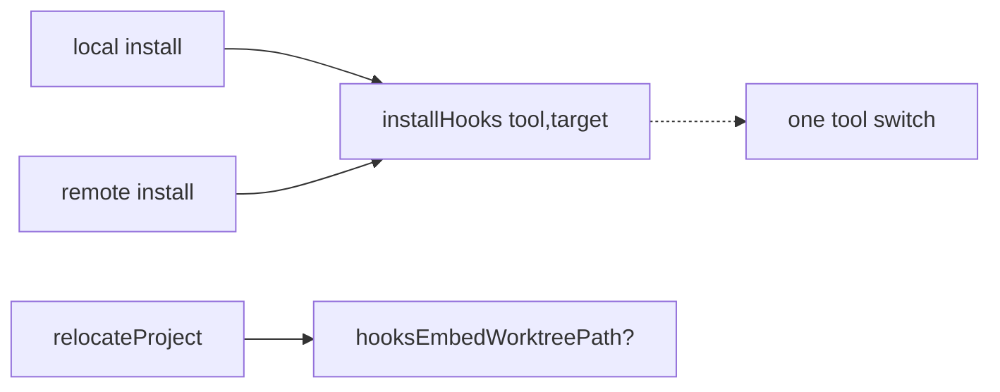

### omp-hook-bridge-hand-sync-drift — the CLAUDE.md-flagged manual copy · Worth exploring · score 16/25

- **Files** — `src/main/host-bootstrap.ts:338-372` (`buildOmpHookScript`) hand-duplicates `hooks/omp-notify.ts:77-102`; both carry a "MANUAL SYNC CHECKLIST". Estimate ~2-3 files.
- **Score** — 16/25: leverage 3, locality 3, blast radius 2 (touches the omp `--hook` script contract, preserved not changed), heat 3.
- **Problem** — _Hand-synced drift._ Four handlers, the timeout, and the `notify()` payload shape live in two files edited in lockstep; the test guards the signature but not the handler bodies, so a payload change can silently diverge.
- **Deletion test** — _Derive, not delete._ Naively deleting one copy would move complexity into a runtime file-read the single-round-trip remote install can't do. Import the canonical text at build time (`import ompNotify from '../../hooks/omp-notify.ts?raw'`) and substitute the `NOTIFY_SCRIPT` line, so both consumers come from one source.
- **Solution** — One template, two consumers: local file used directly; remote install = same text with the resolved remote path substituted.
- **Benefits** — Locality: the bridge logic has one home. Removes a documented hand-sync hazard.

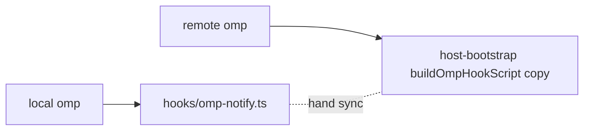

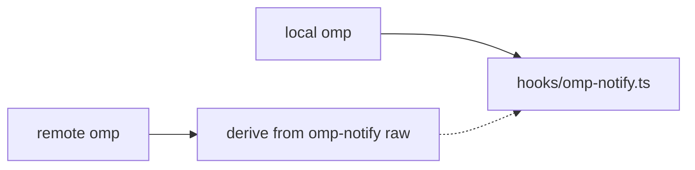

### ssh-base-argv-prologue — collapse the repeated ssh -o prologue · Speculative · score 14/25

- **Files** — `host-connection.ts:268-282,294-297,354-356,496-499,602-627` (7 sites). Estimate ~1-2 files.
- **Score** — 14/25: leverage 2 (readability/consistency, not depth), locality 3, blast radius 1, heat 2 (the prologue itself is stable).
- **Problem** — _Repeated prologue._ Every ssh invocation re-lists the same `-o` flags; only the master connection (`:268-282`) legitimately diverges with `ControlMaster=yes`.
- **Deletion test** — Concentrates, but low value — a consistency win, not a depth win.
- **Solution** — `sshBaseArgv(runtime, {master?})` returning the shared `-o` array; call sites spread it.
- **Benefits** — Minor locality; one place to change ssh options.

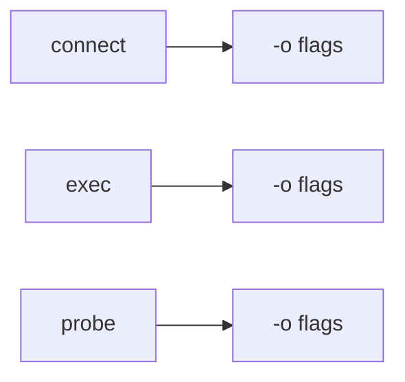

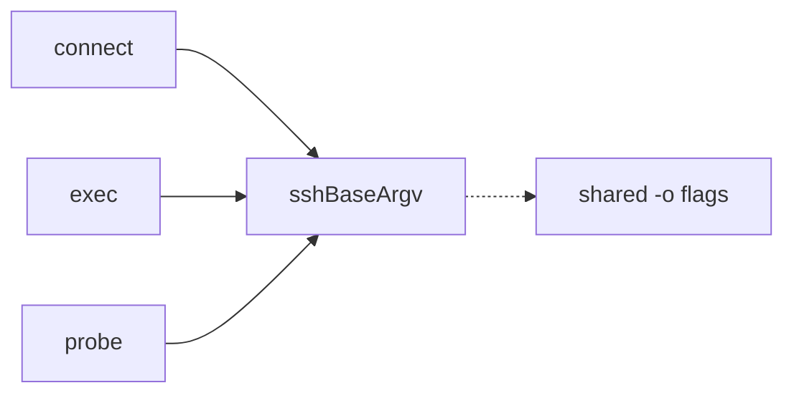

## Dropped

| Candidate                             | Dropped because                                                                                                                                                                                                                                                                                                                                        |
| ------------------------------------- | ------------------------------------------------------------------------------------------------------------------------------------------------------------------------------------------------------------------------------------------------------------------------------------------------------------------------------------------------------ |
| `session-manager-spawn-reattach-seam` | Overlaps in-flight architecture PRs #300 and #301 (the remote-spawn family in the same file). The pick's remote branch (`:1555-1597`) sits inside the code #300/#301 rewrite; a third PR here would conflict and be unreviewable. Reversible — the reattach-or-resume (local) remainder can be reconsidered once #300/#301 merge and the file settles. |

## Too large to automate

None. The largest candidate (`agent-profile-table`, blast radius 3) is still one-PR-sized if kept data-only, but is better approached incrementally through the smaller candidates.

## Pick

Top-ranked: **`session-manager-spawn-reattach-seam` (22/25)**. Runner-up **candidate**: `local-remote-git-twins-exec-adapter` (20/25) — a clear 2-point gap, not a close call.

**This firing implements nothing and opens no PR.** The pick is blocked by the one-architecture-PR-at-a-time rule, triggered twice over:

- **PR #300** (`refactor(session-manager): extract remote agent spawn tail into a deep module`, branch `sym/pewpew/routine/refactor-audit/01M1FK9R13`, OPEN/MERGEABLE, opened 2026-09-01) extracts `remote-agent-spawn.ts` from the remote spawn tail.
- **PR #301** (`refactor(session-manager): collapse the 4 remote-spawn copies into one deep seam`, branch `sym/pewpew/routine/refactor-audit/01M1J5Q8D9`, OPEN/MERGEABLE, opened 2026-09-02) collapses the four remote session-creation functions.

Both are prior firings of this same `pm-deepen` refactor-audit routine, both are still open and unmerged, and both refactor exactly the remote-spawn family that the top candidate's remote branch lives in. They also overlap **each other** (both rewrite the same four functions), so they cannot both merge cleanly. Adding a third concurrent architecture PR against the same file — even the local reattach-or-resume half — would be unreviewable and would conflict on merge. Per the autonomy contract, the run stops here, records the memory, and leaves the two open PRs for a human to land or close before the next firing proceeds.

The runner-up candidate `local-remote-git-twins-exec-adapter`, and the cooler independents (`agent-state-path-prefixes-centralize`, `omp-hook-bridge-hand-sync-drift`, `ssh-base-argv-prologue`) touch different subsystems and would not conflict on merge, but the same one-PR-at-a-time reviewer-bandwidth rule blocks them too while #300/#301 are open. They are recorded `proposed` for a future firing.

## Design

No design pass ran. The firing bailed at step 2 (reconcile/pick) because the top candidate is blocked by open PRs #300/#301; step 4 (design-it-twice) was not reached.
