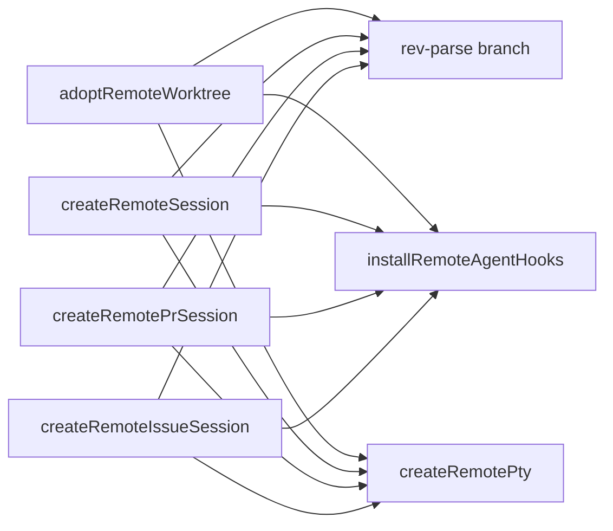
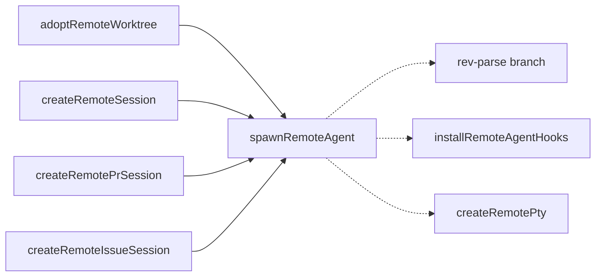

# Architecture review — pewpew — 2026-09-10

**Scope**: Full main-process + renderer scan, weighted to git hot spots. `session-manager.ts` (92 touches / last 200 commits, 2541 LOC), `index.ts` (37), `pty-manager.ts` (26), `ProjectTree.tsx` (26) dominated the heat map, so the scan started there and widened.
**Picked**: `remote-agent-spawn-seam` (22/25) — **but not implemented**: it is already in flight via PR #300 and PR #301. See the Pick section and `.architecture/backlog.md`.
**Degradations**: none. `gh` authenticated; sub-agents available (3 parallel exploration agents ran).
**Diagram convention**: solid edges are the interface a caller sees; dashed edges are inside a module's implementation.

This is a **bailed run**. The deterministic rubric selected the top candidate, but reconciliation against `gh` found the identical refactor open in two prior PRs. The one-architecture-PR-at-a-time rule ([autonomy-contract.md]) forbids a third concurrent PR, so no design pass, no implementation, and no new PR followed. The full scored slate is preserved below and in the backlog so the next firing has memory the unmerged PRs otherwise deny it.

## Candidates

### remote-agent-spawn-seam — collapse the 4 remote-spawn copies into one deep seam · Strong · score 22/25

- **Files**: `src/main/session-manager.ts` — `adoptRemoteWorktree` :676-722, `createRemoteSession` :766-864, `createRemotePrSession` :908-1060, `createRemoteIssueSession` :2192-2300, partial `reviveSession` :1545-1599. Estimate ~2 files (impl + test).
- **Score** 22/25:
  - **Leverage 4** — four call sites simplify and a leaky 6-field lease destructure collapses; also fixes real drift.
  - **Locality 4** — remote-spawn behaviour (branch resolution, hook install, pty creation) concentrates in one seam.
  - **Blast radius 1** — one module, no exported/wire/IPC interface touched (verified: `session-manager.test.ts` mocks `pty-manager`/`hook-installer`/`host-connection` at the module boundary and asserts on observable effects, not helper ordering).
  - **Heat 5** — hottest file in the repo.
- **Problem**: Every remote creator opens `remoteHostRuntime.withPreparedHost(...)` and destructures 6 lease fields, then repeats a verbatim prologue (`agentPaths[tool]` → not-installed error) and a 3-step epilogue: `rev-parse --abbrev-ref HEAD || fallback` (4× verbatim), `installRemoteAgentHooks(...)` (4×), `createRemotePty(id, worktreePath, host, {...})` (4×). Callers reach into the prepared-host object purely to re-thread 5 of its 6 fields onward — a leaky, shallow seam. The duplication has already drifted: `adoptRemoteWorktree`/`createRemoteSession` **throw** the not-installed error while `createRemotePrSession`/`createRemoteIssueSession` **return it as a string**; and the first pair build the `Session` outside the lease while the second pair build it inside.
- **Deletion test**: Passes. A `spawnRemoteAgent(prepared, {...}) → { branch, sandboxed }` seam concentrates agent-path resolution, branch resolution, hook install and pty creation in one verified place; deleting it re-scatters all three epilogue steps back across four creators. Complexity concentrates, not moves.
- **Solution**: One internal seam taking the whole prepared-host object plus `{ host, id, worktreePath, tool, projectPath, fallbackBranch }`, doing the epilogue (and optionally the prologue with one unified error contract). `reviveSession`'s remote branch (hooks + pty, no rev-parse) can reuse a `resume` variant.
- **Benefits**: Leverage — 4 creators shrink to "prepare → make-worktree → spawnRemoteAgent → buildSession". Locality — one contract for "launch the agent on a remote worktree". Test surface — the unified error/branch behaviour becomes assertable through one seam under the existing module-boundary mocks.

### git-runner-factory-pair — two GitRunner factories for the 7 inline git closures · Strong · score 21/25 (runner-up candidate)

- **Files**: `src/main/session-manager.ts` (:179, :191, :782-787, :1077-1082, :1997-2001, :2138-2145, :2211-2217), optionally `src/main/origin-base.ts`. ~1–2 files.
- **Score** 21/25 (leverage 4, locality 3, blast radius 1, heat 5).
- **Problem**: `GitRunner` already exists and is consumed by `resolveOriginDefaultBase`/`branchRefExists`, but its two adapters (local `execFileAsync`, remote `expectRemoteOk`) are hand-inlined seven times. Seven copies of a one-adapter shape is a real seam left un-extracted. Local copies also disagree on timeout (5000 / 30000 / none).
- **Deletion test**: Passes — `localGitRunner`/`remoteGitRunner` concentrate git transport into two spots.
- **Solution**: Two factory functions returning `GitRunner`, with an optional `timeoutMs`. Lowest-risk candidate; enables `unified-worktree-at-base`.

### unified-worktree-at-base · Worth exploring · score 21/25

Four creators build the same `createOrAdoptWorktree` triple, differing only by transport (see `git-runner-factory-pair`). Also surfaces a contradiction the code already documents: try-then-fallback (used in `createSession`/`createRemoteSession`) vs the probe-first pattern `createRemotePrSession` adopted after try-then-fallback "masked real failures". Depends on `git-runner-factory-pair`; carries a behaviour decision so needs a pinning test. Blast radius 2.

### session-open-summary · Strong · score 21/25

Pure `(OpenSessionsSummary) => string` formatters trapped as closures in the 1196-line `ProjectTree.tsx` (:328-370), plus a copy-pasted mirror epilogue (:585-590 ≡ :662-667). Extract to `src/renderer/utils/session-open-summary.ts`, following the tested `resolveBulkPrDialogDefaults` precedent. Blast radius 1, very testable.

### exec-target-seam · Worth exploring · score 21/25

Highest raw leverage (leverage 5, locality 5): the `(argv, opts) => Promise<ExecResult>` shape is redeclared ~11× with only a remote adapter — a hypothetical seam. Two adapters (`remoteTarget`/`localTarget`) would collapse paired git/tmux helpers across `pty-manager.ts`, `remote-thumbnail.ts`, etc. But blast radius 4: touches exported (non-wire) types across the main tier and forces `createPty` sync→async. Depends on `ssh-invoke-and-exec-result-helpers`. Not a good unattended first pick.

### ssh-invoke-and-exec-result-helpers · Worth exploring · score 20/25

Grows the shallow 25-line `remote-command.ts` into a deep home for `execFailureDetail` (the `stderr||stdout||exit N` idiom, 10×) and `isSshTransportFailure` (the `classifySshExit` 4-reason check, 3×), plus a private `buildSshArgv` in `host-connection.ts` (~6×). Tractable first slice and prerequisite for `exec-target-seam`. Blast radius 2.

### canvas-geometry · Strong · score 20/25

The zoom/pan re-anchor invariant is duplicated 3× in `SessionCanvas.tsx` (:244-252, :281-299, :388-391) with a "keep in sync" comment, reachable only through a real DOM. Extract a pure `src/renderer/utils/canvas-geometry.ts`. Truest shallow→deep transform and cleanest test-first target — but heat 2 (SessionCanvas is cold).

### coalesce-adoption-seam · Worth exploring · score 19/25

`createSessionForWorktree` (:411-442) and `createRemoteSessionForWorktree` (:629-662) run a near-verbatim ~30-line in-flight-dedup dance (identical mismatch error string). Extract `coalesceAdoption(map, key, tool, existing, run)`. Blast radius 1.

### hunk-annotations · Worth exploring · score 18/25

The `"path::index"` hunk-key contract is duplicated (`getHunkKey` in two modules), parsed ad hoc (`.split('::')`), and the rejected>commented>approved severity rule copy-pasted across three files. One module owning key + severity. Touches an exported interface, blast radius 2, heat 2.

### host-lifecycle-cascade · Worth exploring · score 18/25

`hosts:delete` (`index.ts` :772-780) owns a load-bearing 7-module teardown cascade; `host-registry.deleteHost` is only the trivial last step. Extract `forgetHost`/`retargetHost`. Genuine leaky seam, only 2 call sites.

### detail-pane-view · Speculative · score 16/25

`(status, connectionState)` decoded into ~8 overlapping booleans in `DetailPane.tsx` (:17-28) re-branched in JSX. Extract `deriveDetailView(session) => { mode, reason }`. Weakest candidate.

## Dropped

| Candidate | Dropped because                                                                                                       |
| --------- | --------------------------------------------------------------------------------------------------------------------- |
| —         | No candidate tripped a hard filter (no leverage-1, no blast-radius-5, no ADR conflict — the repo has no `docs/adr/`). |

## Too large to automate

None at blast radius 5. `exec-target-seam` (blast 4) is large and has a prerequisite but remains a one-PR-with-care item, left `proposed`.

## Pick

`remote-agent-spawn-seam` (22/25) is the top candidate, edging the field of 21s. The top two are within 1 point, so the runner-up candidate `git-runner-factory-pair` (21/25, same file, blast 1, heat 5 — it wins the tie among the 21s on lower blast then higher heat) is the natural next firing.

**The pick was not implemented.** Reconciling against `gh` found `remote-agent-spawn-seam` already open in **two** mergeable PRs from prior firings of this routine — #300 (`extract remote agent spawn tail into a deep module`, adds a new `remote-agent-spawn.ts` module + test) and #301 (`collapse the 4 remote-spawn copies into one deep seam`, keeps the seam in `session-manager.ts`). The one-architecture-PR-at-a-time rule forbids opening a third concurrent PR, so this run stops at step 2 with this report and the backlog as its evidence. The backlog marks the candidate `in-flight`; the ten other scored candidates remain `proposed` for the next firing.

Root cause of the repeat pick: neither prior PR merged, so `origin/main` carries no `.architecture/backlog.md`, and the deterministic rubric re-derives the same top candidate every firing. A human merging or closing #300/#301 restores the dedup.

## Design

No design pass ran — this run bailed at step 2 before design. (Design-it-twice + adjudication is skipped on a bail.)
