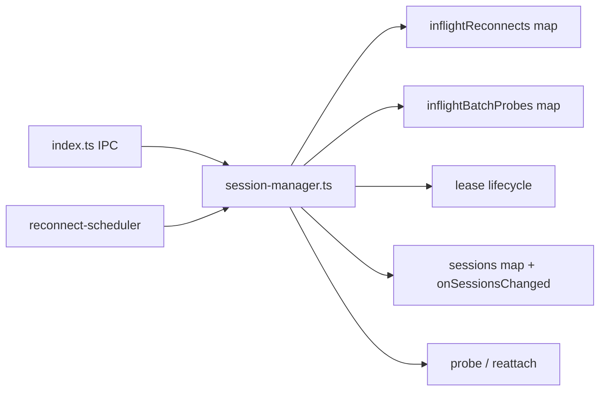
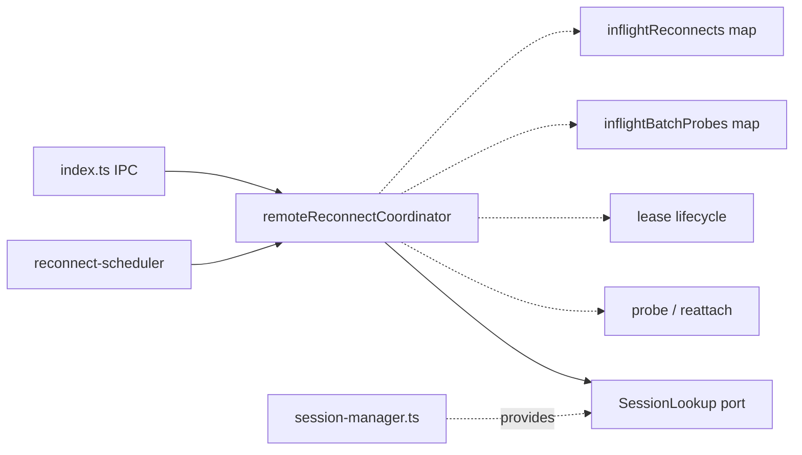
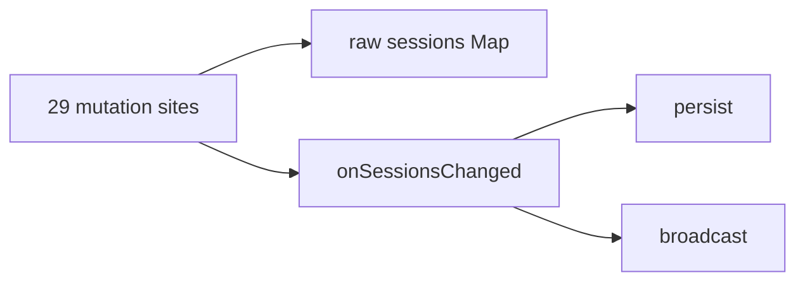
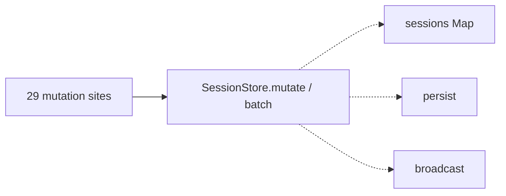
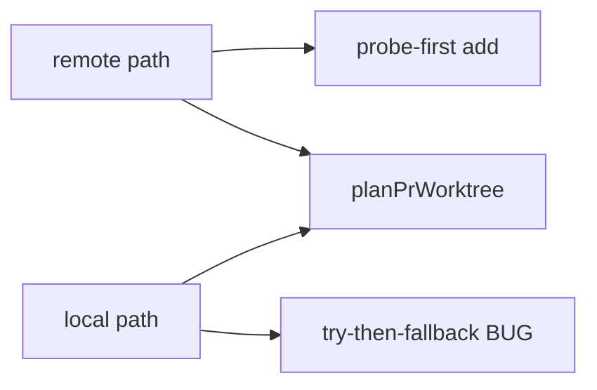
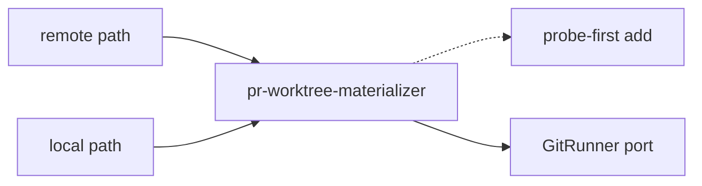
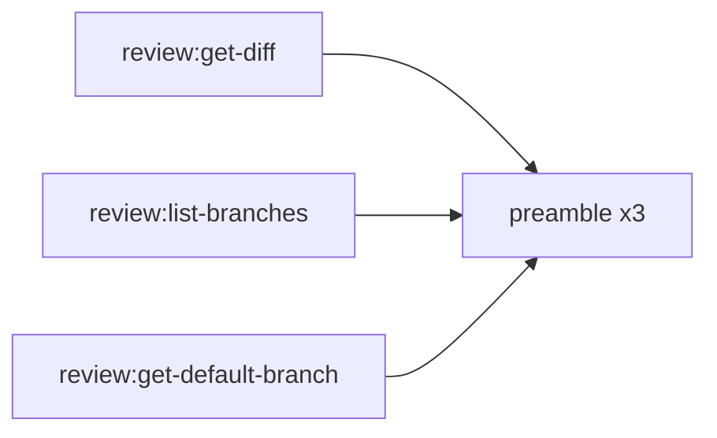
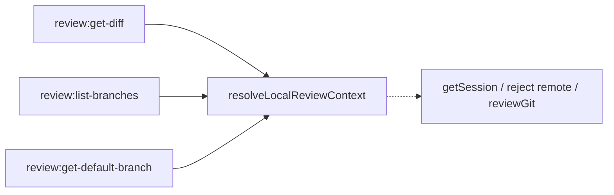

# Architecture review — pewpew — 2026-09-11

**Scope**: `src/main/`, weighted to the codebase's hot spot. `src/main/session-manager.ts` is 2420 lines and appears in ~35 of the last 60 `src/*` commits — by far the most-churned module — so friction there pays back fastest (YAGNI: deepening earns its keep on _future_ change). Recent firings have already extracted several deep modules from it (`remote-agent-spawn`, `buildSession`, create-or-adopt worktree protocol, `agent-resumability`, `probe-transition`, `planRelocation`, `session-queries`, `numbered-session-plan`); this run picks up the next-ranked candidate on the persisted backlog after verifying its friction is still live.
**Picked**: `remote-reconnect-coordinator` — see the PR and `.architecture/backlog.md`.
**Degradations**: none. `gh` authenticated; sub-agent exploration available; `codebase-design` vocabulary applied.

**Diagram legend** (replaces upstream's HTML legend): in every Mermaid block, **solid edges are the interface** a caller sees; **dashed edges are inside the implementation**, hidden behind the seam.

## Candidates

### remote-reconnect-coordinator — a single seam for remote reconnect/probe orchestration · Strong · score 21/25

- **Files**: `src/main/session-manager.ts:1088-1435` (the region to extract) + new `src/main/remote-reconnect.ts` + its test. **Estimate: 3 files** (band 2). Delegation also rewires ~7 in-file scheduler call sites and 3 export delegators, all mechanical and inside the one module.
- **Score**: **21/25** — leverage 4, locality 5, blast radius 2, heat 4.
  - _Leverage 4_: the manual reconnect (`reconnectRemoteSession`), the auto-reconnect attempt (`attemptAutoReconnect`), and the sibling batch (`probePendingSessionsOnHost`) are three call sites (IPC handler, scheduler, self) over one tangled subsystem; today any test of them must stand up the whole `session-manager` module behind ~8 `vi.mock`ed collaborator modules. Behind an injected seam a caller/test gains one constructed object. Not 5: it deepens one subsystem, not many call sites repo-wide.
  - _Locality 5_: a reconnect/probe/lease bug today is traced across a ~350-line span interleaved with unrelated session-manager code (persistence, spawn, revive); afterwards all reconnect concurrency, lease lifecycle, and probe-cascade logic live in one file, so a change to the coalescing or lease rules is a one-file edit.
  - _Blast radius 2_: one module plus its direct callers; no published interface changes (the three exports keep their signatures).
  - _Heat 4_: session-manager is the hottest file, and this region specifically has churned through the `probe-transition`, `reconnect-outcome`, and `reconnect-scheduler` extractions.
- **Problem**: the region is **shallow-by-tangle**. Two module-level in-flight Maps (`inflightReconnects` at `:1097`, `inflightBatchProbes` at `:1327`) plus a `PreparedRemoteHostLease` lifecycle (acquire at `:1199`; release on the batch tail `:1171`, the no-batch path `:1175`, and the error path `:1237`) are threaded through five functions that also reach directly into the global `sessions` Map (`:1117,1130,1157,1181,1250,1271,1353`) and call `onSessionsChanged()` inline. There is no interface: understanding "how does a dropped remote session come back?" means reading orchestration glue braided into the rest of a 2420-line file, and _exercising_ it means mocking eight modules because the only entry points are module-scoped exports over module-scoped state.
- **Deletion test**: delete the region and the coordinating behaviour (coalescing, lease-keep-alive-across-the-batch, probe→transition→reattach, auth-cascade short-circuit) does not disappear — every caller would have to re-implement it. Complexity **concentrates**, it doesn't move. That is the signal of a real deep-module opportunity.
- **Solution**: extract a `RemoteReconnectCoordinator` into `src/main/remote-reconnect.ts` that owns the two in-flight Maps, the lease lifecycle, and the probe/reattach orchestration behind a small interface (`reconnectRemoteSession`, `probePendingSessionsOnHost`, `attemptAutoReconnect`). It reaches the outside world through injected **ports** — a `SessionLookup` (get-by-id, iterate, notify), a host/runtime port, a probe/reattach/pty port, and effect ports (`emitToast`, `promptCleanup`) — with the pure cores (`computeProbeTransition`, `applyProbeTransition`, `classifyAutoReconnectResult`) called directly. `session-manager` constructs one instance wired to its production collaborators and keeps the three existing exports as thin delegators, so the 44 existing tests and the `index.ts` IPC caller are untouched.
- **Benefits**: **leverage** — reconnect behaviour becomes testable by constructing the coordinator with fakes, no `vi.mock` of eight modules and no `vi.resetModules()` re-import dance. **Locality** — the concurrency invariants (two clicks coalesce; the lease outlives the fire-and-forget batch; a mid-batch SSH failure stops the cascade) are stated once, in one file, next to the state they govern. **Test surface** — the injected `SessionLookup` port is the exact seam `session-store` (backlog, next) will implement, so this run also lays that seam's first consumer.
- **Before / After**:

### session-store — one owner for mutate+persist+notify over the sessions Map · Worth exploring · score 20/25

- **Files**: `src/main/session-manager.ts` + new `src/main/session-store.ts` + broad test-harness churn. **Estimate: 3 files, wide test churn** (band 4).
- **Score**: **20/25** — leverage 4, locality 5, blast radius 4, heat 5.
- **Problem**: the raw `const sessions = new Map` (`:143`) is mutated in ~39 places that each must remember to call `onSessionsChanged()` — 29 hand-paired call sites (`:231` defn; sites at `:217,242,276,292,329,…,2416`). The mutate-then-notify pairing is an invariant with no owner.
- **Deletion test**: concentrates — a `SessionStore.mutate()`/`batch()` owns the pairing; deleting it scatters 29 reminders back to callers.
- **Solution**: a `SessionStore` owning mutate+persist+notify, exposing a `batch()` that must preserve the #185 write-storm collapse (`updateLastKnownStatesBatch` at `:284-293`) and the restore bulk-insert (`:2372/2382` under one notify at `:2416`). This is the keystone: it also provides the `SessionLookup` seam the picked candidate injects.
- **Benefits**: **locality** — "when do we persist?" answered in one file; **leverage** — every mutation site drops its manual notify.
- **Before / After**:

### materialize-pr-worktree — one probe-first PR-worktree executor · Worth exploring · score 20/25

- **Files**: `src/main/session-manager.ts`, `src/main/pr-worktree-planner.ts`, new `src/main/pr-worktree-materializer.ts`. **Estimate: 3 files** (band 2).
- **Score**: **20/25** — leverage 4, locality 4, blast radius 2, heat 4.
- **Problem**: the remote PR-worktree path was fixed to **probe-first** (`:904-932`: compute `branchExistsLocally` then _select_ the `worktree add` form), but the **local path still uses the buggy try-then-fallback** (`:1980-1994`) — the exact anti-pattern the remote comment (`:904-907`) says "masked real failures … by surfacing the second attempt's misleading 'branch already exists' error." Planning is already pure and shared (`planPrWorktree`); the **executor** is what diverged.
- **Deletion test**: concentrates — one injected-`GitRunner` executor removes the divergence _and fixes the latent local bug by construction_.
- **Solution**: a single probe-first materializer driven by an injected `GitRunner` (local `execFileAsync` vs remote `expectRemoteOk`); `createPrSession` already exposes a `deps.runGit` seam (`:1902-1907`).
- **Benefits**: **leverage** + a real correctness fix; **locality** — one executor for both tiers.
- **Before / After**:

### resolve-local-review-context — one resolver for the review-IPC preamble · Worth exploring · score 19/25

- **Files**: `src/main/index.ts:596-641`. **Estimate: 1 file** (band 1).
- **Score**: **19/25** — leverage 3, locality 4, blast radius 2, heat 5.
- **Problem**: the identical preamble (`getSession` → throw if missing → reject remote with `{ ok:false, reason:'remote-unsupported' }` → `cwd = worktreePath || projectPath` → `reviewGit(cwd)`) is duplicated across three `review:*` handlers (`:604-610,620-626,633-639`).
- **Deletion test**: concentrates weakly — a resolver returning `{ ok:true, git } | { ok:false, reason:'remote-unsupported' }` collapses each handler to a call; lowest leverage of the four.
- **Solution**: extract the resolver; each handler becomes one call.
- **Benefits**: **locality** — the "remote review is unsupported" policy lands in one place.
- **Before / After**:

## Other proposed candidates (carried in the backlog, not re-carded this run)

| Candidate                        | Score | Why not picked this run                                                                  |
| -------------------------------- | ----- | ---------------------------------------------------------------------------------------- |
| `create-broadcast-setting-store` | 18/25 | Below the pick; renderer setting-store factory.                                          |
| `git-runner-factories`           | 17/25 | Below the pick; overlaps the runner-injection seam `materialize-pr-worktree` introduces. |
| `single-owner-pr-metadata`       | 17/25 | Below the pick; low heat (2).                                                            |
| `unify-gh-query-dispatch`        | 16/25 | Below the pick; low heat (1).                                                            |
| `hunk-key-value`                 | 15/25 | Below the pick.                                                                          |

## Dropped

| Candidate                | Dropped because                                                                                                                                                                                     |
| ------------------------ | --------------------------------------------------------------------------------------------------------------------------------------------------------------------------------------------------- |
| `config-ipc-passthrough` | Leverage 1 — fails the deletion test; moves IPC plumbing rather than concentrating behaviour, and touches the published IPC contract. Re-checked: filter still applies.                             |
| `repo-ref-value-object`  | Published-interface change — rewrites exported `src/shared/types.ts` and the preload IPC surface; the autonomy contract bars expanding a published interface unattended. Re-checked: still applies. |
| `gh-string-error-union`  | Pervasive-convention migration (`T                                                                                                                                                                  | string` → typed Result) across many files, not a single seam. Re-checked: still applies. |

## Too large to automate

None — no surviving candidate scored blast radius 5.

## Pick

**`remote-reconnect-coordinator` (21/25).** It is the top-scored surviving candidate after reconciliation (see below), its friction is confirmed live at `session-manager.ts:1088-1435`, and it passes every hard filter (leverage 4 ≠ 1; blast radius 2 ≠ 5; no ADRs exist to contradict; not already landed/rejected/dropped/in-flight; the three entry points have 44 existing test references, so current behaviour is pinnable before it moves).

**Close call — noted.** The runner-up **candidates**, `session-store` and `materialize-pr-worktree`, both score **20/25**, within 1 point. Either is the natural next firing. `remote-reconnect-coordinator` edges them: it is contained (blast radius 2 vs `session-store`'s 4) and, unlike `materialize-pr-worktree`, ships no behaviour change — a smaller, safer unattended PR.

**On sequencing.** The backlog notes this candidate "best sequenced after the `session-store` SessionLookup seam." That note is honoured, not violated, by the design: the coordinator **defines its own minimal `SessionLookup` port** and `session-manager` satisfies it today with a thin adapter over the raw Map. When `session-store` lands, it implements the same port — so this run creates the seam's first consumer rather than waiting on it. One adapter today is a hypothetical seam; `session-store` will be the second implementation that makes it real.

## Reconciliation (this run)

- `spawn-remote-agent-pipeline` → **landed** (PR #300 merged 2026-09-10; also visible as `fc9c9e4` on main).
- PR #301 (a duplicate firing of the same candidate, "collapse the 4 remote-spawn copies") → **closed unmerged**; the candidate it represented is already `landed` via #300, so no separate backlog row.
- No open architecture PR remains, so the "one PR at a time" bail does not apply and this run implements.

## Design

_Written in step 4 (appended after this file's first commit)._
