# Architecture review — pewpew — 2026-09-18

**Scope**: Whole-repo walk weighted toward the hot spots of the last 120 commits — `src/main/session-manager.ts` (66 touches), `src/main/index.ts` (14), `src/main/pty-manager.ts` (12), `src/main/host-bootstrap.ts` (10), `src/main/hook-installer.ts` (5) — plus a re-verification of all eleven candidates carried in `.architecture/backlog.md` from the 2026-09-02 and 2026-09-11 firings. Two sub-agents ran in parallel: one fresh friction walk, one backlog re-verification against `HEAD` (`760f6b5`).

**Picked**: `session-store` — see `.architecture/backlog.md`

**Degradations**: none. `gh` authenticated; sub-agents available; `codebase-design` vocabulary loaded.

**Diagram convention**: solid edges are the interface a caller must learn; dashed edges are inside the implementation.

---

## Reconciliation

| Entry | Was | Now | Why |
|---|---|---|---|
| `remote-reconnect-coordinator` | `in-flight` (PR #312) | **`landed`** | PR #312 merged 2026-09-16 (`760f6b5`). |
| `session-store` | `proposed` 20/25 (blast radius 4) | **`proposed` 24/25 (blast radius 2)** | Blast radius 4 was a mis-score against the band description — band 4 requires *"crosses a package/tier seam, or touches a published interface"*, and this does neither. `sessions` is module-private; `getSession`/`getSessions` and the `sessions:updated` broadcast payload are unchanged. ~5 files. Re-scored to 2. |
| `single-owner-pr-metadata` | `proposed` 17/25 | **`proposed` 18/25** | Re-verification found it is a *pure deletion* of 33 dead lines, not a migration: `github.ts`'s `PrViewInfo`/`PR_VIEW_FIELDS` have zero importers repo-wide, and its `forkFieldsFromPr`/`describePrLookupFailure` are reachable only from `github.test.ts`. Locality 5, blast radius 1. Heat still 2 (both files cold since 2026-07-10). |
| `config-ipc-passthrough`, `repo-ref-value-object`, `gh-string-error-union` | `dropped` | **`dropped`** (re-checked) | Filters all still apply; see *Dropped*. |
| All other `proposed` entries | — | **`proposed`** | Friction confirmed still present; none was resolved incidentally by #300 or #312. |

**Correction to the existing `session-store` entry**: the write-storm batching fix is misattributed to issue #185. It is actually `ffb5083` (*"fix: preserve reconnect state across release + batch lastKnownState writes"*, a PR #53 follow-up), hardened by `6a7bbf3c`. Git `#185` is the animations/GPU work (`545dd45`, `6d5a609`) and belongs to `create-broadcast-setting-store`. Corrected in the backlog.

---

## Candidates

### session-store — one owner for mutate + persist + notify  ·  Strong  ·  score 24/25

- **Files** — `src/main/session-manager.ts:145-149` (`SessionEntry`, the raw `sessions` Map), `:227-241` (`persistSessions` / `notifyRenderer` / `onSessionsChanged`), `:243-249` (`updateSession`), `:251-299` (the batching primitives), `:1095-1103` (the coordinator adapter); `src/main/remote-reconnect.ts:13-24` (`SessionLookup`, the seam already declared); new `src/main/session-store.ts`. **File-count estimate: 5** (new module + new test, `session-manager.ts`, `remote-reconnect.ts`, `session-manager.test.ts`).
- **Score** — **24/25**
  - *Leverage 5* — 59 mutation sites and 38 notify sites across two modules collapse onto one owner, and the `sessionsUpdatedBroadcasts` hand-counting that 16 test sites do today becomes assertable through the store's own interface. A consumer has already written the interface down without an owner existing.
  - *Locality 5* — "mutate, then persist, then broadcast, then update the tray" is today a convention enforced 38 times by hand. Afterwards it is one function; forgetting the pairing stops being expressible.
  - *Blast radius 2* — a module and its direct callers, ~5 files, no published interface. `sessions` is module-private; `getSession`/`getSessions` (`:1927-1933`) and the `sessions:updated` payload (`:233-234`) are unchanged.
  - *Heat 5* — `session-manager.ts` is the hottest file in the repo: 66 of the last 120 commits, most recently 2026-09-16. `remote-reconnect.ts` was created 2026-09-16.
- **Problem** — `session-manager.ts` keeps its session registry as a bare `Map<string, SessionEntry>` and pairs every mutation with a hand-written `onSessionsChanged()`. The interface a caller must learn is the *whole convention*: which Map to touch, that `entry.session` is the live object, that persistence and the renderer broadcast and the tray update are three separate consequences you trigger by remembering to call one function afterwards. That is a shallow module in the purest sense — there is no module at all, only a data structure plus an unenforced protocol, and every one of the 59 mutation sites reaches past the seam to the Map directly.

  The protocol has already leaked *out* of the file. `remote-reconnect.ts:13-24` defines a `SessionLookup` interface whose doc comment says: *"This is the seam `session-store` will implement; a store that returned copies would silently break that re-read."* A consumer has specified the interface; the owner does not exist, so `session-manager.ts:1095-1103` satisfies it with a hand-written Map adapter.

  Two latent bugs follow directly from the unenforced pairing, and neither is a hypothetical:
  - `relocateProject` (`:1935-2012`) writes `projectPath` / `projectName` / `worktreePath` at `:1960-1962` and `repoFingerprint` at `:1963`, then `await installHooks(...)` at `:1973` can throw. The `saveConfig` at `:2000` and the `onSessionsChanged()` at `:2009` never run. In-memory sessions then hold relocated paths, `sessions.json` holds the old ones, and the renderer is never told — recovery needs an app restart, which reads the stale file back.
  - `restoreSessions` (`:2056-2135`) does `sessions.set` at `:2087`/`:2097` inside a loop with a single notify at `:2131`, wrapped in a bare `catch {}` at `:2132-2134`. A mid-loop throw leaves a partially-populated Map that is never persisted or broadcast.

  Two more sites are correct only by convention: `registerSpawnedSession` (`:343-349`) mutates the Map with no notify and relies on all five call sites to remember (`491→511`, `697→698`, `817→818`, `969→970`, `1888→1889`), and `backfillDerivedFields` (`:2044-2054`) writes four fields relying on the distant `:2131`.
- **Deletion test** — **Concentrates.** Delete a `SessionStore` and the Map, the persist call, the broadcast, the tray update, the per-session rate-limit clock and the batch collapse all scatter back across 59 sites in two modules, and the `SessionLookup` seam `remote-reconnect.ts` depends on loses its implementation. This is the opposite of complexity merely moving.
- **Solution** — A `session-store` module owning the registry and the mutate → persist → notify → tray chain behind a small interface, exposing a `batch()` primitive so many mutations collapse into at most one flush. `session-manager.ts` keeps its public functions; it stops owning the protocol. `remote-reconnect.ts`'s `SessionLookup` adapter at `session-manager.ts:1095-1103` shrinks to a pass-through because the store implements the port directly.

  **Two documented invariants constrain every acceptable design:**
  1. **`batch()` must permit zero notifies.** `updateLastKnownStatesBatch` (`:286-299`) ORs per-update dirty flags and fires `onSessionsChanged()` once — *or not at all* when every update was rate-limited or text-unchanged. `session-manager.test.ts:1537-1601` asserts both cases. A `batch()` implemented as `try { fn() } finally { changed() }` breaks the zero case immediately. The design must thread a "did anything actually mutate" signal out of its mutators.
  2. **The store must hand back live references, not copies.** `remote-reconnect.ts:18-19` states it: a store returning copies silently breaks the coordinator's re-read. This disqualifies an immutable-snapshot design outright.
- **Bug-scope decision (settled here, not at step 5)** — **Structural only.** Each existing call site keeps its current notify placement; the store makes the pairing explicit and testable but this PR relocates no existing notify. The two deferred-notify bugs above are recorded here and in the PR body as now-visible and cheap to fix in a follow-up. Rationale: this is a refactor in the hottest file in the repo, and silently changing crash-recovery behaviour inside a refactor PR is not reviewable. The alternative — fixing both in this PR — is defensible but widens a ~60-site mechanical diff into a behavioural one.
- **Benefits** — *Leverage*: one interface replaces a 38-site convention, and the `batch()` primitive becomes reusable rather than being a special case written once for the thumbnail tick. *Locality*: the write-storm rate limit, the 3 KiB cap, the no-op suppression and the flush decision sit in one module instead of being spread between `session-manager.ts:251-299` and its caller at `index.ts:842-860`. *Test surface*: today the batching invariant is pinned by counting broadcasts through a test-harness counter (`session-manager.test.ts:121-123`, referenced 16×) that reaches around the production code; afterwards the store's own interface is the test surface, and `session-store.test.ts` can drive persist/notify/batch without booting the session manager.

**Before**

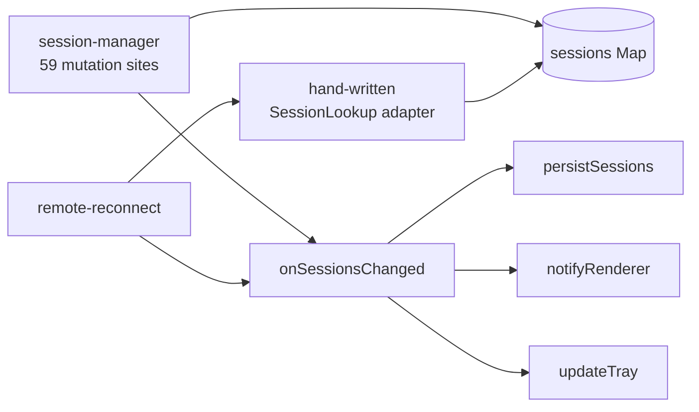
```mermaid
graph LR
  SM[session-manager<br/>59 mutation sites] --> MAP[(sessions Map)]
  SM --> OSC[onSessionsChanged]
  RR[remote-reconnect] --> ADAPT[hand-written<br/>SessionLookup adapter]
  ADAPT --> MAP
  RR --> OSC
  OSC --> P[persistSessions]
  OSC --> N[notifyRenderer]
  OSC --> T[updateTray]
```

**After**

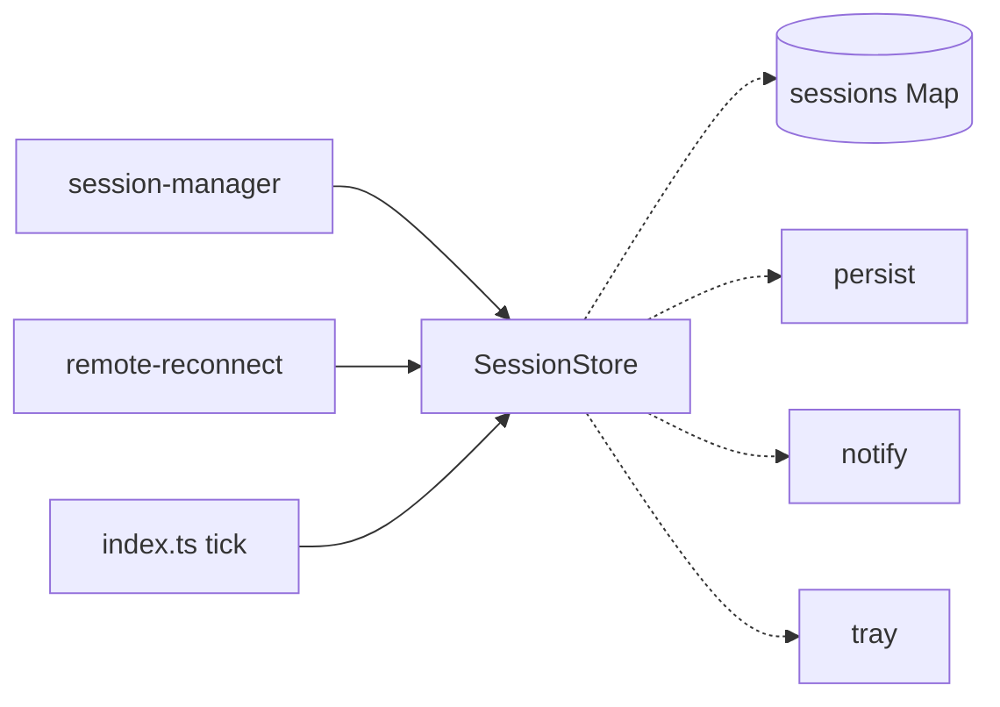
```mermaid
graph LR
  SM[session-manager] --> ST[SessionStore]
  RR[remote-reconnect] --> ST
  IDX[index.ts tick] --> ST
  ST -.-> MAP[(sessions Map)]
  ST -.-> P[persist]
  ST -.-> N[notify]
  ST -.-> T[tray]
```

---

### pty-entry-registration — one owner for the pty registration epilogue  ·  Strong  ·  score 22/25

- **Files** — `src/main/pty-manager.ts:418-433` (`createPty`), `:538-555` (`createRemotePty`), `:804-818` (`reattachPty`), `:847-863` (`reattachRemotePty`), `:577-583`/`:593-599`/`:641-647` (three teardown orders), `:820-832` (a verbatim re-implementation of `getScrollback`'s local branch from `:762-771`); `src/main/session-record.ts:38`. **File-count estimate: 3.**
- **Score** — **22/25**
  - *Leverage 4* — four registration epilogues, eleven open-coded `pewpew-${sessionId}` sites and four repeated geometry literals collapse onto one primitive; a fifth spawn path stops having to rediscover two invariants by reading its siblings.
  - *Locality 5* — the SSH refcount release and the unexpected-exit notification become impossible to omit, and the teardown ordering gets one answer instead of three.
  - *Blast radius 1* — ~3 files, module-private. `PtyEntry` and `ptys` are not exported.
  - *Heat 4* — `pty-manager.ts`, 12 of the last 120 commits, most recently 2026-09-10.
- **Problem** — The same four-line closing block is written four times: build the `PtyEntry`, wire `onData` to the buffer, wire `onExit` to `releaseRemoteEntry` + `notifyUnexpectedExitIfPresent`, then `ptys.set`. The invariants have teeth — omitting `releaseRemoteEntry` leaks an SSH connection refcount (it is the only path back to `releaseHostConnection`), and omitting `notifyUnexpectedExitIfPresent` breaks dead-session detection that `session-manager.ts:311-341` depends on. The shallowness shows up as a caller working around a hazard the callee should own: `ptys.set` in `reattachPty:818` overwrites an existing entry without destroying it, leaking the prior node-pty and its exit handler, and that hazard is documented *in a different file*, at `session-manager.ts:1228-1231`.
- **Deletion test** — **Concentrates.** A `registerPtyEntry(sessionId, ptyProcess, tmuxSession, host?)` plus `tmuxSessionName(id)` would absorb four epilogues, eleven naming sites, the overwrite hazard and the teardown ordering. Deleting it scatters all four back.
- **Solution** — One registration primitive owning entry construction, handler wiring and the replace-vs-leak decision, and one `tmuxSessionName` helper. The persisted `pewpew-${id}` string form must be preserved byte-for-byte: `session-record.ts:38` writes it into `Session.tmuxSession`, making it a persisted-file format.
- **Benefits** — *Leverage*: a new spawn path learns one call instead of four siblings. *Locality*: refcount and exit-detection bugs get one place to be. *Test surface*: `reattachPty` and `reattachRemotePty` have **no tests at all** today, and the harness's `fakePty()` (`pty-manager.test.ts:26-34`) stubs `onData`/`onExit` as no-ops, so even the tested paths never exercise the wiring. Making `fakePty` capture its handlers turns all four paths into pinnable behaviour and is a self-contained first step.

**Before**

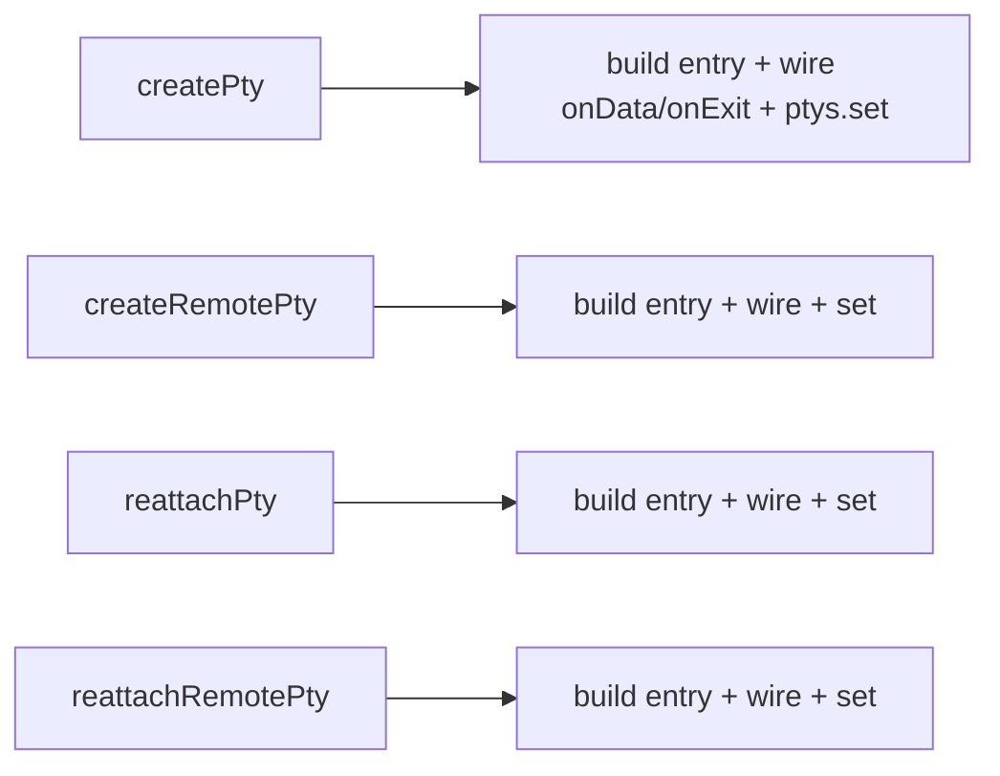
```mermaid
graph LR
  A[createPty] --> E[build entry + wire onData/onExit + ptys.set]
  B[createRemotePty] --> E2[build entry + wire + set]
  C[reattachPty] --> E3[build entry + wire + set]
  D[reattachRemotePty] --> E4[build entry + wire + set]
```

**After**

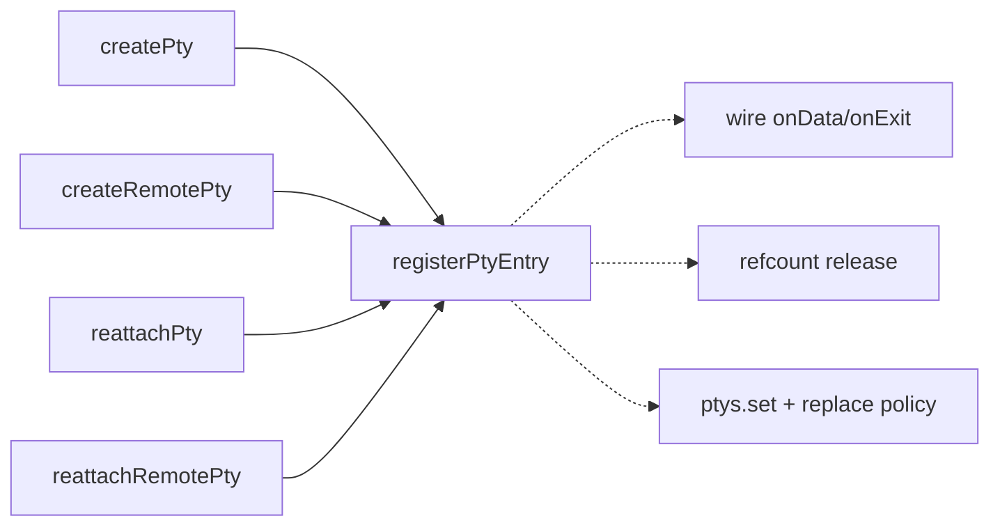
```mermaid
graph LR
  A[createPty] --> R[registerPtyEntry]
  B[createRemotePty] --> R
  C[reattachPty] --> R
  D[reattachRemotePty] --> R
  R -.-> W[wire onData/onExit]
  R -.-> RC[refcount release]
  R -.-> S[ptys.set + replace policy]
```

---

### session-op-ipc — a registrar for the session IPC handlers  ·  Worth exploring  ·  score 22/25

> **Hard-filtered despite the score: current behaviour cannot be pinned before moving it.** The handlers register inside the `app.whenReady()` closure in a 900-line file with no test file, so there is no way to write a characterization test first. The extraction *is* the testability unlock, which makes it valuable — but test-first is the terminal step of this skill, and a candidate that cannot be pinned cannot be implemented unattended. Recorded with its score so the next firing sees the filter rather than re-deriving the candidate and discovering the problem at step 5.

- **Files** — `src/main/index.ts:522-530` (`sessions:kill`), `:531-539` (`revive`), `:540-548` (`reconnect`), `:549-557` (`attach`), `:562-570` (`remove`), `:571-582`/`:583-594`/`:595-606` (the three batch handlers), `:558-561` (`sessions:remove-worktree`, the inconsistent sibling), and a third copy of the batch shape at `src/main/session-manager.ts:1317-1325`. **File-count estimate: 3.**
- **Score** — **22/25** — *Leverage 4* (eight hand-copied bodies plus a third-shape copy collapse to two registrars; ~70 lines become ~10). *Locality 5* (the throw-vs-swallow policy becomes a fact of the code rather than a comment). *Blast radius 1* (~3 files; channel names and payloads unchanged). *Heat 4* (`index.ts`, 14 of the last 120 commits, most recently 2026-09-12).
- **Problem** — Five single-session handlers are character-for-character identical but for a verb and a function, and three batch handlers are identical but for the error swallow. The policy is real and is *stated in a comment* at `:516-520` — *"Single-session handlers log and re-throw … Batch handlers below swallow per-session errors"* — so it is enforced eight times by hand. `sessions:remove-worktree` at `:558-561` sits in the middle of the block and does neither: no try, no log. That is precisely the drift a comment cannot prevent.
- **Deletion test** — **Concentrates.** `registerSessionOp` / `registerSessionBatchOp` would own the policy; deleting them re-scatters eight copies plus the comment.
- **Solution** — Two registrars taking an injected `ipcMain`-shaped object, so the throw/swallow policy is assertable against a fake.
- **Benefits** — *Leverage*: adding a ninth session operation becomes one line. *Locality*: one place decides what happens to a failing session op. *Test surface*: this is the whole point — `src/main/index.ts` has no test file at all, and an injected registrar is the first testable seam in it.

**Before**

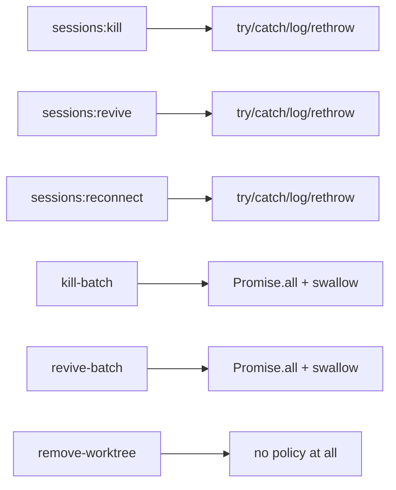
```mermaid
graph LR
  K[sessions:kill] --> T1[try/catch/log/rethrow]
  R[sessions:revive] --> T2[try/catch/log/rethrow]
  C[sessions:reconnect] --> T3[try/catch/log/rethrow]
  KB[kill-batch] --> T4[Promise.all + swallow]
  RB[revive-batch] --> T5[Promise.all + swallow]
  RW[remove-worktree] --> T6[no policy at all]
```

**After**

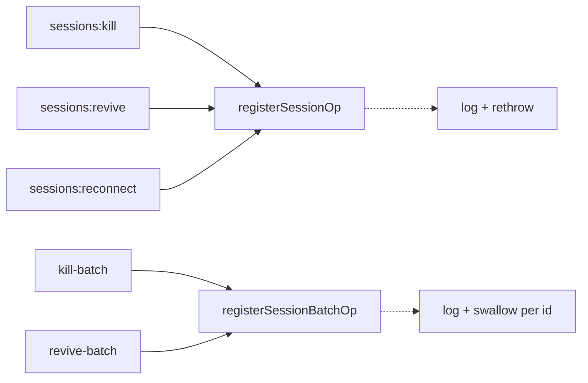
```mermaid
graph LR
  K[sessions:kill] --> RO[registerSessionOp]
  R[sessions:revive] --> RO
  C[sessions:reconnect] --> RO
  KB[kill-batch] --> RB2[registerSessionBatchOp]
  RB[revive-batch] --> RB2
  RO -.-> P[log + rethrow]
  RB2 -.-> S[log + swallow per id]
```

---

### remote-hook-merge-executor — one owner for the hook-merge policy  ·  Strong  ·  score 21/25

> **This card is a bug report as well as a refactor.** `installRemoteHooks` (`hook-installer.ts:158`) pipes `if [ -s "$settings" ]; then cat "$settings"; else printf "{}"; fi` straight into `jq`, with no validity pre-check. `installRemoteCodexHooks` (`:328-329`) has exactly that guard — `if [ -s "$hooks" ] && jq -e 'type == "object"' "$hooks"` — added with a comment saying it *"mirrors the local installer's tolerance for a malformed/non-object prior file"*, and local `installHooks` gets the same tolerance from `parseAsObject` (`:101-111`). Verified by inspection of all three paths. Consequence: a malformed `.claude/settings.local.json` in a remote worktree makes `jq` exit non-zero, `set -e` aborts before the `mv`, and the remote **claude** session cannot be created — while local claude and remote codex both recover silently. Nothing documents this as deliberate.

- **Files** — `src/main/hook-installer.ts:117-142` (`installHooks`), `:146-172` (`installRemoteHooks`), `:262-294` (`installCodexHooks`), `:305-351` (`installRemoteCodexHooks`), `:404-489` (`mergeCodexHooksFlag` in TS vs the same idea re-encoded in awk). **File-count estimate: 3.**
- **Score** — **21/25** — *Leverage 4* (four install functions, one merge policy written three times in two languages; a `HookFileStore` port with a local `fs` adapter and a remote `sh` adapter deletes both `jq` programs outright — and two adapters is a real seam, not a hypothetical one). *Locality 5* (malformed-input tolerance, the external-hook filter and the atomic-write discipline get one owner). *Blast radius 1* (~3 files, module-private; imported only by `index.ts`, `session-manager.ts`, `remote-agent-spawn.ts`). *Heat 3* (5 of the last 120 commits, most recently 2026-08-18).
- **Problem** — One policy — *"keep hook entries that don't mention pewpew, append ours"* — is implemented three times. The TypeScript loop is byte-identical at `:127-137` and `:277-287`; the `jq` `reduce` program is byte-identical inside the two remote shell scripts at `:159-164` and `:334-339`. To know what hook merging does, a reader must diff a TS loop against a `jq` program against an `awk` program and trust they agree. They do not — see the callout above.
- **Deletion test** — **Concentrates.** One `mergeHookFile({ read, write }, newHooks)` over a small `FileStore` port puts the tolerance policy, the filter and the atomic write in one place. Deleting it scatters three copies back across two languages.
- **Solution** — Read the prior file through a port (local `fs`, remote `cat`), merge in TypeScript once, write back through the port. The `jq` programs disappear; the local/remote difference collapses to the adapter.
- **Benefits** — *Leverage*: a change to the merge rule becomes one edit instead of three in two languages. *Locality*: the malformed-input divergence becomes inexpressible. *Test surface*: `hook-installer.test.ts:46-63` already has an `execLocally` harness that runs the remote shell script for real against a `mkdtempSync` project dir, and uses it for `installRemoteCodexHooks` at `:259-273`. Writing a malformed `settings.local.json` and asserting `installRemoteHooks` does not throw is **a red test available today** — the best immediate red-green of anything in this report.

**Before**

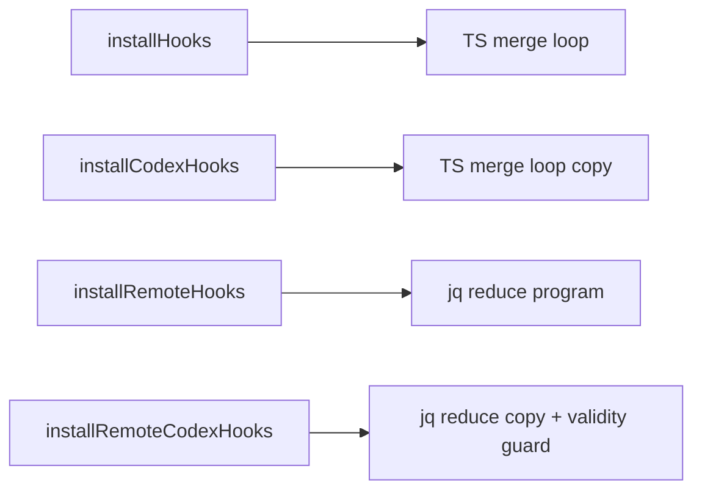
```mermaid
graph LR
  A[installHooks] --> TS[TS merge loop]
  B[installCodexHooks] --> TS2[TS merge loop copy]
  C[installRemoteHooks] --> JQ[jq reduce program]
  D[installRemoteCodexHooks] --> JQ2[jq reduce copy + validity guard]
```

**After**

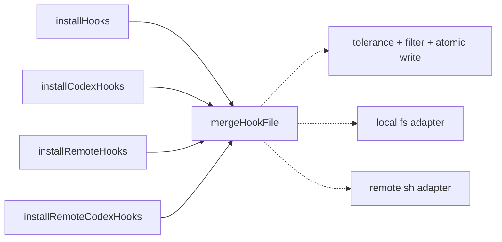
```mermaid
graph LR
  A[installHooks] --> M[mergeHookFile]
  B[installCodexHooks] --> M
  C[installRemoteHooks] --> M
  D[installRemoteCodexHooks] --> M
  M -.-> POL[tolerance + filter + atomic write]
  M -.-> LFS[local fs adapter]
  M -.-> RSH[remote sh adapter]
```

---

### remote-exec-result-check — a bound RemoteShell owning the result check  ·  Worth exploring  ·  score 21/25

- **Files** — `src/main/remote-command.ts:18-24` (`expectRemoteOk`, the existing helper); bypassed at `src/main/hook-installer.ts:169-172`, `:248-252`, `:344-347`, `:486-489`, `src/main/pty-manager.ts:524-527`, `src/main/session-manager.ts:864-868`; a second private copy at `src/main/host-bootstrap.ts:547-557` (`expectOk`). **File-count estimate: 6.**
- **Score** — **21/25** — *Leverage 4* (10 copies of one detail line across 5 modules, 6 of which could call the existing helper today). *Locality 4*. *Blast radius 2* (~6 files, module-private). *Heat 5* (`session-manager.ts` 2026-09-16, `pty-manager.ts` 2026-09-10, `hook-installer.ts` 2026-08-18).
- **Problem** — A shallow interface spawned six copies of its own body. `expectRemoteOk` already owns `const detail = result.stderr.trim() || result.stdout.trim() || \`exit ${result.code}\`` wrapped in `if (result.timedOut || result.code !== 0)` — but it takes three positional parameters and **no timeout**. Every hook-installer call needs `{ timeoutMs: 10000 }` or `{ timeoutMs: 15000 }`, so each rebuilt the check by hand. `host-bootstrap.ts` independently grew a second helper for the same idea. Compounding it, all five remote hook-installer functions thread `execRemote` as their *first parameter*, and `remote-agent-spawn.ts:26` and `pty-manager.ts:502-505` each build the same `(argv, opts) => execRemote(host, argv, opts)` closure to feed them.
- **Deletion test** — **Concentrates.** One bound `RemoteShell` (`{ run(argv, opts), expectOk(argv, message, opts) }`) owns timeout policy, the detail-extraction precedence and the timed-out-vs-nonzero distinction, and removes the closure-threading at the same time. Deleting it re-scatters 10 copies and two competing helpers.
- **Solution** — Give the existing helper an options bag, bind it to a host, and collapse `host-bootstrap`'s private `expectOk` into it.
- **Benefits** — *Leverage*: callers stop passing `execRemote` around as a parameter. *Locality*: one timeout policy. *Test surface*: `hook-installer.test.ts:155-167` already asserts `installRemoteHooks` throws with the remote stderr text, and the detail precedence (stderr → stdout → `exit N`) plus the timeout branch are directly assertable through the existing `vi.fn` exec stubs.

**Before**

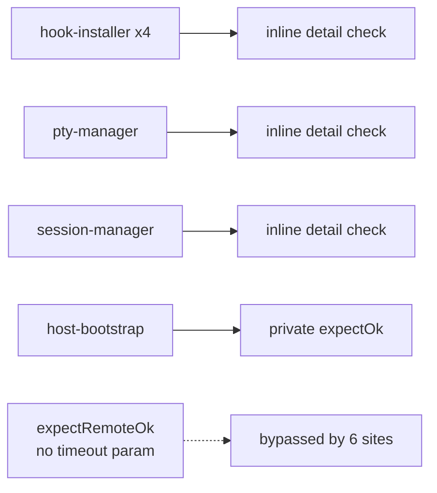
```mermaid
graph LR
  H[hook-installer x4] --> D1[inline detail check]
  P[pty-manager] --> D2[inline detail check]
  S[session-manager] --> D3[inline detail check]
  B[host-bootstrap] --> EO[private expectOk]
  X[expectRemoteOk<br/>no timeout param] -.-> UNUSED[bypassed by 6 sites]
```

**After**

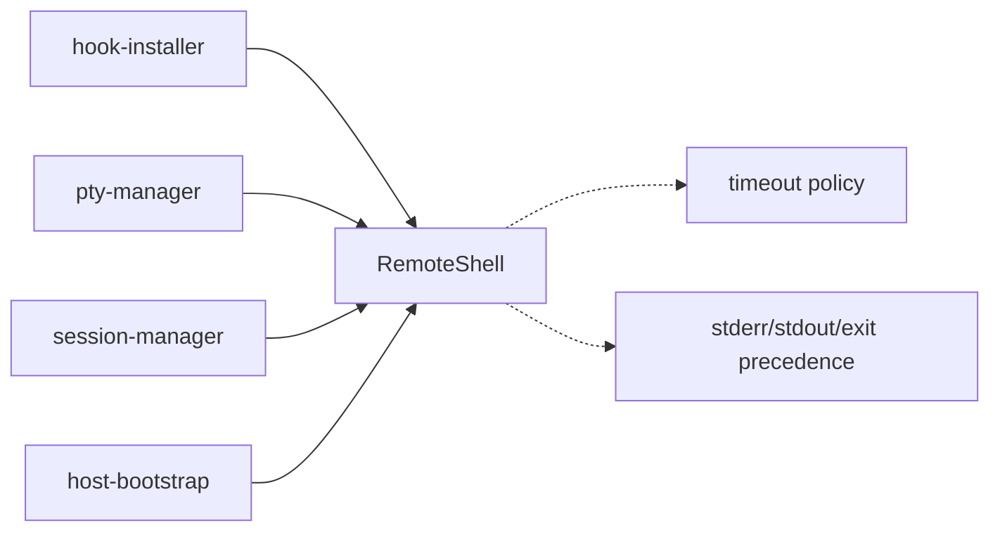
```mermaid
graph LR
  H[hook-installer] --> RS[RemoteShell]
  P[pty-manager] --> RS
  S[session-manager] --> RS
  B[host-bootstrap] --> RS
  RS -.-> TO[timeout policy]
  RS -.-> DET[stderr/stdout/exit precedence]
```

---

### worktree-add-strategy — one executor for `git worktree add`  ·  Worth exploring  ·  score 21/25

- **Files** — `src/main/session-manager.ts:895-920` (probe-first, correct), `:988-1009`/`:732-767`/`:1769-1787`/`:1816-1860` (via `createOrAdoptWorktree`), `:1010-1021`/`:776-786` (masked try-then-fallback); `src/main/worktree-adoption.ts:1-3`. **File-count estimate: 4.**
- **Score** — **21/25** — *Leverage 4* (7 add sites, 3 strategies, 2 verbatim error-mapping copies and 2 sites missing the mapping). *Locality 4*. *Blast radius 2*. *Heat 5*.
- **Problem** — `worktree-adoption.ts` opens by claiming it is the *"shared two-phase fallback for `git worktree add`, used by both the local and remote issue- and session-creation paths so those four sites can't drift."* It covers the `baseRef === 'origin-default'` **half** of those sites. The `else` half still runs the old try-then-fallback — the very pattern `createRemotePrSession:895-898` documents removing because *"the fallback masked real failures (e.g. branch already checked out in a stale worktree) by surfacing the second attempt's misleading 'branch already exists' error."* A module whose stated purpose is preventing drift advertises coverage it does not have, and a reader adding a fourth create path has three strategies and no stated rule.
- **Deletion test** — **Concentrates.** One `addWorktree(runner, { path, branch, base })` owning base resolution, add-form choice and failure wording — plus the `no-origin-remote` / `no-origin-default-branch` mapping that is duplicated verbatim at `:1771-1776` and `:1826-1831` and **absent** from `createSession`/`createRemoteSession`, which let the raw sentinel escape as an Error message.
- **Solution** — Probe first, select the add form from the probe, map failures once.
- **Benefits** — *Test surface*: `session-manager.test.ts:763` and `:2510` already drive these paths through injected `runGit`/`branchExists` deps; the current-HEAD branch of `createSession` needs a `child_process` mock the suite already uses elsewhere.

**Before**

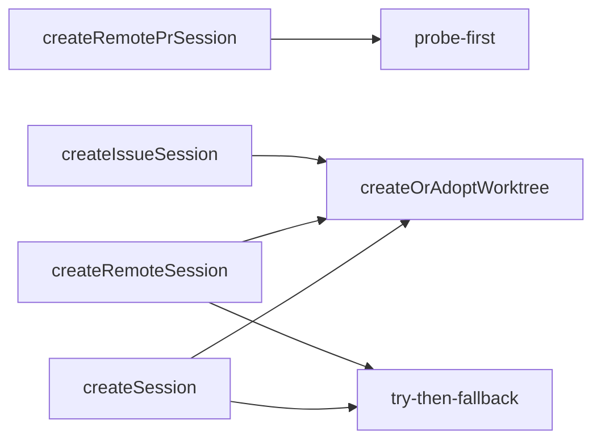
```mermaid
graph LR
  PR[createRemotePrSession] --> S1[probe-first]
  CS[createSession] --> S2[createOrAdoptWorktree]
  CS --> S3[try-then-fallback]
  CRS[createRemoteSession] --> S2
  CRS --> S3
  CI[createIssueSession] --> S2
```

**After**

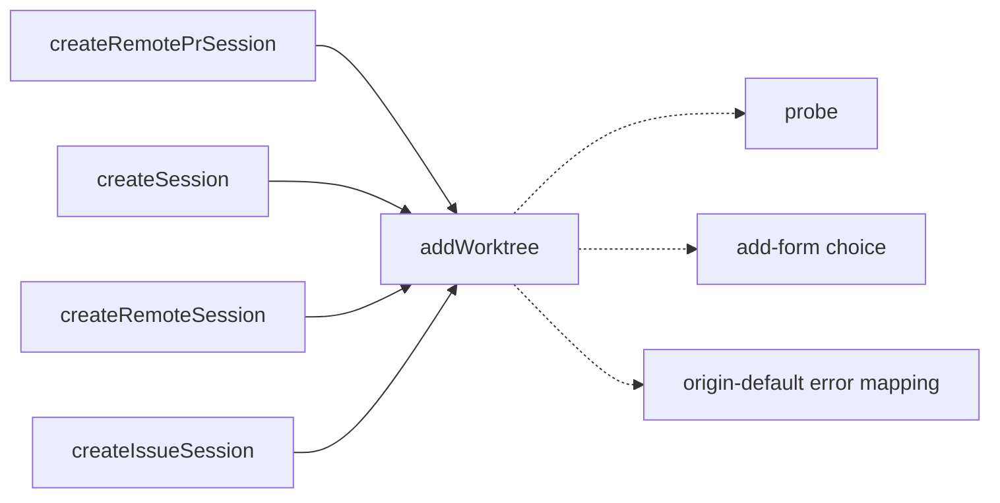
```mermaid
graph LR
  PR[createRemotePrSession] --> AW[addWorktree]
  CS[createSession] --> AW
  CRS[createRemoteSession] --> AW
  CI[createIssueSession] --> AW
  AW -.-> PB[probe]
  AW -.-> FORM[add-form choice]
  AW -.-> ERR[origin-default error mapping]
```

---

### adoption-gate — one exclusive-adoption primitive  ·  Worth exploring  ·  score 21/25

- **Files** — `src/main/session-manager.ts:413-442` (`createSessionForWorktree`), `:603-637` (`createRemoteSessionForWorktree`); the two parallel `Map<string, InflightAdoption>` at `:411` and `:598`. **File-count estimate: 3.**
- **Score** — **21/25** — *Leverage 3* (two gates collapse to one; the mixed-tool rejection message is duplicated verbatim at `:430-432` and `:622-624`). *Locality 5*. *Blast radius 1*. *Heat 5*.
- **Problem** — Both functions are pure dedupe bookkeeping around a delegated `adoptWorktree`/`adoptRemoteWorktree`. The prologue is structurally identical — resolve `effectiveTool`, find existing, `assertToolCompatible`, look up the in-flight map, reject mixed tools, `set`/`try`/`finally delete` — and the two maps differ only in key shape (`canonicalPath(worktreePath)` vs `` `${hostId} ${worktreePath}` ``). The comment at `:598-601` says as much: *"Mirrors `inflightAdoptions` (local)."*
- **Deletion test** — **Concentrates.** `runExclusiveAdoption({ key, tool, findExisting, adopt })` owns the mixed-tool policy, the message and the `finally` cleanup.
- **Benefits** — *Test surface*: `session-manager.test.ts:494`, `:613` and `:680` already exercise both gates, and `mirrorAllWorktrees` accepts an injected `adopt` dep (`MirrorAllDeps`, `:555-557`) that makes the concurrency behaviour directly drivable.

**Before**

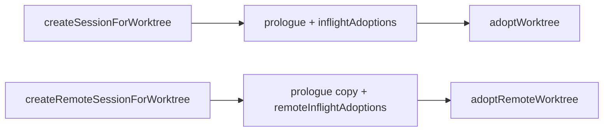
```mermaid
graph LR
  A[createSessionForWorktree] --> P1[prologue + inflightAdoptions]
  B[createRemoteSessionForWorktree] --> P2[prologue copy + remoteInflightAdoptions]
  P1 --> AD1[adoptWorktree]
  P2 --> AD2[adoptRemoteWorktree]
```

**After**

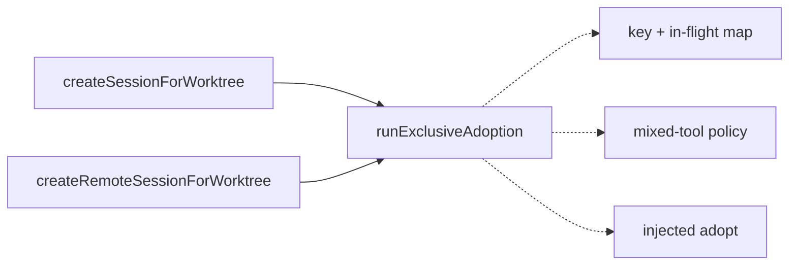
```mermaid
graph LR
  A[createSessionForWorktree] --> G[runExclusiveAdoption]
  B[createRemoteSessionForWorktree] --> G
  G -.-> K[key + in-flight map]
  G -.-> MT[mixed-tool policy]
  G -.-> AD[injected adopt]
```

---

### materialize-pr-worktree — one executor for the PR-worktree plan  ·  Worth exploring  ·  score 20/25

- **Files** — `src/main/session-manager.ts:826-974` (`createRemotePrSession`, add-form decision at `:908-935`), `:1605-1721` (`createPrSession`, add-form decision at `:1684-1706`); `src/main/pr-worktree-planner.ts:88-131` (pure, unchanged). **File-count estimate: 5.**
- **Score** — **20/25** — *Leverage 4*. *Locality 4*. *Blast radius 2* (~5 files; `createPrSession`'s signature and `Session | string` return preserved). *Heat 4* (`session-manager.ts` 2026-09-16; `pr-worktree-planner.ts` cold since 2026-07-10).
- **Problem** — Two executors consume one plan with four duplicated stages: lookup → `planPrWorktree` → destructure (`:877-880` vs `:1637-1639`), fetch-with-tolerated-failure (`:891-907` vs `:1671-1683`), the fork bail (`:915-919` vs `:1685-1687`), and session registration (`:951-971` vs `:1708-1718`).
- **Bug claim — verified, and narrower than the backlog recorded it.** The local path *does* probe (`:1685`, `branchRefExists(runGit, localBranch, { quiet: true })`) — but it uses the result only to gate the fork bail-out and then throws it away. For a **same-repo** PR it still does try-then-fallback (`:1691` → `:1700`), so a real failure surfaces the second attempt's misleading `fatal: a branch named '<x>' already exists`. The fork branch is already symmetric with remote. Corrected in the backlog.
- **Deletion test** — **Concentrates.** One probe-first executor over an injected `GitRunner`.
- **Benefits** — *Test surface* is also the hidden cost: `session-manager.test.ts` has 12 `createPrSession` calls across 8 tests, and **every one passes `hostId = null`**. There are **zero tests for `createRemotePrSession`** — so this refactor would normalize the tested path toward the untested one. New remote-executor tests are prerequisite work, not optional. That prerequisite is why it sits below the 21s despite an equal leverage score.

**Before**

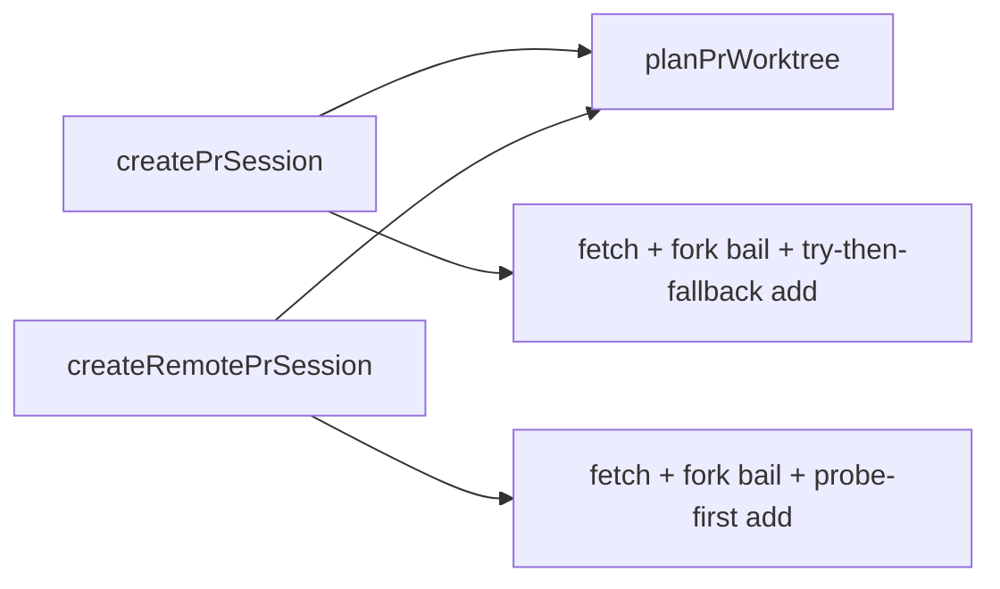
```mermaid
graph LR
  L[createPrSession] --> PL[planPrWorktree]
  R[createRemotePrSession] --> PL
  L --> E1[fetch + fork bail + try-then-fallback add]
  R --> E2[fetch + fork bail + probe-first add]
```

**After**

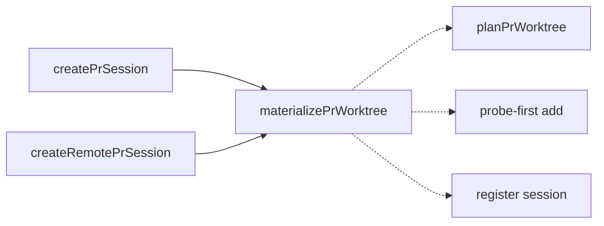
```mermaid
graph LR
  L[createPrSession] --> EX[materializePrWorktree]
  R[createRemotePrSession] --> EX
  EX -.-> PL[planPrWorktree]
  EX -.-> PB[probe-first add]
  EX -.-> REG[register session]
```

---

### git-runner-factories — one owner for the GitRunner adapter and its timeout policy  ·  Worth exploring  ·  score 18/25

- **Files** — `src/main/session-manager.ts:181`, `:192-195`, `:733-739`, `:989-994`, `:1616-1619`, `:1758-1763`, `:1820-1824`; `src/main/index.ts:101-103`; the `GitRunner` type declared byte-identically at `src/main/origin-base.ts:6` **and** `src/main/review.ts:9`. **File-count estimate: 6.**
- **Score** — **18/25** — *Leverage 3*. *Locality 4*. *Blast radius 2*. *Heat 4*.
- **Timeout claim — confirmed.** `createPrSession`'s default runner (`:1614-1619`) passes **no options object at all**, while `createIssueSession`'s otherwise byte-identical runner (`:1756-1763`) passes `{ timeout: 30000 }`. The un-timed runner performs `git fetch <remote> <refspec>` at `:1677` against a possibly-unreachable fork upstream, and `worktree add` at `:1691`/`:1700`. A hung fetch wedges the IPC handler indefinitely. Eight construction sites carry five different timeout policies.
- **Deletion test** — **Concentrates**, weakly: the factories own the adapter and one timeout policy, and `git-runner.ts` becomes the single owner of a type currently declared twice.
- **Constraint** — the `deps.runGit ??` pattern at `:1614-1615` and `:1756-1757` is the existing test seam; a factory must preserve those injection points or the `createPrSession`/`createIssueSession` suites break wholesale.
- **Benefits** — *Test surface*: **no test asserts a timeout value** on any of the eight constructions, so the policy is currently unpinned and the fix needs a new test.

**Before**

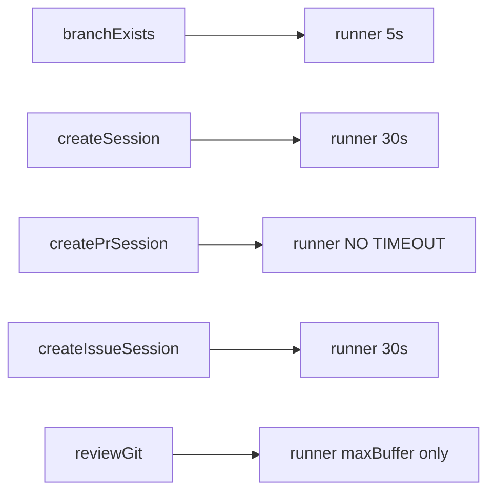
```mermaid
graph LR
  A[branchExists] --> R1[runner 5s]
  B[createSession] --> R2[runner 30s]
  C[createPrSession] --> R3[runner NO TIMEOUT]
  D[createIssueSession] --> R4[runner 30s]
  E[reviewGit] --> R5[runner maxBuffer only]
```

**After**

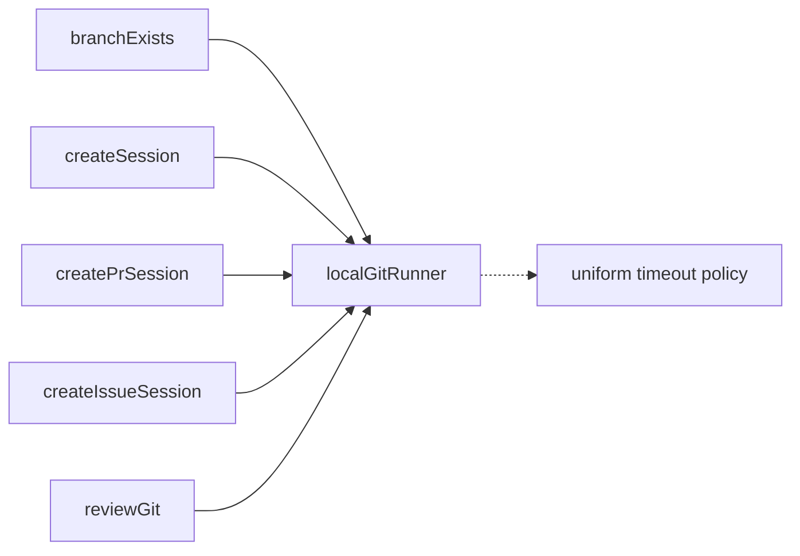
```mermaid
graph LR
  A[branchExists] --> F[localGitRunner]
  B[createSession] --> F
  C[createPrSession] --> F
  D[createIssueSession] --> F
  E[reviewGit] --> F
  F -.-> TO[uniform timeout policy]
```

---

### single-owner-pr-metadata — delete the dead duplicate  ·  Worth exploring  ·  score 18/25

- **Files** — `src/main/github.ts:6-52` (delete), `src/main/github.test.ts` (drop 2 imports and 6 now-redundant tests). **File-count estimate: 2.**
- **Score** — **18/25** (was 17) — *Leverage 3*. *Locality 5*. *Blast radius 1*. *Heat 2* (both files cold since 2026-07-10).
- **Problem** — `PrViewInfo`, `PR_VIEW_FIELDS`, `forkFieldsFromPr` and `describePrLookupFailure` are duplicated across `github.ts` and `pr-worktree-planner.ts` with exactly **one** character-level difference across ~33 lines: `forkFieldsFromPr`'s return annotation is an inline type in one and the structurally identical `ForkFields` alias in the other. Everything else, comments and regexes included, is byte-identical.
- **Deletion test** — **This candidate *is* the deletion.** `github.ts`'s `PrViewInfo`/`PR_VIEW_FIELDS` have zero importers repo-wide, and its `forkFieldsFromPr`/`describePrLookupFailure` are reachable only from `github.test.ts`; `session-manager.ts:63-69` already imports all four from `pr-worktree-planner`. Zero production files change. Commit `92129d6` (2026-07-10) did exactly this for five *other* byte-identical symbols and explicitly left these behind — this is that pass's residual.
- **Benefits** — *Test surface*: `pr-worktree-planner.test.ts` already has a **superset** of the coverage being deleted (7 tests vs 6), so the deletion is covered before it happens. Ranked below the 21s only because both files are cold — the YAGNI discount is doing the work, not any doubt about the evidence.

**Before**

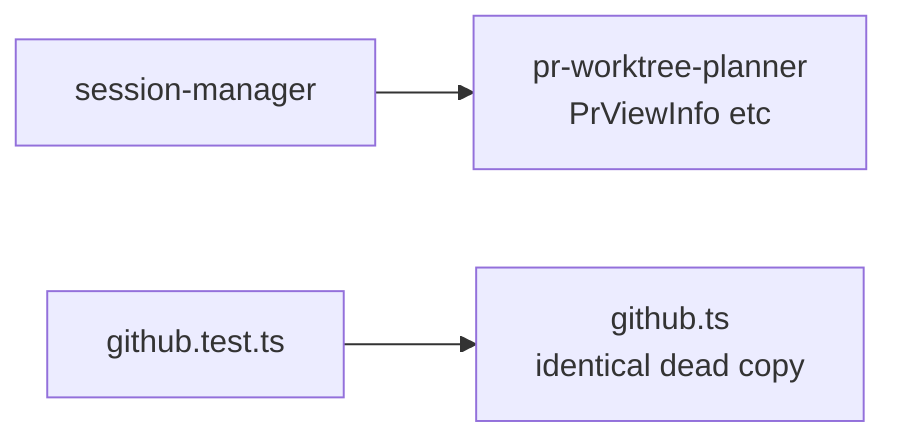
```mermaid
graph LR
  SM[session-manager] --> PWP[pr-worktree-planner<br/>PrViewInfo etc]
  GT[github.test.ts] --> GH[github.ts<br/>identical dead copy]
```

**After**

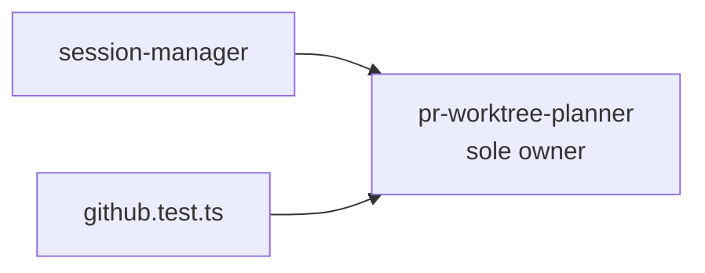
```mermaid
graph LR
  SM[session-manager] --> PWP[pr-worktree-planner<br/>sole owner]
  GT[github.test.ts] --> PWP
```

---

### resolve-local-review-context — one resolver for the review-IPC preamble  ·  Worth exploring  ·  score 18/25

- **Files** — `src/main/index.ts:628-673` (shifted from 596-641): `review:get-diff` `:628-647`, `review:list-branches` `:649-660`, `review:get-default-branch` `:662-673`. **File-count estimate: 2.**
- **Score** — **18/25** — *Leverage 3*. *Locality 4*. *Blast radius 1*. *Heat 3* (the file moved 2026-09-12 but this block dates to 2026-07-10).
- **Problem** — Five lines repeated three times (`getSession` → not-found throw → remote reject → `cwd` resolution), after which each body is a single line.
- **Deletion test** — **Concentrates**, modestly: one resolver owns the remote-unsupported policy.
- **Benefits** — *Test surface* is the weak point: there is **no `src/main/index.test.ts`** anywhere in the repo. `review.test.ts` covers only the pure functions the preamble calls into; the preamble itself has zero coverage, and a `remote-unsupported` regression would be caught only by untested renderer handling.

**Before**

```mermaid
graph LR
  A[review:get-diff] --> P1[getSession/reject remote/cwd]
  B[review:list-branches] --> P2[same 5 lines]
  C[review:get-default-branch] --> P3[same 5 lines]
```

**After**

```mermaid
graph LR
  A[review:get-diff] --> RC[resolveLocalReviewContext]
  B[review:list-branches] --> RC
  C[review:get-default-branch] --> RC
  RC -.-> S[getSession]
  RC -.-> RR[remote reject]
```

---

### create-broadcast-setting-store — a factory owning the stale-reply race guard  ·  Worth exploring  ·  score 17/25

- **Files** — `src/renderer/stores/theme.ts` (77 lines, whole file), `src/renderer/stores/animations.ts` (82 lines, whole file). **File-count estimate: 4.**
- **Score** — **17/25** — *Leverage 3*. *Locality 5*. *Blast radius 2*. *Heat 2* (`animations.ts` 2026-07-13, `theme.ts` 2026-05-11).
- **Problem** — The two stores are structurally isomorphic: same `loaded` re-entrancy guard, same module-level `broadcastListenerInstalled` latch, same `mutationCount: 0` seed, same capture-before-await / compare-after-await sequence, same setter shape, same toggle. **The predicted drift has already happened**: `theme.ts:38` still carries the bug `animations.ts:53-63` fixed in `6d5a609`. A cross-window `theme:changed` broadcast matching the receiving window's current value returns early *without bumping* `mutationCount`, so a slow in-flight `getTheme()` reply passes the guard at `:55` and clobbers — with no way to correct it in a window that has no local toggle, such as Swim Lanes. Same failure mode, same blast radius as the one already fixed next door.
- **Deletion test** — **Concentrates.** One factory owns the guard; the `apply` hook stays a parameter because `theme.ts` also exports a DOM-event bridge that animations has no analogue for.
- **Benefits** — *Test surface*: there is **no `theme.test.ts` and no `animations.test.ts`**; zero tests reference either store, and all three race-guard fixes landed untested. Writing the characterization tests is a prerequisite and is also most of the value. Held below the 18s by heat alone.

**Before**

```mermaid
graph LR
  T[theme store] --> G1[mutationCount guard<br/>no-op bug present]
  A[animations store] --> G2[mutationCount guard<br/>bug fixed]
```

**After**

```mermaid
graph LR
  T[theme store] --> F[createBroadcastSetting]
  A[animations store] --> F
  F -.-> MC[mutationCount guard]
  F -.-> AP[injected apply hook]
```

---

### unify-gh-query-dispatch — one dispatcher for the gh queries  ·  Speculative  ·  score 16/25

- **Files** — `src/main/github-items.ts:71-112`, `:157-173`, `:175-216`, `:218-226`, `:228-237`, `:239-255`, `:257-302`; a fourth probe site outside the module at `src/main/session-manager.ts:851-853`. **File-count estimate: 3.**
- **Score** — **16/25** — *Leverage 3*. *Locality 4*. *Blast radius 1*. *Heat 1* (two commits total, last 2026-07-10).
- **Problem** — Five exported query entry points over two private executors repeat: a byte-identical 3-line remote prologue at `:88-90`, `:182-184`, `:276-278`; the `if (hostId === null)` dispatch at `:75`, `:223-225`, `:234-236`, `:262`; six catch sites all wrapping `describeGhError`; the remote shell scaffold three times; and the local exec options four times.
- **Deletion test** — **Concentrates**, but the YAGNI discount is severe: two commits ever, nothing in over two months.
- **Constraint** — the return types (`NumberedGhItem[] | string` etc.) are mirrored in `preload/index.ts:44-66` and `env.d.ts:65-71`, so a dispatcher is safe **only if** it preserves the `T | string` convention — it must stay strictly separate from `gh-string-error-union`.
- **Benefits** — *Test surface*: best-covered of the set at 30 tests, so the work would be low-risk whenever it is scheduled.

**Before**

```mermaid
graph LR
  A[getRepoChoices] --> PR1[probe + dispatch + wrap]
  B[listOpenPrs] --> PR2[probe + dispatch + wrap]
  C[listRepoLabels] --> PR3[probe + dispatch + wrap]
```

**After**

```mermaid
graph LR
  A[getRepoChoices] --> RG[runGh]
  B[listOpenPrs] --> RG
  C[listRepoLabels] --> RG
  RG -.-> PB[probe]
  RG -.-> DP[local/remote dispatch]
  RG -.-> EW[error wrapping]
```

---

### hunk-key-value — an owner for the `filePath::hunkIndex` key  ·  Speculative  ·  score 14/25

- **Files** — `src/renderer/components/review/DiffViewer.tsx:11-13`, `src/renderer/utils/prompt-generator.ts:31-33` (byte-identical copy), `src/renderer/stores/review.ts:31` (inlined), `src/renderer/components/ReviewOverlay.tsx:287` (the split). **File-count estimate: 6.**
- **Score** — **14/25** — *Leverage 3*. *Locality 3*. *Blast radius 2*. *Heat 1* (all four files last touched 2026-05-11).
- **Problem** — Built in three places, split in a fourth, and `DiffViewer`'s copy is imported across a component boundary by `ReviewOverlay.tsx:6`. The split at `:287` uses `split('::')[0]`, which truncates at the *first* `::` — so a path containing `::` yields a wrong `focusedFile`. Low probability on POSIX paths; a tie-breaker, not the headline.
- **Deletion test** — **Concentrates**, weakly. The string form must be preserved: it keys `ReviewSessionState.annotations` and leaks into the DOM as `data-hunk-key`, queried back by scroll/focus logic.
- **Benefits** — *Test surface*: partially pinned — `prompt-generator.test.ts:40-44` covers one copy and `review.test.ts` pins the format through 28 literal `::` keys, but there is no test file for `DiffViewer.tsx` or `ReviewOverlay.tsx`, so the split is entirely unpinned. Coldest candidate in the report; YAGNI puts it last.

**Before**

```mermaid
graph LR
  D[DiffViewer] --> K1[getHunkKey copy 1]
  P[prompt-generator] --> K2[getHunkKey copy 2]
  S[review store] --> K3[inline template literal]
  O[ReviewOverlay] --> SP[split on ::]
```

**After**

```mermaid
graph LR
  D[DiffViewer] --> HK[hunk-key module]
  P[prompt-generator] --> HK
  S[review store] --> HK
  O[ReviewOverlay] --> HK
  HK -.-> B[hunkKey]
  HK -.-> PA[parseHunkKey]
```

---

## Dropped

| Candidate | Dropped because |
|---|---|
| `session-op-ipc` (22/25) | **Not pinnable before the change.** Handlers register inside the `app.whenReady()` closure in a 900-line file with no test file, so no characterization test can be written first. The extraction is itself the testability unlock, which makes it a strong candidate for a *human* — but test-first is this skill's terminal step. Score recorded so the next firing sees the filter rather than re-deriving the candidate. Reversible: extracting any testable seam from `index.ts` first would clear it. |
| `config-ipc-passthrough` | **Re-checked — filter still applies, strengthened.** Now **14** channels (`index.ts:675-753`, up from the filed range). Leverage still 1: each channel name is mirrored three times (handler → `preload/index.ts:95-117` → `env.d.ts:97-112`), so a generic dispatcher edits all three layers plus 5 renderer consumers / 15 call sites, and *widens* the IPC surface to an untyped key-string channel. Two of the 14 are not passthroughs at all — `config:save-theme` and `config:save-reduce-animations` each fan out a `BrowserWindow.getAllWindows()` broadcast, so a table-driven dispatcher needs an escape hatch for exactly the two channels that matter. |
| `repo-ref-value-object` | **Re-checked — filter still applies.** Published-interface change: the raw `repo` string threads through 25 declaration sites in 10 files, crossing `src/shared/types.ts:177-181`, `preload/index.ts:44/57/66` and `env.d.ts:58/64/69` simultaneously. Narrow note for a future human: `pr-worktree-planner.ts` already concentrates the `owner/name` parsing, so it is the natural home if a value object is ever wanted — and `single-owner-pr-metadata` should land first. |
| `gh-string-error-union` | **Re-checked — filter still applies.** Pervasive-convention migration: 25 signature sites and 10 `typeof x === 'string'` discrimination sites across 7 files. Every `Promise<T \| string>` in `env.d.ts:42-71` is a de-facto wire-format commitment — the renderer distinguishes success from failure by `typeof` — so it cannot be done file-by-file without compatibility shims on both sides. |
| `remote-session-context` | Leverage 1 — `remote-agent-spawn.ts:52-56` documents the throw-vs-return-string split as deliberate. Residue worth recording: `host.label \|\| host.alias` is open-coded at 8 sites while `host-connection.ts:79` has `hostLabel()` with *different* semantics (`getHost(host.hostId)?.label ?? host.alias`, re-reading the registry so a renamed host shows its new label, and `??` not `\|\|`). Two label semantics, one helper, seven bypasses — worth a follow-up, not a deepening. |
| `local-agent-respawn` | Leverage 1 — the one behavioural difference between `reviveSession:1232-1257` and `attachLocalSession:1279-1307` (swallow vs propagate a hook-install failure) is documented at `:1290-1297`, and the remote half is already covered by the landed `spawn-remote-agent-pipeline`. |
| `preload-subscribe` | Leverage 2 — seven identical `on<X>` wrappers in `src/preload/index.ts`, but almost no behaviour behind the interface; complexity would mostly move. It also touches the published `window.api` shape, which the other candidates do not. |
| `renderer-error-message` | Leverage 1 — `errorMessage(e)` duplicated verbatim in `stores/projects.ts:32-36` and `stores/hosts.ts:27-31` plus three ad-hoc inlines, but it is four lines; complexity just moves. |
| `project-tree-stale-tokens` | Leverage 2 — four guard sequences over two refs in `ProjectTree.tsx`, with a real semantic split (three sites claim latest via `(ref.current += 1)`, `handleSubmitIssues:499` only reads). Contained to one file and adjacent to `create-broadcast-setting-store`; mostly moves. |

### Standing observation — the pure-module cluster

Not a candidate, but the friction most felt while reading, and the reason three of the cards above exist. `session-manager.ts` imports **13** plan/derive modules (`worktree-plan.ts` is 15 lines; `branch-ref.ts` 21; `session-fields.ts` 54 lines with a 128-line test; `probe-transition.ts` 65/127). Reading `restoreSessions` alone means bouncing through five files. The deletion test says *just moves* for any individual one — inlining relocates ~10 lines and loses a test — so none is separately actionable. But the pattern is exactly "pure functions extracted for testability while the real bugs hide in how they are called": the **decisions** got extracted and tested; the **IO sequencing around the decisions** stayed in `session-manager.ts`, untested, and drifted. `session-store` is the first candidate that addresses the sequencing rather than the decisions.

## Too large to automate

None. No candidate scored blast radius 5. The three published-interface candidates in *Dropped* (`config-ipc-passthrough`, `repo-ref-value-object`, `gh-string-error-union`) are blast radius 4 — implementable in principle, but excluded by the autonomy contract's bar on changing a published interface unattended. A human can schedule any of them; `repo-ref-value-object` is the one with a natural staging path.

## Pick

**`session-store`, 24/25.** The runner-up **candidates** are `pty-entry-registration` and `session-op-ipc`, tied at 22/25 — a **2-point gap**, so this was not a close pick. (`session-op-ipc` is additionally hard-filtered as unpinnable, leaving `pty-entry-registration` as the effective runner-up and the natural next firing.)

`session-store` wins on the axis the exercise exists to move. It is the only candidate scoring leverage 5, and the evidence is unusually strong for an inferred refactor: **a consumer has already written the interface down.** `remote-reconnect.ts:13-24` — landed six days ago by the previous firing — declares a `SessionLookup` interface whose doc comment names this candidate by slug and specifies its central constraint (live references, not copies). The seam is not hypothetical; it has an implementation gap.

It also carries the strongest correctness case. Two deferred-notify defects follow mechanically from the unenforced mutate/notify pairing (`relocateProject:1973`, `restoreSessions:2132`), and two further sites are correct only because five call sites happen to remember. A store that owns the pairing makes that class of bug inexpressible — which is leverage in the precise sense, not just tidiness.

Blast radius was the axis that moved the ranking. The 2026-09-02 firing scored it 4 and ranked it below `remote-reconnect-coordinator`; re-verification shows band 4 was a mis-score against its own description — this crosses no package/tier seam and touches no published interface. Corrected to 2. Note the honest caveat that the band does not capture: at ~60 mutation sites this is the largest *line* diff in the report even though it is a small *file* diff, and it lands in the file that has absorbed the last two firings' extractions. Step 5 watches the real diff against the 5-file estimate and bails rather than pressing on.

`pty-entry-registration` loses on leverage (4 vs 5) and heat (4 vs 5). Its case is strong and largely independent of this one — different file, no overlap with `session-manager.ts` — so it is a clean next firing whatever happens to this PR.

## Design

Three designs were produced in parallel by sub-agents, each briefed to a *radically different* optimisation target, and each given both invariants and the structural-only scope decision verbatim. All three independently converged on: the registry becomes `Map<string, Session>` (the `SessionEntry` wrapper dies), the store satisfies `remote-reconnect.ts`'s `SessionLookup` structurally so the 9-line adapter at `session-manager.ts:1095-1103` collapses to `sessions: store`, `remote-reconnect.ts` is **not edited**, and the work fits in 3 files. They disagree on how much policy the store should own, and on whether a `batch()` primitive should exist at all.

### Design A — minimal surface

**Thesis**: because the store must hand back live references (invariant 2), field mutators are unnecessary — callers already mutate through the reference they hold. The only things a store must own are **membership** and the **fan-out**. Everything else is composition.

Five methods, three of which are `SessionLookup` verbatim:

```ts
export interface SessionStoreSinks {
  persist(sessions: Session[]): void
  broadcast(sessions: Session[]): void
  tray(sessions: Session[]): void
}

export interface SessionStore {
  get(id: string): Session | undefined
  values(): Iterable<Session>
  add(session: Session): void      // insert or replace by id; does NOT flush
  remove(id: string): boolean      // returns whether present; does NOT flush
  changed(): void                  // persist -> broadcast -> tray, one snapshot
}

export function createSessionStore(sinks: SessionStoreSinks): SessionStore
```

**There is deliberately no `update()` and no `batch()`.** Invariant 1 is satisfied *by construction rather than by care*: no operation on this store can flush, so no operation can flush spuriously, and the `try { fn() } finally { changed() }` failure mode is unrepresentable. `updateLastKnownStatesBatch` survives byte-for-byte; only three lines inside `applyLastKnownState` change (`entry.session` → `session`).

**What it hides**: that three sinks exist at all; the persist → broadcast → tray order; that all three see one snapshot array (today each of `persistSessions`, `notifyRenderer` and `updateTray(getSessions())` independently rebuilds it — three allocations, three chances to diverge); that a `Map` exists; the `SessionEntry` wrapper.

**Trade-offs it states against itself**: nothing enforces "mutate then flush" — every mutation site stays individually responsible for calling `changed()`. The `lastKnownState` throttle (the 10 s window, the 3 KiB cap, the text-equality no-op) stays *outside* the store, so `session-store.test.ts` cannot test it; those keep needing the `session-manager.test.ts` mega-harness. A sixth operation `noteLastKnownState(id, text, now): boolean` was considered and rejected because it would make the store know a field name.

**Migration**: 45 field mutations change **0** (live references mean the mutation sites are exactly the ones that don't change); 25 `onSessionsChanged()` sites change 0 (kept as a hoisted wrapper); 30 direct registry accesses all change, mechanically. ~130-160 changed lines in one file, 3 files total.

### Design B — optimised for the most common caller

Began with a census of all 59 mutation and 38 notify sites, classified by statement shape. Result: **bucket A — "look up one session by id → write 1-4 fields → persist+broadcast+tray once" — is 23 of 38 notifies (61%) and 29 of 59 mutation lines**, in 21 statements. The runner-up shape (insert-then-flush) is 5 sites. So the interface is shaped around one call, `store.update(id, patch)`:

```ts
export type SessionPatch = Partial<Omit<Session, 'id'>>

export interface SessionStore {
  get(id: string): Session | undefined
  values(): Iterable<Session>          // lazy
  all(): Session[]                     // stable snapshot
  update(id: string, patch: SessionPatch): boolean   // patches in place, then FLUSHES
  insert(session: Session): void       // throws on duplicate; does not flush
  remove(id: string): boolean          // does not flush
  changed(): void
  batch(fn: () => void): void          // depth counter + dirty flag
}
```

`batch` is a depth/dirty counter, not `try/finally`: `depth++; try { fn() } finally { depth-- }; if (depth === 0 && dirty) flush()`. The `finally` restores depth only; the flush sits outside it and is gated on `dirty`, so a throw unwinds without broadcasting.

**Census findings worth keeping regardless of which design wins:**
- **Bucket C (9 of the 59 "mutation" lines) is not registry mutation at all** — `backfillDerivedFields` and the restore-loop writes happen on JSON-parsed objects *before* `sessions.set`. No store design can affect them.
- **Line 1482 is a 60th mutation site** the review's list omits (`if (session.hostId) session.connectionState = 'live'`, immediately before `updateSession(id, 'completed')` at 1483).
- **There are four hand-rolled dirty flags, not one**: `updateLastKnownStatesBatch`'s `any` (`:288`), `removeSessionsForHost`'s `removed` (`:1405`), `handleHookEvent`'s `mutated` (`:1062`), and `remote-reconnect.ts`'s `dirty` (`:394`). Invariant 1's shape appears four times in this codebase.
- `handleHookEvent` has a **real** zero-notify case: `applyHookEvent`'s `session.end` branches return the *original* map, so every identity test fails and no flush happens.

**Why it loses on scope**: two of its moves are behaviour changes, and this run's scope decision is structural only. Its `handleHookEvent` rewrite folds the reducer's fresh object onto the live one via `Object.assign` instead of swapping it — which *fixes* the stale-reference hazard rather than preserving it — and its `insert` throws on a duplicate id where today's `sessions.set` silently replaces. It also flags a third intentional change at `:504`. Each is individually defensible and arguably an improvement; together they turn a mechanical refactor into a behavioural one in the hottest file in the repo. Its `SessionPatch` also carries an unguarded hazard it documents but cannot type: with `exactOptionalPropertyTypes` off, `{ branch: undefined }` type-checks and would produce a `Session` violating its own type.

### Design C — ports and adapters

Opens by rejecting the hexagonal instinct toward a pure immutable core, in the codebase's own words: `remote-reconnect.ts:12-19` requires live references, so the boundary is drawn not around field mutation but around **membership**, **identity-preserving reads**, **the change edge**, and **the two write policies that already travel with the data**.

```ts
export interface SessionPersistence { save(sessions: readonly Session[]): void }
export interface SessionBroadcast   { publish(sessions: readonly Session[]): void }
export interface SessionTray        { update(sessions: readonly Session[]): void }
export type Now = () => number

export interface SessionStore {
  get(id: string): Session | undefined
  values(): Iterable<Session>
  all(): Session[]
  insert(session: Session): void
  replace(id: string, next: Session): boolean
  delete(id: string): boolean
  setStatus(id: string, status: SessionStatus): boolean
  recordLastKnownState(id: string, text: string): boolean
  changed(): void
  batch(body: () => boolean): boolean
}
```

**`batch(body: () => boolean)` is the design's sharpest move.** The natural wrong implementation cannot be *expressed* through this signature — a caller who forgets to thread the dirty flag gets `error TS2345: Argument of type '() => void' is not assignable to parameter of type '() => boolean'` rather than a spurious broadcast. Invariant 1 becomes a compile-time property.

**Mutators never notify**; every mutator returns whether it changed anything and fires no port. `changed()` is the only thing that reaches disk, renderer or tray.

**It owns the most policy**: the whole `lastKnownState` write policy (the 10 s window, the per-session bookkeeping map, the 3 KiB tail cap, the idle-text-equality no-op — ~35 lines at `:251-284` collapse to one `recordLastKnownState` call), the status+`lastActivity` stamping, and the clock.

**Port honesty**: the design audits its own ports against the "one adapter = hypothetical seam, two = real" rule and concludes **all four are hypothetical** — production plus a test double is one real adapter, not two. It declines to dress this up, and explicitly declines a `observers: SessionObserver[]` collapse that *would* have cleared the two-adapter bar, on the grounds that the shared signature is a coincidence rather than a category (persist must be durable-before-visible; broadcast structured-clones every field over IPC; tray reads a status aggregate). What the ports actually buy is **import-graph isolation**: `session-store.ts` imports exactly one thing, `type { Session, SessionStatus }` — no `fs`, no `./config`, no `electron`, no global `Date` — so its test needs zero `vi.mock` calls against `session-manager.test.ts`'s ~15.

**Where it declines its own uniformity**: `handleHookEvent` deliberately keeps an explicit `if (mutated) store.changed()` rather than using `batch`, because the intents must be realized *between* the last mutation and the notification — which is exactly what `batch`'s shape forbids. The design keeps that visible rather than contorting the call site.

**One load-bearing implementation detail it flags**: the clock adapter must be `now: () => Date.now()`, not `now: Date.now`. Vitest's fake timers install a new `Date` on `globalThis`, so a reference captured at module init keeps returning real time and silently breaks `session-manager.test.ts:1588-1598`.

**One non-structural liberty it flags**: `delete(id)` also drops the session's `lastKnownStateWrites` entry, which `session-manager.ts` never does today — a small unbounded-growth leak. Unobservable (ids are `randomUUID`, never reused) and free once the store owns the map.

**One pre-existing hazard it documents rather than fixes**: `session-manager.ts:1068` swaps the stored object because `applyHookEvent` is copy-on-write, so any reference captured before the swap goes stale. `remote-reconnect.ts`'s `SessionLookup` CONTRACT covers *deletion* mid-await but says nothing about *replacement*. Scope is structural only, so the design moves the behaviour behind `replace`, writes the hazard into that method's contract, and pins it with a test.

**Migration**: 51 in-place field writes change **0**; 6 structural sites change; 2 of 38 notify sites change. 3 files. `remote-reconnect.ts` zero edits, `session-manager.test.ts` zero edits — and the design names that last one as the bail-out gate: *"if the implementer finds themselves changing an assertion in that 3,888-line suite, something has drifted and the run should bail rather than 'fix' the test."* It also sequences the work into four steps, each of which type-checks and leaves the suite green, so a bail at any point lands something coherent.

### Adjudication

Adjudicated against the fixed criteria, in order: **depth** (behaviour per unit of interface a caller must learn), **locality** (where change, bugs and verification concentrate afterwards), **seam placement** (is the seam where something actually varies — one adapter is hypothetical, two is real), **test surface** (can the behaviour be exercised through the interface without reaching past it), **blast radius** (of two otherwise-equal designs, the smaller diff wins). The advisor was consulted on the written designs above.

**Winner: Design C (ports and adapters).**

1. **Depth** — C is deepest by a clear margin. It absorbs the `lastKnownState` write policy (~35 lines of rate limit, cap and no-op suppression), the status+`lastActivity` stamping and the clock behind its interface; A owns only membership and fan-out and explicitly leaves the throttle outside; B sits between them, keeping the throttle guards in `session-manager.ts`. Behaviour-per-unit-of-interface is the axis this exercise exists to move, and it separates the three cleanly.
2. **Locality** — C concentrates the most. After it, a change to the rate-limit window, the cap, the no-op rule or the fan-out order is a one-file edit with a test beside it. A's own trade-off section concedes the opposite: the throttle "keeps needing the `session-manager.test.ts` mega-harness."
3. **Seam placement** — a wash on the letter of the rule, since every port in all three designs has exactly one production adapter. C is the only design that *audits itself against the rule and says so*, and the only one that declined an available collapse that would have cleared the bar artificially. Its `Now` port is the one seam with an independent justification — it removes fake-timer dependence from the store's tests, with a concrete failure mode demonstrating the binding matters.
4. **Test surface** — decisive for C. It can assert the rate-limit boundary exactly (9,999 → false, 10,000 → true, where the existing test can only approach it with `+11_000`), the 3 KiB cap, the text no-op, persist-first fail-fast under a throwing sink, fan-out ordering, single-snapshot identity, the live-reference contract as executable spec, and the `replace` staleness hazard — all with zero `vi.mock` and no fake timers. A can reach ordering, snapshot identity and live references but not the throttle. This is "the interface is the test surface" applied literally.
5. **Blast radius** — A and C are comparable (3 files; A ~130-160 changed lines, C similar with 6 structural sites and 2 notify sites changing), so this criterion does not separate them and the higher criteria stand.

**Why A lost** (the runner-up **design**): it is the safest and the most elegant argument — invariant 1 satisfied by construction rather than by care is a genuinely better answer than either alternative's runtime mechanism, and it is right that live references make field mutators unnecessary. But it buys that safety by owning less. Its own report names the cost: the throttle stays outside, so the single largest block of testable policy in the area remains reachable only through the mega-harness, and "nothing enforces mutate-then-flush." A store that owns membership and a fan-out is a *shallower* module than one that also owns the write policies that travel with the data. On depth, locality and test surface — the first, second and fourth criteria — C wins, and blast radius does not rescue A.

**Why B lost**: its census is the most valuable artefact any of the three produced and its findings are folded into this report regardless. But it is disqualified on scope before the criteria are reached: two of its moves (the identity-preserving `handleHookEvent` fold, and `insert` throwing on a duplicate) are behaviour changes, and a third is flagged at `:504`. This run settled on structural-only precisely so that a ~60-site mechanical diff in the hottest file in the repo stays reviewable. B's changes are defensible improvements — the `handleHookEvent` fold would close a real stale-reference hazard — but they belong in their own PR, proposed rather than smuggled.

**Carried into implementation from the losing designs:**
- From B: the census figures (bucket C's 9 lines are object construction, not registry mutation; the four hand-rolled dirty flags; the 60th mutation site at `:1482`).
- From A: the `session-manager.test.ts`-needs-zero-edits bail-out gate, which C independently reached and states more sharply.
