# Architecture review — pewpew — 2026-09-21

**Scope**: Hot spots by churn over the last 120 commits — `src/main/session-manager.ts` (2087 LOC, 67 touches), `src/main/pty-manager.ts` (914, 13), `src/main/index.ts` (900, 13), `src/renderer/components/ProjectTree.tsx` (1206, 16), `src/main/host-bootstrap.ts` / `host-connection.ts` / `hook-installer.ts`. Scoped this way because deepening pays off through _future_ change: YAGNI applies to cold code however shallow it looks. The three previously-landed extractions (`remote-agent-spawn.ts`, `remote-reconnect.ts`, `session-store.ts`) were excluded from re-proposal and their residue re-checked instead.
**Picked**: `pty-entry-registration` — see `.architecture/backlog.md`
**Degradations**: one. The **advisor was rate-limited at step 4**, so the design adjudication was made by this run against the three written designs rather than by an independent reviewer — the skill's stated fallback. `gh` authenticated; sub-agents available for the scan and for design-it-twice; no flags forced; no skill absent.

**Diagram legend**: solid edges are the **interface** a caller must learn; dashed edges are inside the implementation, behind the **seam**.

## Candidates

### `pty-entry-registration` — one primitive owns the four-times-repeated pty registration epilogue · Strong · score 23/25

- **Files** — `src/main/pty-manager.ts:476-492` (`createPty`), `:597-616` (`createRemotePty`), `:848-863` (`reattachPty`), `:892-908` (`reattachRemotePty`); `src/main/session-record.ts:40`. Estimate: **3 files** (`pty-manager.ts`, `pty-manager.test.ts`, and either a new module or a local primitive).
- **Score** — 23/25 (leverage 4, locality 5, blast radius 1, heat 5)
  - _Leverage 4_: four call sites collapse to one line each, and a silent-leak invariant stops being something a fifth site can forget. Not 5 only because the four sites are all inside one module.
  - _Locality 5_: the rule "a remote entry must release its SSH lease on exit" currently lives in two of four call sites; afterwards it lives in exactly one place and follows structurally from the presence of a `host`.
  - _Blast radius 1_: contained to `pty-manager.ts` and its test. No published interface changes — `createPty`/`createRemotePty`/`reattachPty`/`reattachRemotePty` keep their signatures.
  - _Heat 5_: `pty-manager.ts` last touched **2026-09-18**, three days ago, by `a21af71` / PR #321 ("isolate local tmux server and keep killed sessions restartable") — which edited the socket field _inside these very epilogues_. 13 touches in the last 120 commits.
- **Problem** — `pty-manager.ts` registers a `PtyEntry` in four places with a hand-paired five-step sequence: build the entry literal → `ptyProcess.onData(d => appendToBuffer(entry, d))` → `ptyProcess.onExit(...)` → `notifyUnexpectedExitIfPresent(sessionId)` → `ptys.set(sessionId, entry)`. The interface each caller must learn is the whole implementation: there is no seam, so every step is the caller's to remember.

  The step that matters is the one that varies. The two **remote** sites must prefix `onExit` with `releaseRemoteEntry(entry)` (`:609`, `:904`), which is the only path back to `releaseHostConnection` — omit it and the SSH connection refcount leaks with no error anywhere. The two **local** sites must not. `releaseRemoteEntry:495-499` no-ops when `entry.host` is unset, so the omission is silent in both directions. Nothing in the current shape makes forgetting unrepresentable; the correlation between "has a `host`" and "releases on exit" is enforced only by four hand-written copies agreeing.

  Two further verbatim repeats sit in the same file: the remote attach block `spawnAttach(host, ['tmux','attach-session','-t',tmuxSession], { name:'xterm-256color', cols:120, rows:30, env: sanitizeChildEnv() as Record<string,string> })` at `:588-593` and `:883-888`; and the tmux session name `` `pewpew-${sessionId}` ``, open-coded at **10 sites** in `pty-manager.ts` (`:453`, `:511`, `:649`, `:675`, `:721`, `:768`, `:785`, `:815`, `:842`, `:881`) plus once in `session-record.ts:40` where it is _persisted_ into `Session.tmuxSession`.

- **Deletion test** — **Concentrates.** Deleting the primitive restores four hand-written epilogues and re-scatters the release-on-exit rule back across them, where the failure mode is an invisible refcount leak. It does not move complexity to callers: the callers are the four sites, and each loses ~15 lines and gains one.
- **Solution** — One `registerPtyEntry(sessionId, pty, target)` primitive, where `target` is a discriminated description of _where the pty lives_ — local (carrying its `tmuxSocket`) or remote (carrying its `host`) — so the lease rule is derived from the target rather than remembered. Add a `tmuxSessionName(sessionId)` helper owning the `` `pewpew-${id}` `` string form, and a single remote-attach spawn helper for the duplicated options block.
- **Benefits** — _Leverage_: four ~15-line bodies become one call each; a fifth registration site (a future remote reattach variant, say) gets the lease rule for free. _Locality_: buffer wiring, exit notification, lease release and map insertion all become one-file edits. _Test surface_: today `pty-manager.test.ts`'s `fakePty()` (`:29-37`) stubs `onData`/`onExit` as no-ops, so **no existing test observes any of this wiring**, and `reattachPty`/`reattachRemotePty` have no tests of their own at all. A primitive with a named interface can be exercised directly, and making `fakePty` capture its handlers is a self-contained prerequisite that unlocks assertions on all four sites.
- **Before / After**

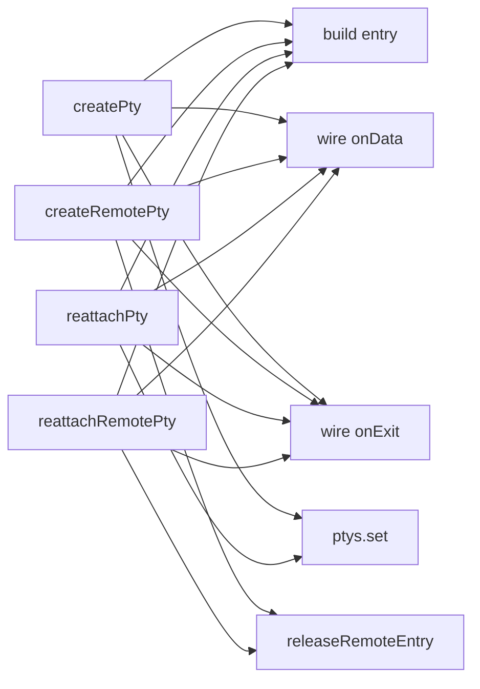

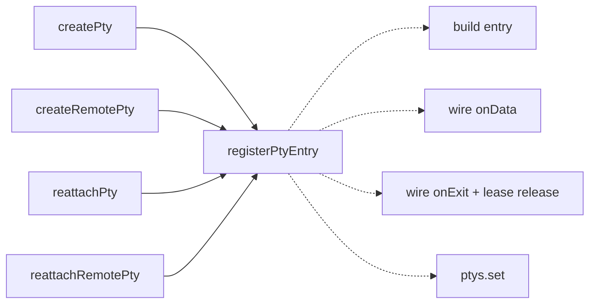

### `adoption-gate` — one primitive owns the in-flight adoption map and the mixed-tool policy · Strong · score 21/25

- **Files** — `src/main/session-manager.ts:372-404` (`createSessionForWorktree`), `:557-597` (`createRemoteSessionForWorktree`). Estimate: **2 files**.
- **Score** — 21/25 (leverage 3, locality 5, blast radius 1, heat 5). _Leverage 3_: two call sites, but the shared rule is a concurrency invariant. _Locality 5_: the map lifecycle becomes a one-file edit. _Blast radius 1_: contained, no published interface. _Heat 5_: `session-manager.ts` touched 2026-09-20.
- **Problem** — `:372-404` and `:557-597` are the same function twice: resolve `effectiveTool`, return an existing session after `assertToolCompatible`, read an in-flight map, throw the character-for-character identical `` `Worktree already has a ${inflight.tool} session in-flight; mixed tools per worktree are not supported` `` (`:392`, `:584`), else `map.set(key, …)` and `try { return await promise } finally { map.delete(key) }`. They differ only in the key shape (`canonicalPath(worktreePath)` vs `` `${hostId} ${worktreePath}` ``), the lookup helper, and which of the two maps is used (`:372`, `:559`). The source says so itself at `:557-559`: _"Mirrors `inflightAdoptions` (local)."_
- **Deletion test** — **Concentrates.** Deleting the seam restores two ~30-line bodies and re-duplicates a concurrency rule that has no test.
- **Solution** — `runExclusiveAdoption({ key, tool, findExisting, adopt })` owning the map, the mixed-tool rejection and the `finally` cleanup.
- **Benefits** — _Leverage_: the `finally`-delete ordering (which must not race an awaiting caller) is written once. _Locality_: one place to fix. _Test surface_: `session-manager.test.ts:550-571` and `:592-602` both `await` the first call before the second, so they exercise `findSessionOnWorktree` and **never the in-flight map**; a concurrent double-call test against a named primitive is straightforward, against the current shape it needs the whole session-creation apparatus.
- **Before / After**

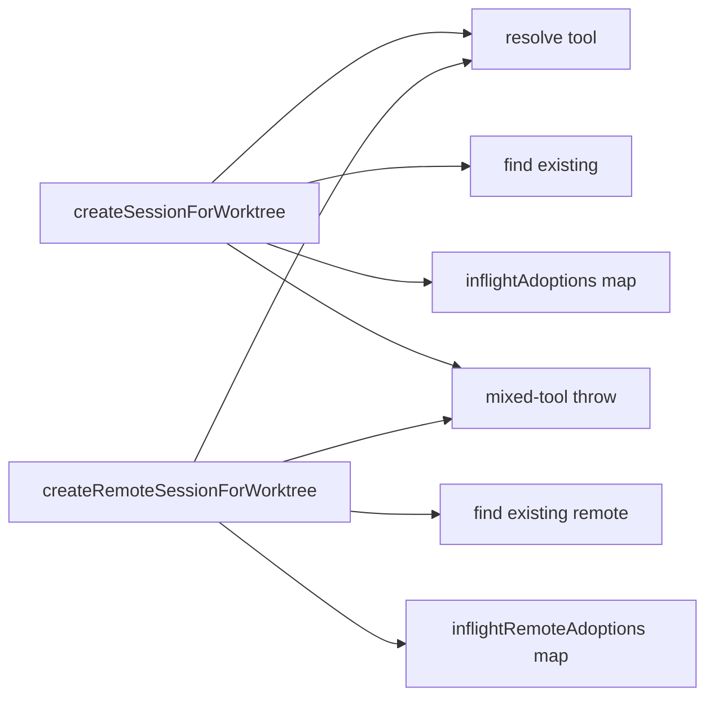

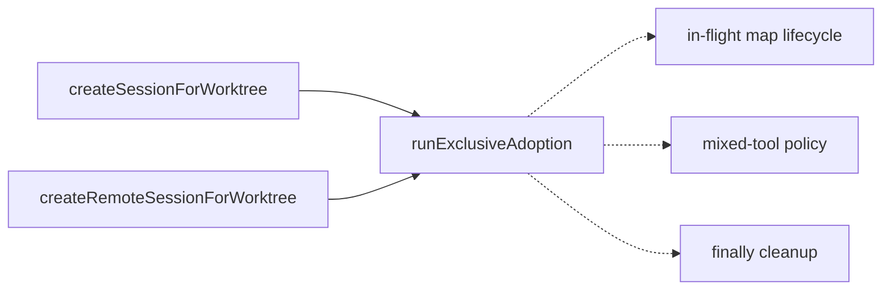

### `remote-hook-merge-executor` — one hook-merge policy over a file-store port · Strong · score 21/25

- **Files** — `src/main/hook-installer.ts:129-140` / `:152-166` / `:276-291` / `:322-345` / `:404-443` / `:453-490`. Estimate: **3 files**.
- **Score** — 21/25 (leverage 4, locality 5, blast radius 1, heat 3). _Heat 3_: `hook-installer.ts` last touched 2026-08-18, but it is edited whenever a new agent is supported.
- **Problem** — The same three algorithms are implemented **twice in two languages**: hook merging in TypeScript against `node:fs` and again as an embedded `jq` program shipped over SSH; the codex `hooks.json` merge likewise; the `[features].codex_hooks` TOML flag as TS and again as `awk`. They have already been hand-synced once — `:315-319` carries a comment explaining that its `jq -e` pre-check _mirrors the local installer's tolerance_, which is the shell transcription of `parseAsObject:101-111`. Every future edit to the merge rule is two edits in two languages.
- **Deletion test** — **Concentrates.** Deleting the executor restores ~60 lines of embedded `jq` and re-forks the merge rule across a language seam.
- **Solution** — A `{ read, writeAtomic, mkdirp }` file-store port, implemented once over `node:fs` and once over `execRemote`; the pure TS mergers then serve both hosts and both `jq` programs delete.
- **Benefits** — _Leverage_: one merge rule for four install functions. _Locality_: a merge-semantics bug is one edit. _Test surface_: `hook-installer.test.ts:46-63` already has an `execLocally` harness running the remote shell for real against a `mkdtempSync` dir, so the remote half is testable today.
- **Carries a verified bug** — `installRemoteHooks` (`:158`) pipes the prior settings file straight into `jq` with no validity pre-check, while `installRemoteCodexHooks` (`:328-329`) has an explicit `jq -e 'type == "object"'` guard and local `installHooks` gets the same tolerance from `parseAsObject`. A malformed `.claude/settings.local.json` in a remote worktree therefore aborts before the `mv` under `set -e`, and the remote **claude** session cannot be created, while local claude and remote codex recover silently.
- **Invariant any implementation must preserve** — `ensureRemoteCodexHooksFeatureFlag` uses a PID-suffixed temp path (`tmp="$cfg.tmp.$$"`, `:~467`) _specifically_ so two concurrent revives on one host cannot clobber each other, pinned by `hook-installer.test.ts:434-492`. A naive fetch-to-local / merge-in-TS / push-back reintroduces exactly that lost-update race across an SSH round trip, where it is worse. The honest scope is the two JSON merges, leaving the TOML flag in `awk`.
- **Before / After**

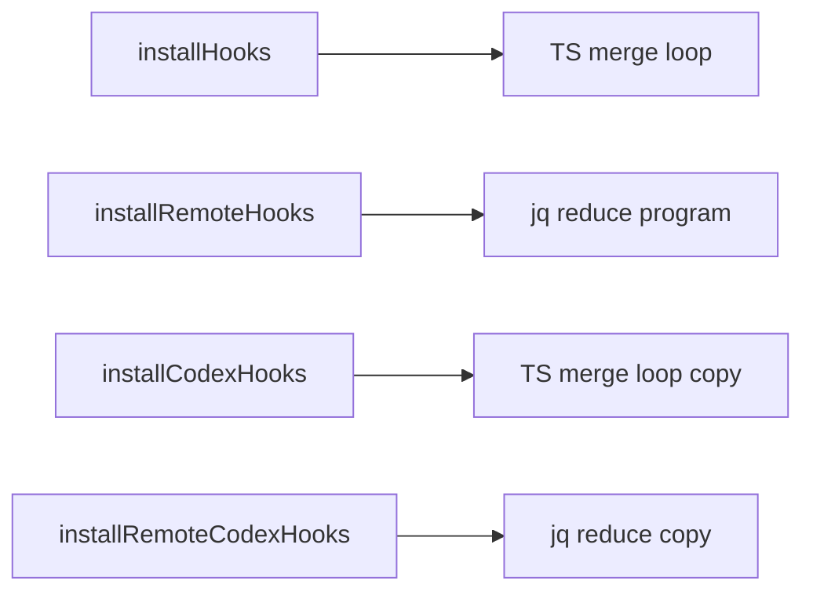

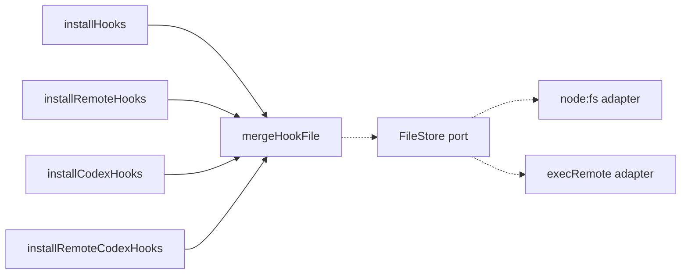

### `remote-exec-result-check` — bind `expectRemoteOk` to a host as a `RemoteShell` · Worth exploring · score 21/25

- **Files** — `src/main/remote-command.ts:17-25` (the existing primitive), bypassed at `src/main/hook-installer.ts:169-172`, `:248-252`, `:344-347`, `:486-489`; `src/main/pty-manager.ts:584-587`; `src/main/session-manager.ts:827`, `:1989`; second private copy at `src/main/host-bootstrap.ts:547-557`, itself bypassed at `:484`. Estimate: **6 files**.
- **Score** — 21/25 (leverage 4, locality 4, blast radius 2, heat 5).
- **Problem** — The detail line `` result.stderr.trim() || result.stdout.trim() || `exit ${result.code}` `` appears at **12 non-test sites across 5 modules**, always inside `if (result.timedOut || result.code !== 0)`. The primitive that owns it already exists; most sites rebuild its body because it takes no timeout and no caller-chosen error type. `host-bootstrap.ts` went so far as to define a _second_ private `expectOk` — and then open-code the epilogue six lines above it.
- **Deletion test** — **Weak pass.** The primitive already exists, so this is adoption plus widening rather than new depth. Real leverage, modest depth.
- **Solution** — Give `expectRemoteOk` an options bag (timeout, error kind) and bind it to a host as `RemoteShell = { run, expectOk }`, which the five hook-installer functions already approximate by threading `execRemote` as their first parameter.
- **Benefits** — _Leverage_: 12 sites, four hot-spot modules. _Locality_: timeout and error-detail policy in one place. _Test surface_: already adequate — `remote-command.test.ts` covers the primitive, `hook-installer.test.ts:155-167` asserts the thrown message carries remote stderr.
- **Before / After**

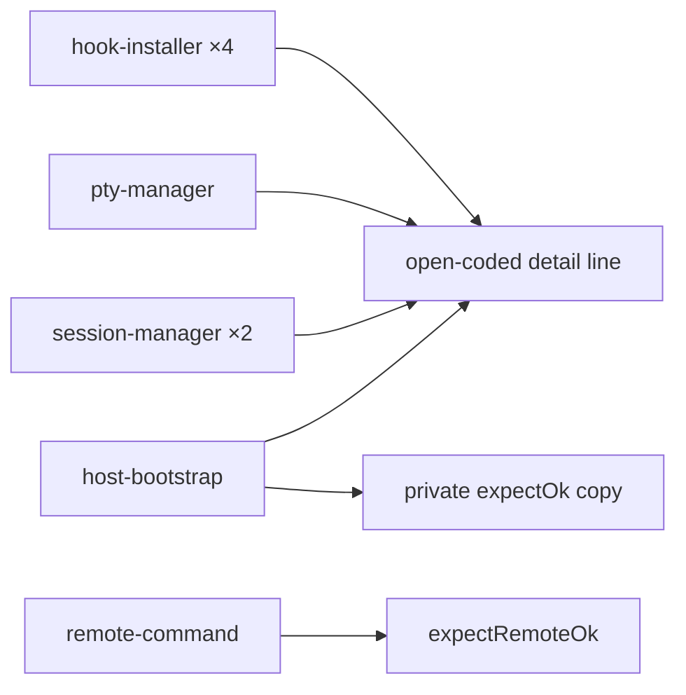

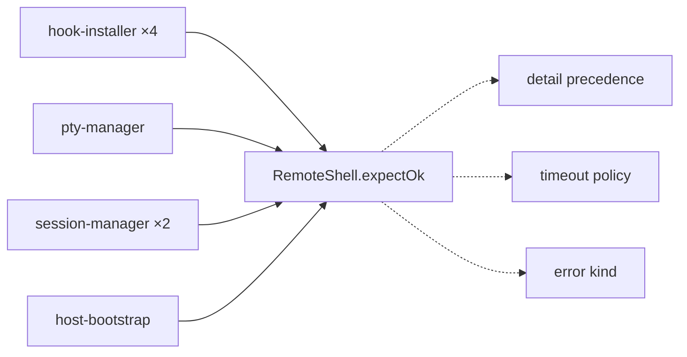

### `worktree-add-strategy` — one probe-first worktree executor over a `GitRunner` · Worth exploring · score 21/25

- **Files** — `src/main/session-manager.ts:947-986` (`createSession`), `:695-745` (`createRemoteSession`), `:1736-1746` (`createIssueSession`), `:1789-1816` (`createRemoteIssueSession`), `src/main/worktree-adoption.ts`. Estimate: **4 files**.
- **Score** — 21/25 (leverage 4, locality 4, blast radius 2, heat 5).
- **Problem** — Four provisioning bodies differ _only_ in whether git runs locally or over SSH; the remote `GitRunner` adapter is hand-rolled verbatim three times (`:196-201`, `:695-700`, `:1776-1781`) and the local one twice (`:186-188`, `:949-955`), even though `origin-base.ts:6` already **declares** the `GitRunner` interface and `resolveOriginDefaultBase` already consumes it. The origin-error triage (`no-origin-remote` / `no-origin-default-branch` → user-facing string) is duplicated character-for-character at `session-manager.ts:1729-1730` and `:1783-1784`, is **absent** from `createSession`/`createRemoteSession` (which let the raw sentinel escape as an Error message), and has a **third** copy in the renderer at `ProjectTree.tsx:331-333`, which re-derives it by `message.includes(...)` because the main-side strings never reached it as data.
- **Deletion test** — **Concentrates.** Deleting the executor restores four bodies, three hand-rolled adapters, and re-splits one user-facing error mapping three ways.
- **Solution** — `gitRunnerFor(host | null, projectPath)` plus `provisionWorktree(runner, { worktreePath, branch, base })` owning base resolution, probe-first add-form choice and failure wording.
- **Benefits** — _Leverage_: four bodies to four calls. _Locality_: the `origin-default` triage becomes one function. _Test surface_: `session-manager.test.ts:768-902` pins the local `origin-default` path; `createRemoteSession` and `createRemoteIssueSession` have **zero** test references, so remote characterization tests are prerequisite work, not optional.
- **Before / After**

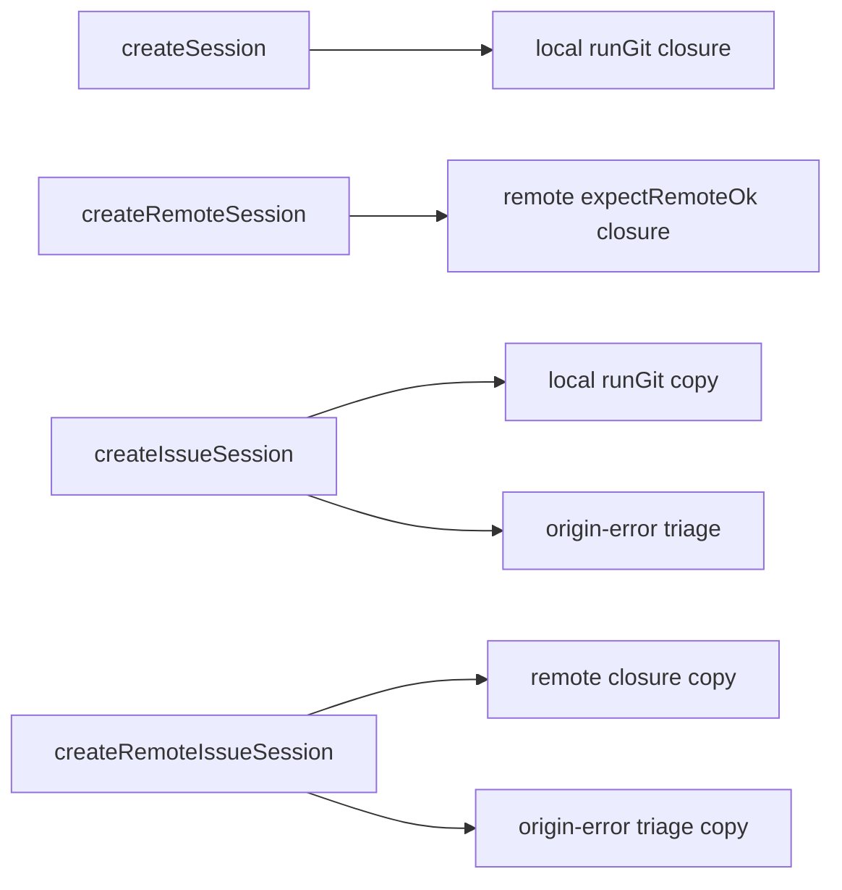

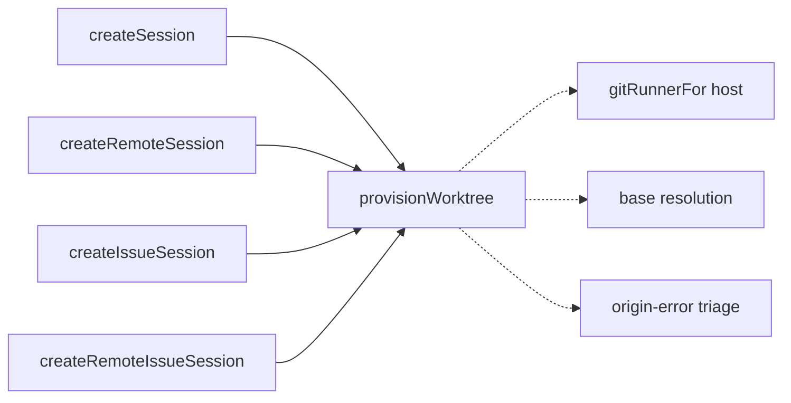

### `materialize-pr-worktree` — one executor for the PR-worktree plan · Worth exploring · score 20/25

- **Files** — `src/main/session-manager.ts` (`createPrSession:1638-1666`, `createRemotePrSession:876-902`), `src/main/pr-worktree-planner.ts`. Estimate: **3 files**.
- **Score** — 20/25 (leverage 4, locality 4, blast radius 2, heat 4). Carried from the 2026-09-02 backlog; friction re-verified present.
- **Problem** — One executor, probe-first, driven by an injected `GitRunner`, would remove a latent local-path try-then-fallback that the remote path already fixed. Narrower than originally filed: the local path _does_ probe (`:1685`) but uses the result only to gate the fork bail-out; only the **same-repo** case still does try-then-fallback (`:1691` → `:1700`). The fork branch is already symmetric with remote.
- **Deletion test** — **Concentrates**, on the same argument as `worktree-add-strategy`, of which this is the PR-path sibling (different, fetch-then-probe shape).
- **Prerequisite** — **zero tests for `createRemotePrSession`**; all 12 `createPrSession` test calls pass `hostId = null`.
- **Before / After** — see `worktree-add-strategy`; the shape is the same with a fetch step ahead of the probe.

### `project-tree-stale-tokens` — one owner for the stale-reply guard · Worth exploring · score 20/25 · **moved back from `dropped`**

- **Files** — `src/renderer/components/ProjectTree.tsx:196-201` (the two refs), `:207-225`, `:398-406`, `:428-449`, `:499-519`. Estimate: **3 files**.
- **Score** — 20/25 (leverage 3, locality 5, blast radius 1, heat 4). Previously `dropped` at _leverage 2 — contained to a single file and mostly moves_.
- **Reason for reversal** — An independent scan this run found the count is **five** guard sites over two refs, not four, and — decisively — that this is the repo's cleanest instance of _a pure function extracted only for testability while the real bugs hide in how it is called_. `resolveBulkPrDialogDefaults` is `export`ed at `:26-41` **purely so a test can reach it**, and it is the one piece of the flow containing **no** token logic; the guard it exists to serve lives at the call site (`openAllPrs:398`, `:406`), outside the tested module. `ProjectTree.test.ts` is 24 lines with one test, exercising the extracted function only; the guards themselves have **zero** coverage, and three separate guard fixes appear to have landed untested. That is a locality failure, not a cosmetic one — leverage 2 → 3. Still ranks below the pick, so the reversal does not change this run's outcome.
- **Problem** — `const token = (ref.current += 1)` … `if (ref.current !== token) return`, hand-written across five in-flight calls, each with its own reset payload and its own `.catch` arm that must remember to re-check (`:222-225`, `:446-449`, `:509-515`). `closeIssuesDialog:459-461` bumps the token _without_ starting a request — a bare-invalidate case the idiom does not name. `handleSubmitIssues:499` only _reads_ `ref.current` where the other three claim latest.
- **Deletion test** — **Concentrates.** Deleting a `useLatestRequest()` hook restores five hand-written guards whose failure mode (a dialog opening sessions for a dismissed request) is silent and untested.
- **Solution** — `useLatestRequest()` returning `{ run(fn), invalidate() }`, naming the bare-invalidate case.
- **Before / After**

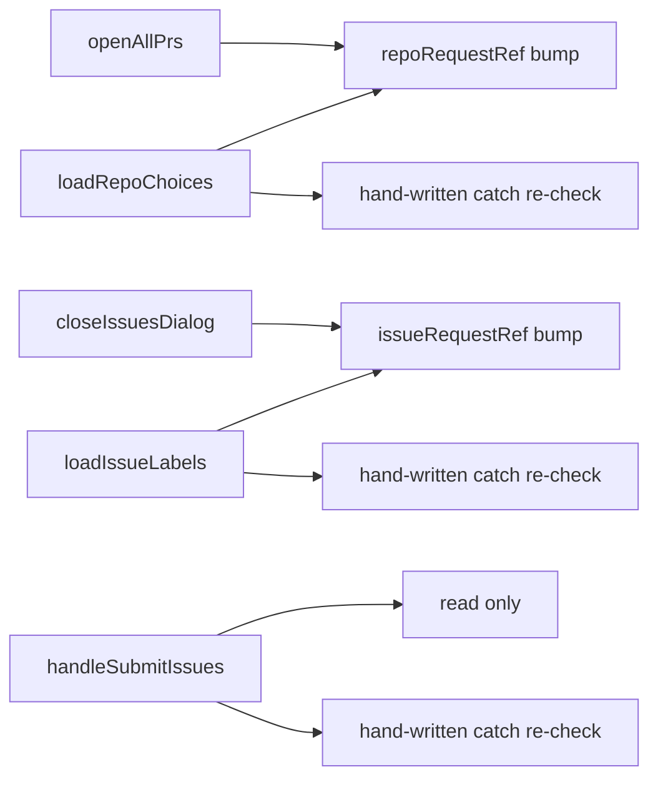

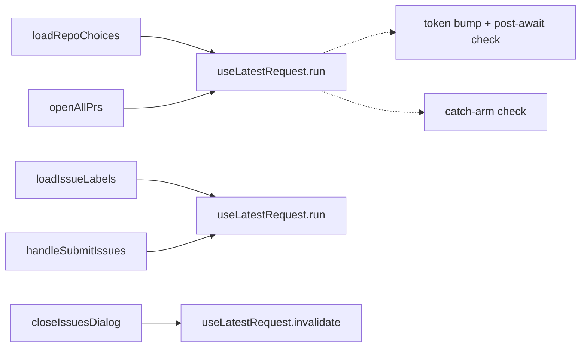

### Carried candidates, re-verified, not re-carded

Scored in prior runs, friction re-checked present this run, ranked below the pick. Full cards are in `.architecture/reviews/2026-09-02-spawn-remote-agent-pipeline.md` and `2026-09-18-session-store.md`; the backlog carries the evidence.

| Candidate                        | Score | Note from this run's re-check                                                                           |
| -------------------------------- | ----- | ------------------------------------------------------------------------------------------------------- |
| `git-runner-factories`           | 18/25 | Still present; partially subsumed by `worktree-add-strategy`, which would land the adapter it asks for. |
| `resolve-local-review-context`   | 18/25 | Still present; capped by there being no `src/main/index.test.ts` (verified absent again this run).      |
| `single-owner-pr-metadata`       | 18/25 | Still a pure deletion; both files cold since 2026-07-10.                                                |
| `create-broadcast-setting-store` | 17/25 | Still present, including the `theme.ts:38` no-op-broadcast bug `animations.ts` already fixed.           |
| `unify-gh-query-dispatch`        | 16/25 | Still present; best-covered module of the set.                                                          |
| `hunk-key-value`                 | 14/25 | Still present; all four files cold since 2026-05-11.                                                    |

## Dropped

| Candidate                                       | Dropped because                                                                                                                                                                                                                                                                                                                                                                                                                                          |
| ----------------------------------------------- | -------------------------------------------------------------------------------------------------------------------------------------------------------------------------------------------------------------------------------------------------------------------------------------------------------------------------------------------------------------------------------------------------------------------------------------------------------- |
| `session-op-ipc` (scored 22/25)                 | **Not pinnable before the change.** Handlers register inside the `app.whenReady()` closure and there is **no `src/main/index.test.ts`** anywhere in the repo — re-verified absent this run. The extraction is itself the testability unlock, which makes it a strong candidate for a human but not implementable under a test-first unattended run. Reversible: extracting any testable seam from `index.ts` first clears it.                            |
| `config-ipc-passthrough`                        | Leverage 1 — fails the deletion test, and widens the published IPC surface to an untyped key-string channel. Filter re-checked, still applies: now 14 channels, each name mirrored three times (handler → preload → `env.d.ts`), and two of the 14 are not passthroughs at all.                                                                                                                                                                          |
| `repo-ref-value-object`                         | Published-interface change — 25 declaration sites in 10 files crossing `shared/types.ts`, `preload/index.ts` and `env.d.ts` simultaneously. Filter re-checked, still applies. Staging note for a human: land `single-owner-pr-metadata` first.                                                                                                                                                                                                           |
| `gh-string-error-union`                         | Pervasive-convention migration, not a single seam — 25 signature sites and 10 `typeof x === 'string'` discrimination sites across 7 files, and every `Promise<T \| string>` in `env.d.ts:42-71` is a de-facto wire-format commitment. Filter re-checked, still applies.                                                                                                                                                                                  |
| `remote-session-context`                        | Leverage 1 — `remote-agent-spawn.ts:52-56` documents the throw-vs-return-string split as deliberate, so the seam would unify two things the code says should stay apart. Filter re-checked, still applies.                                                                                                                                                                                                                                               |
| `local-agent-respawn`                           | Leverage 1 — the one behavioural difference (swallow vs propagate a hook-install failure) is documented at `session-manager.ts:1290-1297`. Filter re-checked, still applies.                                                                                                                                                                                                                                                                             |
| `preload-subscribe`                             | Leverage 2 — almost no behaviour behind the interface, and it touches the published `window.api` shape. Filter re-checked, still applies.                                                                                                                                                                                                                                                                                                                |
| `renderer-error-message`                        | Leverage 1 — four lines; complexity just moves. Filter re-checked, still applies.                                                                                                                                                                                                                                                                                                                                                                        |
| `spawned-session-commit` (new this run)         | Leverage 1 — `buildSession → registerSpawnedSession → onSessionsChanged` repeats at five sites, but the local-only extras (`getRepoFingerprint(…).then`, `resolvePrNumberAsync`) are _correctly_ absent remotely: `resolvePrNumberAsync:217-220` bails on `session.hostId`, and remote sessions take `repoFingerprint` from `remoteProject`. A shared epilogue would immediately need an options flag per difference — complexity would move into flags. |
| `index.ts` config-field handlers (new this run) | Not pinnable — twelve `config:get-X`/`config:save-X` handlers where a `registerConfigField` seam would collapse ~80 lines, but there is no `index.test.ts`. Same filter as `session-op-ipc`; it is also the main-side twin of `create-broadcast-setting-store`.                                                                                                                                                                                          |

## Too large to automate

None this run. No surviving candidate scored blast radius 5. The two closest — `repo-ref-value-object` and `gh-string-error-union` — are dropped on the published-interface and pervasive-convention filters rather than on size, and both are listed above with staging notes for a human.

## Pick

**`pty-entry-registration`, 23/25.** It is the top-ranked surviving candidate and the only one above 21.

The **runner-up candidate** is **`adoption-gate`, 21/25** — first among four candidates tied at 21 (`adoption-gate`, `remote-hook-merge-executor`, `remote-exec-result-check`, `worktree-add-strategy`), taken by the deterministic tie-break: lower blast radius first (`adoption-gate` and `remote-hook-merge-executor` at 1, the other two at 2), then higher heat (`adoption-gate` 5, `remote-hook-merge-executor` 3).

**The top two are 2 points apart, so the pick is not close** — but only because `pty-entry-registration` was **re-scored 22/25 → 23/25 this run** on heat alone (4 → 5). `a21af71` / PR #321, merged **2026-09-18**, edited the `tmuxSocket` field _inside two of the four epilogues_ this candidate exists to unify, which is the strongest possible evidence for the YAGNI axis: this is code being changed right now, by hand, in four places. At its prior 22/25 the pick was within 1 point of the four 21s and would have been worth flagging as close.

Why it outranks the runner-up candidate: the same _locality_ 5, the same _blast radius_ 1, but higher _leverage_ (four sites against two) and higher _heat_. It is also the cheapest of the six to pin test-first — the prerequisite is a single self-contained change to the existing `fakePty()` harness so it captures its handlers, where `adoption-gate` needs a genuinely concurrent double-call test built against the session-creation apparatus, and three of the four 21s need remote characterization tests written from nothing.

## Design

Three designs were produced in parallel by sub-agents, each briefed for a _radically different_ interface, and written here before any adjudication.

### Design A — `attachPty`: one private function, one type, zero new public surface

```ts
// `host` present ⇒ remote (SSH refcount retained now, released on exit).
// `host` absent  ⇒ local (no refcount at all).
// The `never` members make a mixed target unassignable.
type PtyTarget =
  | { readonly tmuxSocket: TmuxSocket; readonly cwd?: string; readonly host?: never }
  | { readonly host: Host; readonly tmuxSocket?: never; readonly cwd?: never }

/** Attach a node-pty to this session's tmux session and register it as THE entry
 *  for `sessionId`. Returns a sink that pushes text into the same outbound buffer. */
function attachPty(sessionId: string, target: PtyTarget): (text: string) => void
```

- **Placement**: file-local to `pty-manager.ts`, not exported, no new module. The argument: all four callers live in that file, and extracting a registry module would force it to also export `hasPty`, entry lookup for `getScrollback`, entry iteration for `captureThumbnails`, and a delete-and-release for three teardown paths — ~8 exports to serve one file.
- **Usage**: `attachPty(sessionId, { tmuxSocket: TMUX_SOCKET, cwd })` / `attachPty(sessionId, { host })`; the reattach sites call the returned sink to replay scrollback. `reattachRemotePty` becomes two statements.
- **What it hides**: that `PtyEntry` exists at all; the `onData`→`appendToBuffer` wiring; that `onExit` must call `releaseRemoteEntry` **first** and only for remote entries; the retain; the remote attach argv and options; `pewpew-${id}`.
- **Dependency strategy**: injects only `PtyTarget`. `ptys`, `unexpectedExitListener`, `flushTimer` stay module-scoped — the test seam already exists one level lower (`vi.mock('node-pty')`, `vi.mock('./host-connection')`).
- **Distinctive move**: it also changes behaviour. `attachPty` **supersedes** a prior registration (releases and kills the orphan) and keys the exit handler on _entry identity_ rather than `ptys.has(sessionId)`. Today `ptys.set` silently drops a prior entry, orphaning an ssh client whose refcount is never released; `session-manager.ts:1181-1189` carries a hand-written comment and a `hasPty(id)` guard defending exactly this.
- **Trade-offs (author's own)**: no injection points; the returned-closure shape is one more concept than returning `void`; the primitive stays private so a failing test points at `createRemotePty`, not at `attachPty`; **and supersession is a real behaviour change, not pure refactoring** — it needs its own test and its own line in the PR body.
- **Test surface**: first test asserts supersession — `hostReleases` and `first.killed` sampled _before_ firing the orphan's exit, because sampling after makes the assertion pass against unchanged production code (a fake red). Requires `fakePty()` to capture handlers and the `./host-connection` mock to record retain/release.
- **Files**: 2 (4 with the `tmux-session-name` leaf).

### Design B — `PtyHost` port with a local and a remote adapter

```ts
// src/main/pty-host.ts
export type PtyPlacement =
  | { readonly kind: 'local'; readonly tmuxSocket: TmuxSocket }
  | { readonly kind: 'remote'; readonly host: Host }

export interface AttachedPty {
  readonly pty: IPty
  /** Hand back what the attach claimed. Idempotent, never throws. Locally the identity. */
  release(): void
}

export interface PtyHost {
  readonly placement: PtyPlacement
  attach(tmuxSession: string, opts?: { cwd?: string }): AttachedPty
}

export function localPtyHost(tmuxSocket: TmuxSocket): PtyHost
export function remotePtyHost(host: Host): PtyHost
```

plus a module-private `registerPty(sessionId, hosting: PtyHost, opts?): PtyEntry` in `pty-manager.ts`.

- **Evidence of two adapters**: each adapter already has two call sites today — local `spawnLocalAttach` at `:474`/`:846`, remote `spawnAttach(...)` duplicated verbatim at `:588-593`/`:883-888`. Different binary (`tmux` vs `ssh`), different argv shaping, different options, different resource claimed.
- **The honest asymmetry, stated by its author**: `release` has one real implementation and one identity. The design deliberately rejects a `retain()`/`release()` _method pair_ — whose local half would be two hollow methods — and folds the lease into `attach`'s return value instead, so the local arm is an identity element on a real case rather than a placeholder. The port therefore has **one operation with two genuinely different implementations**, plus a two-valued data discriminator.
- **`PtyEntry` becomes** `{ pty, tmuxSession, buffer, hosting: PtyHost, release: () => void }`; `releaseRemoteEntry:495-499` and the `released` flag **delete**. Three read sites (`socketsFor:182`, `captureThumbnails:734`, `getScrollback:806`) switch to `entry.hosting.placement.kind`.
- **Trade-offs (author's own)**: the port's own depth is modest — one type, two factories, one method, hiding an argv, an options block, an ordering and an idempotence flag; the genuinely deep unit is `registerPty`. `opts.cwd` is local-only and ignored remotely. `TMUX_SOCKET`/`tmuxArgs` move into `pty-host.ts` and are re-exported, so `runTmux` imports argv shaping back from the port's module.
- **Test surface**: first a characterization net that is **green on both old and new code** (the net under the call-site rewrite), then `pty-host.test.ts` **red by absence of the module**. `fakePty()` must accumulate handlers in _arrays_, not single slots, because `host-connection.ts:637` already registers its own `onExit` on the same pty.
- **Files**: 4 for slice 1 (`pty-host.ts` + its test, `pty-manager.ts`, `pty-manager.test.ts`); 7 for the full port; slice 3 (create/has/kill on the port) is explicitly declined — it would force `createPty`/`reattachPty` async and take blast radius from 1 to 3+.

### Design C — `registerPty` whose shape _is_ the lease rule

```ts
type PtyPlacement =
  | { readonly kind: 'local'; readonly tmuxSocket: TmuxSocket }
  | { readonly kind: 'remote'; readonly host: Host }

interface LocalPtyEntry extends PtyEntryBase {
  kind: 'local'
  tmuxSocket: TmuxSocket
}
interface RemotePtyEntry extends PtyEntryBase {
  kind: 'remote'
  host: Host
  released: boolean
}
type PtyEntry = LocalPtyEntry | RemotePtyEntry

interface RegisteredPty {
  replay(text: string): void
}

function registerPty(sessionId: string, ptyProcess: IPty, placement: PtyPlacement): RegisteredPty
```

- **The trick**: there is **one `onExit` body, shared by both placements, that calls `releaseRemoteEntry` unconditionally.** The local/remote branch moves from four hand-written copies into one `if` keyed off the discriminant inside `releaseRemoteEntry`. `retainHostConnection` moves _into_ `registerPty`, so the retain/release pair is created and destroyed at one point.
- **Illegal states**, verified empirically against this repo's TypeScript with `ts.createProgram` — actual diagnostics quoted: `{ kind: 'remote', host, tmuxSocket }` → **TS2353**; `{ kind: 'remote' }` → **TS2345** (`Property 'host' is missing`); `{}` → **TS2345**; `entry.host` on an un-narrowed entry → **TS2339**. Today `{ pty, tmuxSession, buffer: '', host }` with an `onExit` that forgets `releaseRemoteEntry` compiles cleanly and leaks a lease on every remote session.
- **Boundary condition, stated by its author**: TypeScript's excess-property check fires only on _fresh_ object literals, so a hoisted `const p = { kind: 'remote' as const, host, tmuxSocket }` would still compile. All four sites are literals and a fifth would be — it is a freshness guarantee, not a nominal one.
- **`releaseRemoteEntry` keeps its exact name and `(entry: PtyEntry)` signature**, so its three other callers at `:637`, `:653`, `:708` stay byte-identical. That one naming decision is what holds the unrelated ripple to **three** one-line narrowings (`socketsFor:182`, `captureThumbnails:734`, `getScrollback:806`).
- **Reported honestly as messier**: `destroyPty:664` iterates `socketsFor(entry)` and runs _local_ `tmux kill-session` on both sockets; today a remote entry's `undefined` `tmuxSocket` silently means `LOCAL_SOCKETS`, so destroyPty on a remote session shells out to local tmux twice, harmlessly and nonsensically. The union makes that visible for the first time, and the design **preserves** it rather than fixing it untested.
- **Residual hole, and why not branded away**: a future site could still mis-tag remote as local. A `unique symbol` brand was considered and rejected because moving the retain inside `registerPty` already **inverts the failure mode** — today's "forget the release → refcount too high → silent permanent leak" becomes "mis-tag → refcount too low → a sibling's release drops a live ControlMaster → the pty dies visibly, immediately."
- **Test surface**: a 4-row **lease matrix** (local create / remote create / local reattach / remote reattach), no timers needed. Stated plainly: this refactor fixes no live bug, so after the test-only prerequisite the rows are green against today's code — the honest TDD story is **mutation, not a natural red**: delete `releaseRemoteEntry(entry)` from `:609` and row 2 goes red, from `:904` and row 4 goes red. Two of the four rows are the first coverage of any kind for `reattachPty`/`reattachRemotePty`.
- **Deliberately excluded**: defensively releasing a prior registration's lease. Named as a real latent gap and left as a follow-on, because including it forfeits the property that makes the mutation proof meaningful and the review cheap — _the diff alters no behaviour_.
- **Files**: 2 (4 with the optional `session-record.ts` extension, which needs no test changes because `session-record.test.ts` already asserts the literal `pewpew-<id>` strings).

### Adjudication

**Adjudicated without an advisor** — the advisor was rate-limited at step 4. Per the skill's stated fallback, the verdict below was reached against the three designs _as written above_, which is why they were written into the report and committed (`4898162`) before any adjudication. Criteria are the fixed ones, applied in order.

Criteria, in this order: **depth** (behaviour per unit of interface a caller must learn) → **locality** (where change, bugs and verification concentrate) → **seam placement** (is the seam where something actually varies; one adapter is hypothetical, two is real) → **test surface** (can the behaviour be exercised through the interface) → **blast radius** (smaller diff wins between otherwise-equal designs).

**Winner: Design C.** **Runner-up design: Design B.**

**Why C wins on the ordered criteria.**

_Depth._ All three collapse the same four epilogues, so the tie-break is what a caller must learn to use the result correctly. C's is `registerPty(sessionId, pty, placement)` — three arguments, one of them a two-armed union — and the lease rule is not part of what a caller must learn at all, because it is derived from the discriminant. B's caller must learn the port as well: a `PtyHost` with a `placement` and an `attach`, an `AttachedPty` with a `release`, and two factories — four named concepts against C's two, for the same hidden behaviour. B's own author concedes the port's depth is modest and that "the genuinely deep unit is `registerPty`" — which is C's unit, reached without the port.

_Locality._ C and A both put every step in one place. B splits the epilogue across two modules: `registerPty` in `pty-manager.ts` and the attach/lease in `pty-host.ts`, and then has to move `TMUX_SOCKET`/`tmuxArgs` into the port's module and import them back so `runTmux` can shape argv — a cycle avoided by relocating vocabulary rather than by the seam being in the right place. That is locality lost, not gained.

_Seam placement._ This is where B's framing is weakest by its own account: its `release` has one real implementation and one identity. B argues convincingly that folding the lease into `attach`'s return is better than a hollow `retain`/`release` pair — but the conclusion of that argument is that the varying thing is _data_, not behaviour, which is precisely C's `PtyPlacement`. A discriminated union is the right shape for a two-valued fact; a port is the right shape for two implementations, and there is only one operation (`attach`) that genuinely has two.

_Test surface._ C's 4-row lease matrix exercises the invariant through the four public entry points with no timers and no new module, and two rows are the first coverage of any kind for `reattachPty`/`reattachRemotePty`. All three designs are honest that there is no natural red — no live bug is being fixed — and each proposes a different substitute. C's is the most rigorous: a **mutation proof** (delete `releaseRemoteEntry` from `:609`, watch row 2 go red; from `:904`, watch row 4) demonstrates the test observes the invariant rather than the implementation. B's substitute is red-by-absence-of-a-module, which proves only that the module does not exist yet.

_Blast radius._ C: 2 files, three forced one-line narrowings, **no behaviour change**. B: 4 files for slice 1, 7 for the full port. A: 2 files, but it bundles a genuine behaviour change.

**Why A loses.** A's `PtyTarget` uses `host?: never` / `tmuxSocket?: never` rather than a discriminant — equivalent in strictness for fresh literals, but it produces worse error messages and does not give `PtyEntry` itself a shape, so `entry.host` stays readable on any entry and the three `entry.host` read sites keep their incidental phrasing. Decisively, A folds **supersession** — release and kill the orphan, key exit on identity — into the same change. That is a real fix for a real latent leak, and A's author says so plainly. But it is a behaviour change inside a refactor whose value depends on being behaviour-preserving, and it is the one part of A's first test that could not be verified without it. C names the same gap and files it as a follow-on, which is the correct disposition for an unattended run.

**What C must carry from the losers.** From B: `fakePty()` should accumulate handlers in arrays rather than single slots, because `host-connection.ts` registers its own `onExit` on the same pty, and a single-slot fake would encode a false assumption. From A: the supersession gap is real and should be named in the PR body as a follow-on, not left silent.
